### 개발환경

Window10, AWS 프리티어 이상 계정 보유

---

AWS의 대표적인 서비스 EC2(elastic compute cloud)를 만들고 터미널 프로그램 Xshell을 사용하여 접속을 해

이번 포스트에서는 AWS의 대표적인 서비스 EC2(elastic compute cloud)를 만들고 터미널 프로그램 Xshell을 사용하여 접속을 해볼 예정이다.

 

먼저 Aws의 EC2 인스턴스를 만들어준다. 본인 계정에 맞는 버전을 선택해야한다. 난 프리티어이기 때문에 고려해서 프리티어 가능 리눅스를 선택했다.

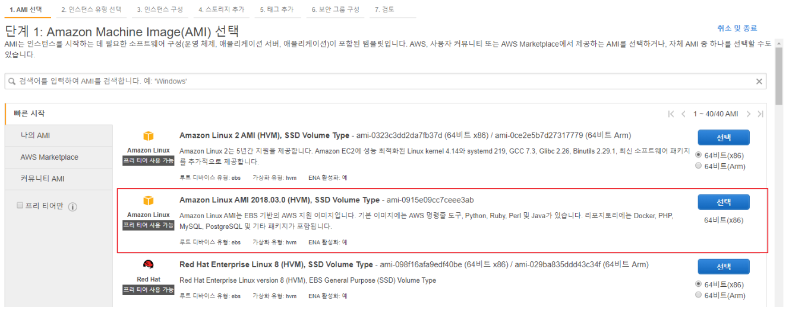

 

인스턴스 세부정보는 본인이 프리티어일 시 건드려줄 게 없다. 바꾸더라도 가용영역의 서브넷, IAM역할 등 본인이 필요한 내용만 설정해주자.

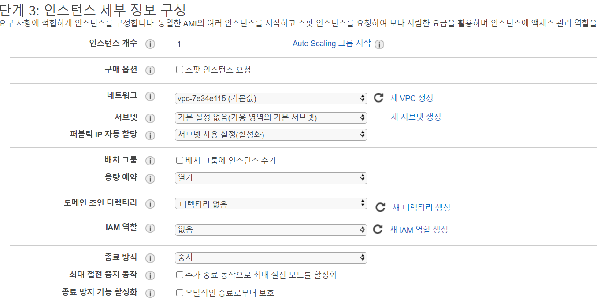

 

보안그룹을 설정해준다. 본인의 용도에 맞게 설정해주면 된다. 개인적으로 ssh 접속은 개발용으로 사용할 IP만 허용해준다. 만약 웹 또는 여러 port를 사용할 예정이면, http, https, 포트번호를 보안그룹으로 접근가능한 IP를 설정해주자. 설정 하지 않고 지나갔다 하더라도 나중에 보안그룹을 편집할 수 있다.

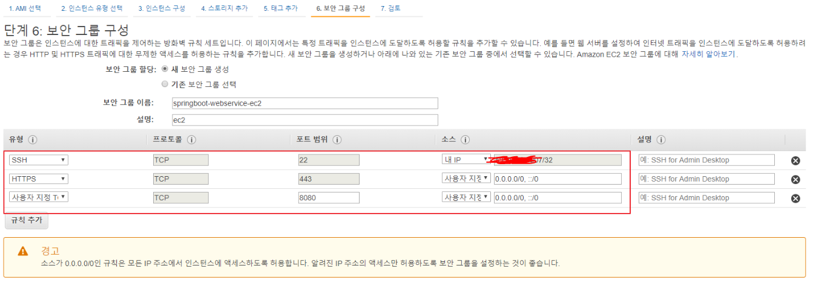

 

마지막으로 키페어를 생성해준다. ssh로 접속할 때 사용할 RSA키이다. 없으면 생성해주고, 있으면 있는 키를 쓴다.

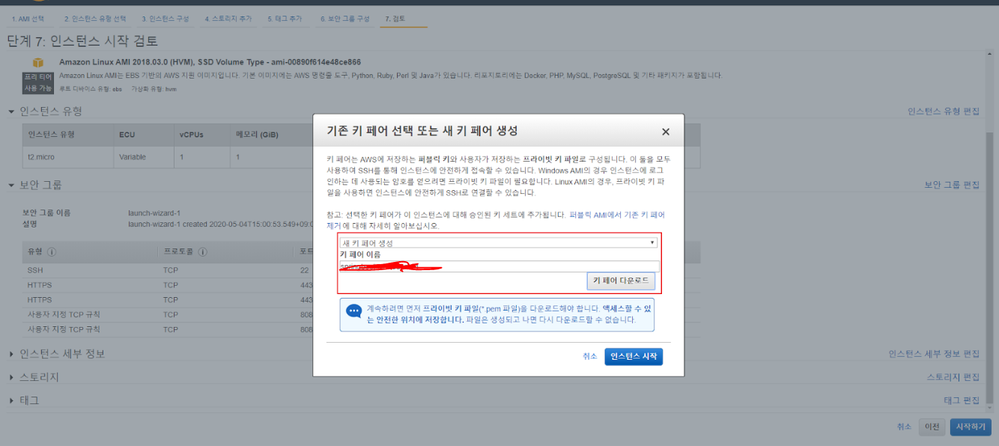

 

생성해주면 다음과 같이 퍼블릭 IP가 할당되어있다. 퍼블릭 IP는 EC2인스턴스를 새로 시작할 때마다 변경되므로 변하지 않는 IP를 사용하고 싶다면 탄력적IP(flexible IP)를 할당해준다.

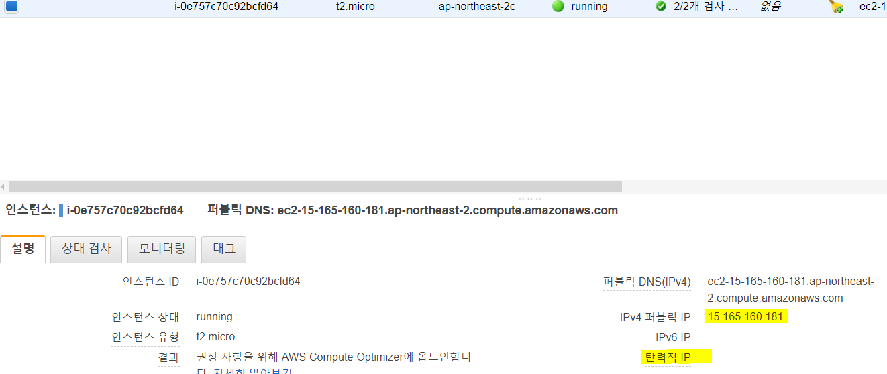

 

단 여기서 주의할 점은, 탄력적 IP를 만들고 EC2인스턴스에 연결하지 않으면 비용이 청구된다. 가뜩이나 부족한 IPv4의 낭비를 막기 위한 AWS의 방침이다. 그러니 사용하지 않으면 삭제해주자.

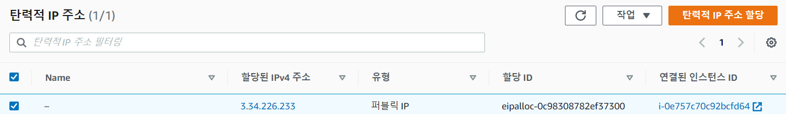

 

이제 탄력적 IP로 접속이 가능하다.

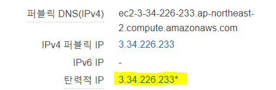

 

만약 인스턴스가 켜져있는 상태에서 탄력적IP를 릴리즈하면 처음과 다른 IPv4가 할당된 것을 볼 수 있다.

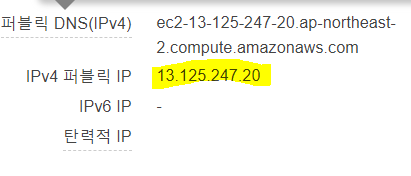

---

## SSH 접속

이제 내 인스턴스에 접속해본다.

예전에는 putty로 접속했지만, Xshell을 사용해보니 너무 편해서 이것을 사용해보려한다.

기업에서는 유료지만 공부목적으로 무료로 사용 가능하다. 

[https://www.netsarang.com/ko/xshell/](https://www.netsarang.com/ko/xshell/)

실행시키고 새 세션 등록을 열어서 탄력적 IP 또는 IPv4 퍼블릭 IP를 입력해준다.

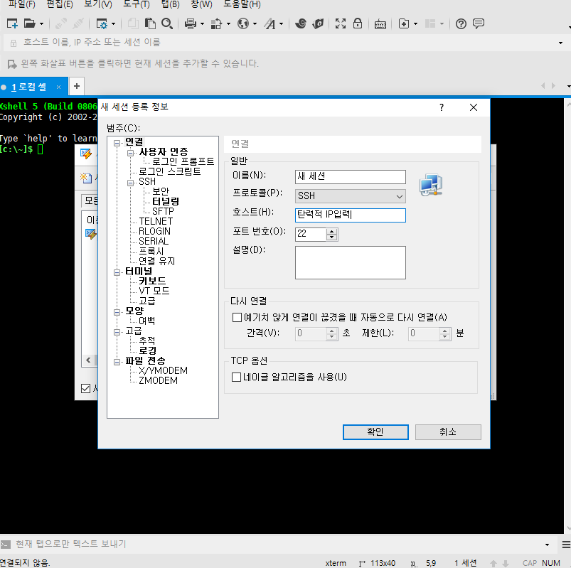

 

사용자인증 탭에서 public key로 설정하고 사용자 이름을 `ec2-user`로 입력한다. EC2의 기본 유저는 `ec2-user`로 정해져있다. 

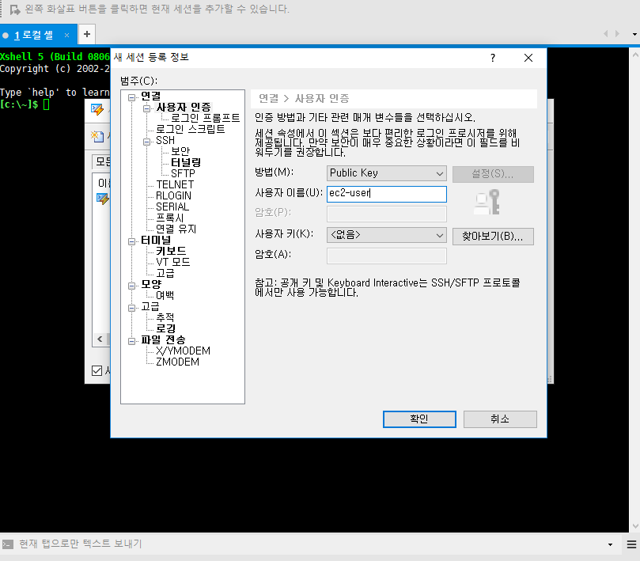

 

그리고 인스턴스 생성시 만들었던 공개키를  넣어주고 연결하면된다. 성공적으로 접속이 되었다.

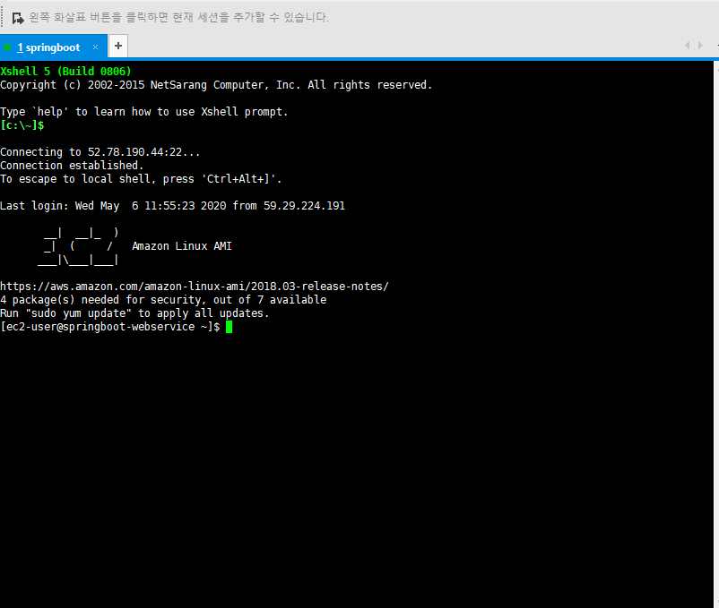

