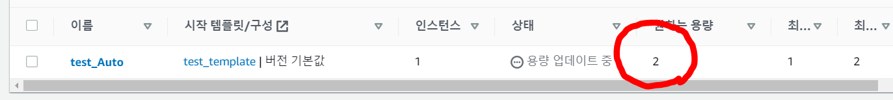

### 작업환경

Windows10

Aws 프리티어 계정

[AWS EC2 시작 및 SSH 접속하기](https://jeonghoon.netlify.app/AWS/Aws/markdown/), [Aws로 EC2와 RDS 연결하기](https://jeonghoon.netlify.app/AWS/aws_rds_connect/) 완료상태

---

Auto Scaling이란, 간단히 말해 자동으로 스케일을 변경해주는 기능을 말한다. AWS에서는 이 기능을 Auto Scaling Group을 통해 제공한다. 여기서는 설정해 두었던 프로세스의 사용량을 초과하면 동일한 EC2를 생성해서 가용성을 높이는 방법을 알아볼 예정이다.

일단 지난번 여기까지 만들었다.


이번에 구축할 아키텍처를 미리 보자면 아래와 같다. VPC로 Auto Scaling Group를 만들고 CPU가 허용치 초과시 EC2를 늘려줄 것이다.


<br/>

### AMI 생성

먼저 현재까지 작업한 EC2의 이미지를 만들어준다(스냅샷이라고 보면 된다). 기존 EC2를 중지하고 이미지를 생성해주자.


<br/>

이름이랑 설명을 작성하고 만들면,


<br/>

이미지 탭에서 이미지가 활성화된 것을 확인할 수 있다.


<br/>

### 시작템플릿 생성

이제 시작템플릿을 만들어준다. 인스턴스의 시작을 자동활 할 수 있게 만들어주기 때문에 필요하다.


<br/>

템플릿의 이름을 작성하고 본인의 AMI, 인스턴스 유형, 키페어를 선택해준다.


<br/>

그 다음 VPC를 선택하고 보안그룹을 설정하고 생성하면 된다.


<br/>

### Auto Scaling Group 생성

이제 Auto Scaling Group 탭으로 이동하고 그룹을 생성해준다.


<br/>

1단계에서 이름과 방금 만든 템플릿을 선택하고


<br/>

2단계에서 VPC와 서브넷을 선택해준다. 2~3개정도 선택해주면 된다.


<br/>

3단계에서 로드밸런싱 선택이 나온다. 다음 포스트인 [AWS로 로드밸런싱하기]()를 하기 위해 대상그룹을 만들어줘야한다. 대상그룹이 이미 있거나 로드밸런싱이 필요 없다면 3단계는 건너뛰어도 된다.

### 3단계 외전, 대상그룹 만들기

그룹생성하기를 눌러주자.


<br/>

포트는 80은 사용할 예정이기 때문에 8000으로, 헬스체크를 위해 경로는 /health로 설정하였다.


<br/>

대상 등록에서 본인의 EC2인스턴스를 선택하고 포함시켜주자.


<br/>

 다시 Auto Scaling Group 생성 3단계로 돌아와서 대상그룹을 지정해준다.

4단계에서 자동으로 스케일링 될 인스턴스 개수를 설정할 수 있다. 원하는용량은 처음에 생성될 EC2의 개수를 말하고, 최소용량과 최대용량은 말 그대로 최소 최대로 만들 수 있는 EC2의 개수를 말한다.


<br/>

조정 정책에서 `대상 추적 조정 정책`을 선택하여 네트워크 입출력, CPU 사용률에 따라 스케일링 되도록 설정할 수 있다. 나는 CPU를 50% 이상 사용하면 EC2가 자동으로 생성되도록 설정하였다. 그리고 5단계 알림추가와 6단계 태그는 필요하면 추가해준다.


<br/>

생성하면 아래와 AMI 만들면서 중지했던 원본 EC2 1개와 Auto Scaling Group을 생성하고 만들어진 복사된 EC2 1개가 있는 것을 확인할 수 있다.


<br/>

만들어진 EC2에 SSH로 접속해보자. 데이터베이스와도 연동이 잘 된다.


<br/>

이제 stress 테스트로 강제로 CPU 사용량을 늘려 자동으로 EC2가 스케일링 되는지 확인해보자.

```
sudo yum install stress -y # 설치
stress --cpu 1 --timeout 600 # 스트레스 시작
```


원하는 용량을 1로 설정했지만 CPU 사용량의 상승으로 인해 2로 변경된 것을 확인할 수 있다.



<br/>

EC2 인스턴스는 그에 맞게 1개 더 추가된 것을 확인할 수 있다.


<br/>

여기서 스트레스 테스트를 종료하면 CPU의 사용량이 낮아져1개의 EC2는 종료된다.


<br/>

하지만 EC2의 퍼블릭 IP가 다르기 때문에, 자동으로 로드 밸런싱이 안 되었다. 다음 포스트에서 로드밸런서를 추가해 자동으로 로드 밸런싱이 되도록 구축해보겠다.

