### 작업환경

Windows10

Aws 프리티어 계정

[AWS EC2 시작 및 SSH 접속하기](https://jeonghoon.netlify.app/AWS/Aws/markdown/), [Aws로 EC2와 RDS 연결하기](https://jeonghoon.netlify.app/AWS/aws_rds_connect/), [Aws로 Auto Scaling Group 만들기](https://jeonghoon.netlify.app/AWS/aws_autoscaling/)완료상태

</br>

지난번 만든까지 만든 아키텍처는 다음과 같다.

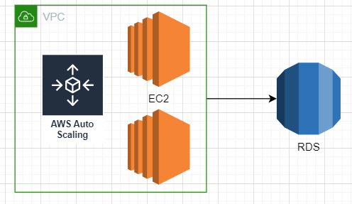

<br/>

이번에 만들 아키텍처는 다음과 같다. 로드밸런서를 만들어주고 웹에서 접속가능하게 만들어줄 것이다.

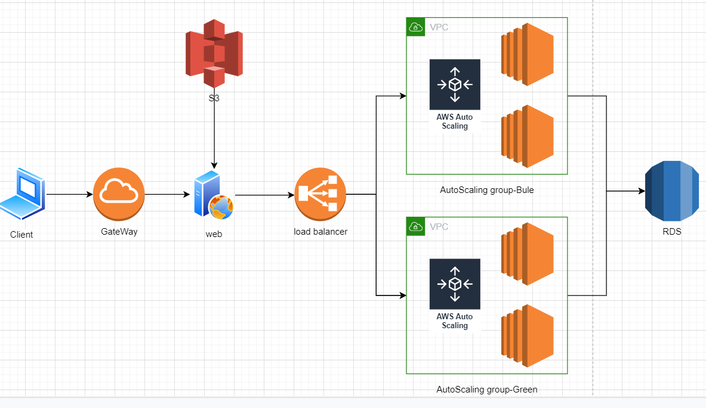

---

### Blue / Green 배포란?

어플리케이션을 서비스함에 있어 무중단은 굉장히 중요한 요소이다. blue / green 배포는 무중단 시스템 배포 방법중 가장 많이 사용하는 방법이다. 원리도, 만들기도 간단하다. 단점이 있다면, 배포할 어플리케이션과 동일한 인스턴스 그룹을 만들어야 하므로 비용 효율적이지는 않다. Aws를 활용하면 이를 간단히 구현 가능하다.

간단히 살펴보자. 아래 그림은 현재 상태이다.

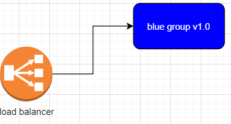

만약 서비스 중인 어플리케이션을 업데이트 해야 한다면, 동일한 green 이라 불리는 새로운 AutoScaling Group 을 만들고 로드밸런서에 연결해준다. 

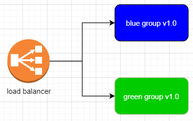

green 그룹에 업데이트를 적용하고기존에 있던 blue 그룹의 연결을 끊어준다. 작동중인 green 그룹에 로드밸런서가 할당되고 정지 없이 배포가 완료된다.

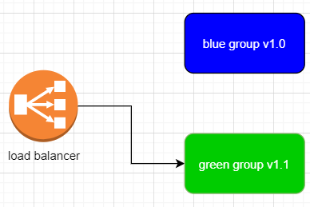

<br/>

---

### node 서버 만들기

먼저 로드밸런싱이 되는지 확인하기 위해 [EC2 인스턴스에 node 및 모듈 설치하기](https://jeonghoon.netlify.app/node/node_install/)를 참고하여 express 모듈을 설치해준다. 그리고 npm init로 pakage.json 파일을 초기화하고 실행명령문을 넣어준다. 

```
npm init
```

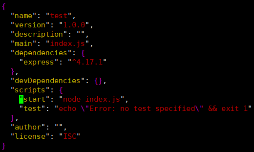

<br/>

마지막으로 index.js 파일을 만들어준다.

```js
const express = require('express');
const app = express();
const port = process.env.PORT || 8000;

app.get('/', (req, res) => {
  setTimeout(function() {
    res.send("sleep all day : " + new Date());
    return console.log(new Date());
  }, 3000);
});
app.listen(port, () => console.log(`Example app listening on port ${port}!`));
```

<br/>

현재 파일 상황

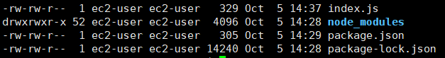

<br/>

서버를 실행하고 퍼블릭IP:8000으로 접속하면 서버가 정상적으로 작동됨을 확인할 수 있다.

```
node 파일명.js
```

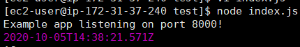

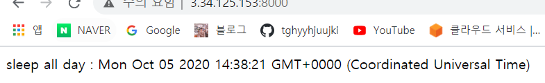

<br/>


### AMI 생성 및 Auto Scaling Group 만들기

바뀐 인스턴스로 AMI(스냅샷)을 생성하고 전 글인  [Aws로 Auto Scaling Group 만들기](https://jeonghoon.netlify.app/AWS/aws_autoscaling/)을 참고하여 Auto Scaling Group을 만들어주자.

blue green 배포를 위해 그룹 이름을 blue로 만들어주었다.

Auto Scaling Group 크기는 모두 2로 선택

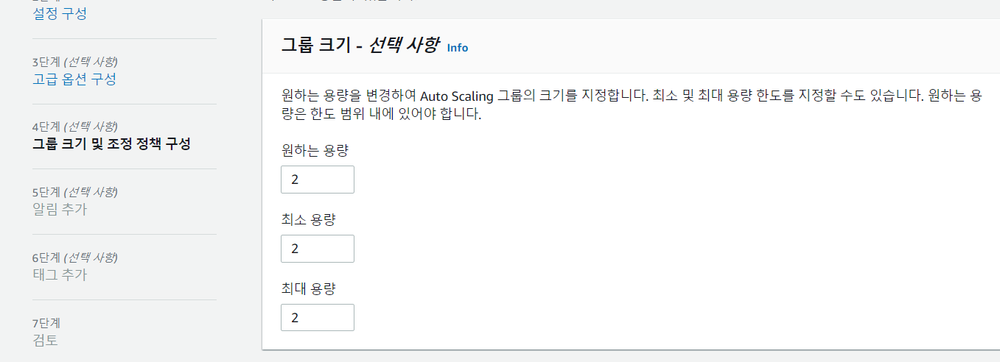

<br/>

만들면, 각각 다른 퍼블릭 IP로 작동하는 EC2 인스턴스를 볼 수 있다.

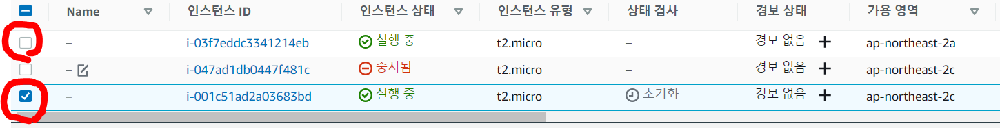

</br>


### Load Balancer 생성

로드밸런서는 기본적으로 트래픽 분산의 역할을 한다. AWS에서 로드밸런서의 할당방식의 디폴트가 라운드로빈으로  설계되어 있다. 따라서 웹에 접속하면 Auto Scaling Group에 속한 인스턴스가 번갈아가면서 호출된다.

다음을 눌러 생성한다.

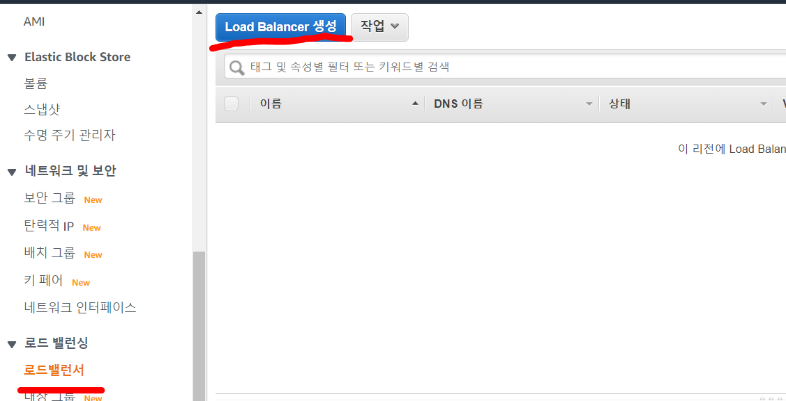


테스트를 웹에서 진행할 예정이므로 HTTP를 선택해준다.

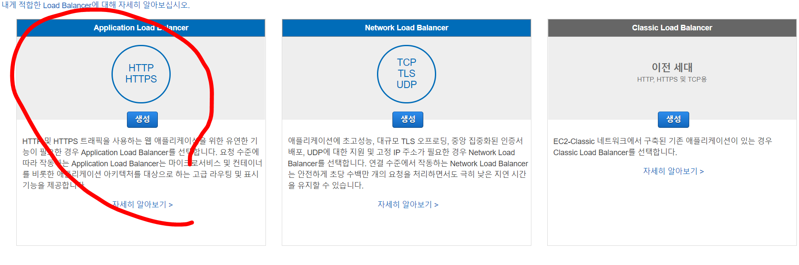

<br/>

간단히 이름 작성 후 본인이 만들어 둔 대상그룹의 포트(여기서는 8000)을 입력해준다.

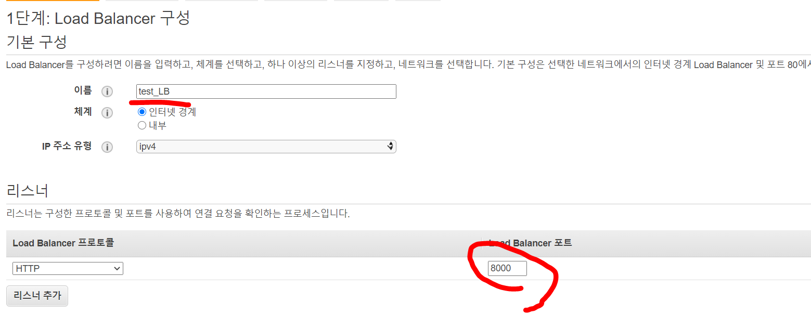

<br/>

가용영역도 선택해주고 보안그룹은 기존 그룹선택하여 생성한다.

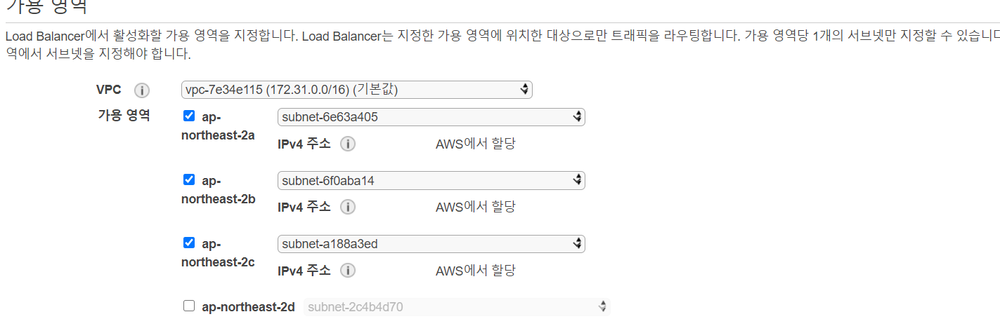


생성된 로드밸런서를 확인해보면 DNS를 확인할 수 있다.

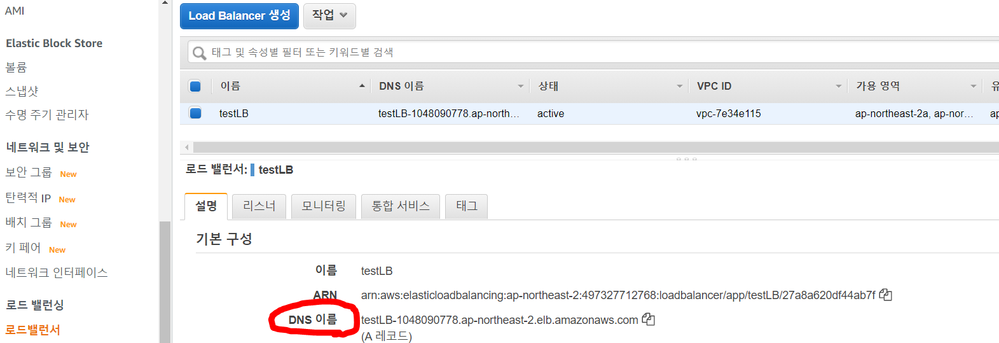

<br/>

`DNS:포트번호`로 웹에서 접속하면 다음과 같이 두개의 인스턴스가 번갈아가며 호출되는 것을 확인할 수 있다.

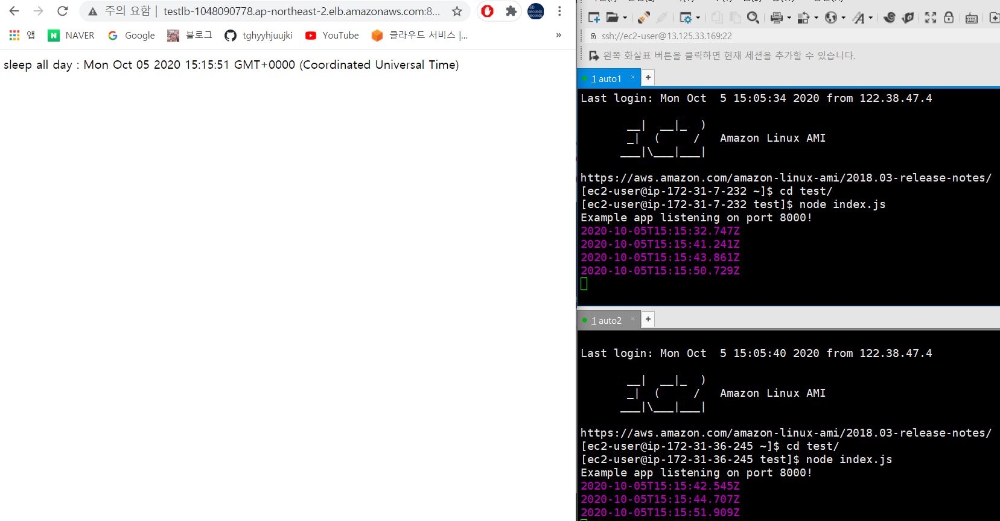

<br/>

현재까지의 아키텍처는 다음과 같다.

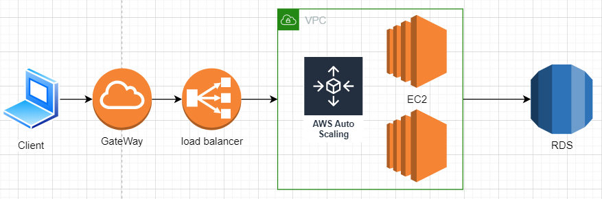

