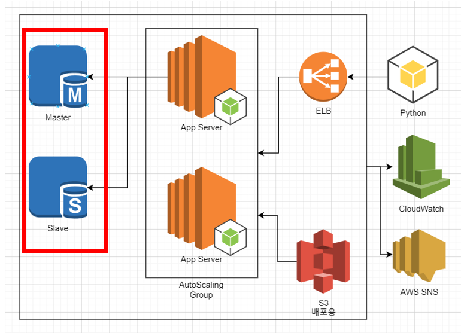
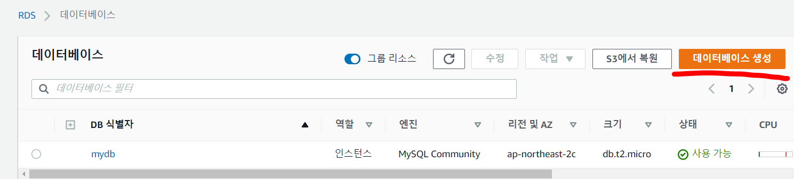
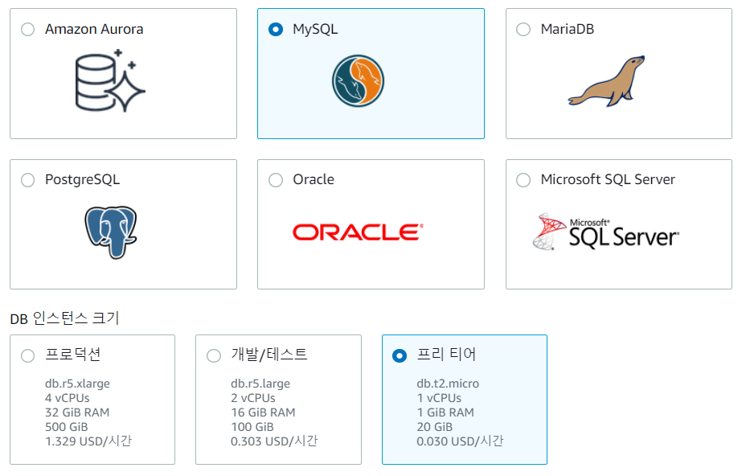
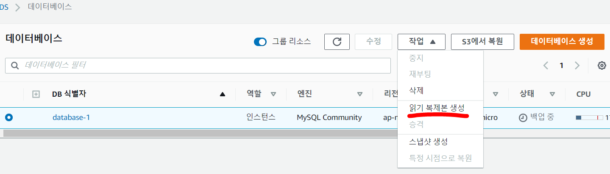
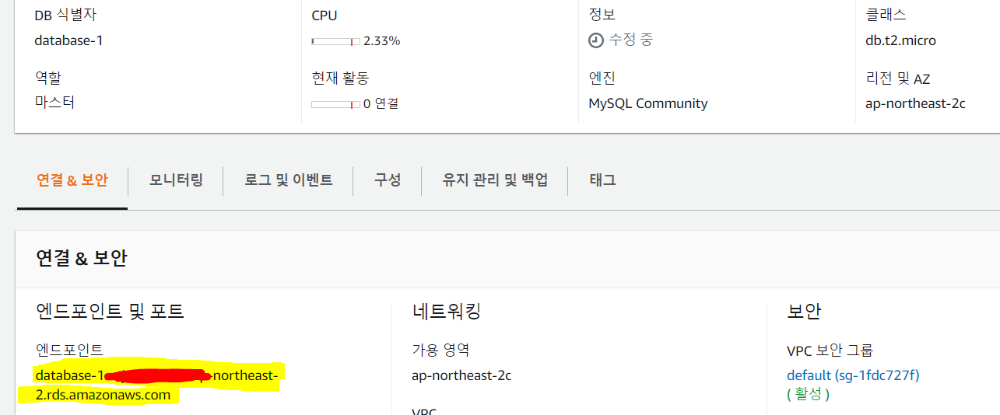
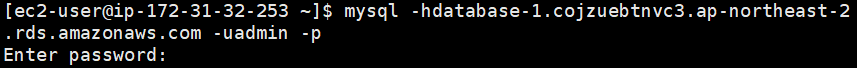
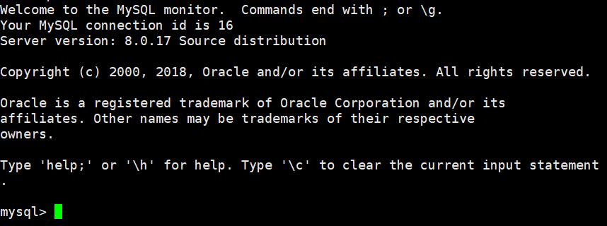
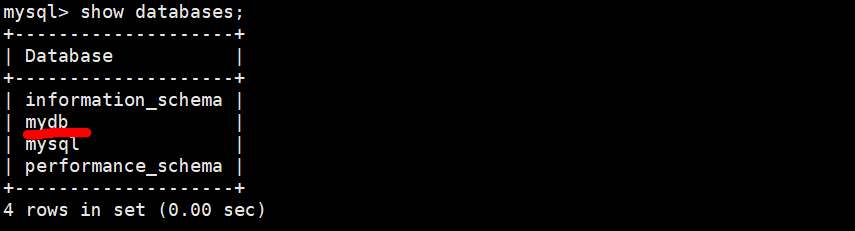
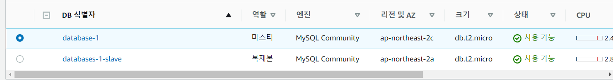

### 작업환경

Windows10

Aws 프리티어 계정

Aws EC2 인스턴스 존재해야함([AWS EC2 시작 및 SSH 접속하기](https://jeonghoon.netlify.app/AWS/Aws/markdown/) 참고)

---

<br/>


## 미니프로젝트 - 중고자동차 판매점

1. MySQL Workbench를 이용하여 DataBase 쿼리 생성
2. 클라이언트 용 Python file 작성
3. **RDS - Master, slave 생성**
4. RDS와 클라이언트 연결하는 node 서버 만들기
5. AutoScaling 그룹 생성 및 ELB(elastic Load Balancer) 연결
6. CloudWatch, AWS SNS 연동
7. CodeDeploy를 통한 배포 구축

<br/>

### RDS - Master, slave 생성

이번에는 AWS RDS를 이용하여 MySQL master와 slave를 만들 예정이다. 부하를 분산시키기 위해 slave는 select 쿼리를 master는 insert, update, delete 쿼리를 처리한다.



<br/>

먼저 RDS로 가서 데이터베이스를 만들어준다.



<br/>

기본환경을 설정해준다. 나는 MySQL, 그리고 프리티어로 만들었다.



<br/>

MySQL에서 사용할 아이디와 비밀번호를 기입하고 데이터베이스 생성!


<br/>

이제 slave를 만들어 줄 차례이다 굉장히 간단하다. 작업 - 읽기복제본 생성을 클릭한다. 환경설정은 db 이름을 제외하고는 디폴트로 설정했다.  또는 본인이 필요한 것 선택한다.



<br/>

slave가 만들어지는동안 MySQL SSH 접속을 테스트해보자. EC2 인스턴스에 mysql 설치부터 한다.

```sh
sudo yum -y upadte # yum 명령어 업데이트, -y는 yes 옵션
sudo yum install -y mysql-server # mysql 서버 설치
```

이제 접속해보자. 엔드포인트는 본인의 MySQL에서 확인 가능하다.

```sh
mysql -h[엔드포인트] -u[만들었던 ID] -p
Enter password : [비밀번호 입력]
```





성공적으로 접속되면 다음 화면이 나온다.



<br/>

이제 [MySQL Workbench를 이용하여 DataBase 쿼리 생성]()에서 만든 DB 쿼리문을 입력해준다. mydb가 생성된 것을 볼 수 있다.



<br/>

그 동안 slave가 만들어졌다. 슬레이브 역시 엔드포인트가 존재하고 동일한 방법으로 접속해주면 된다.



