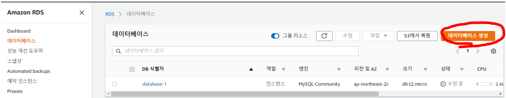
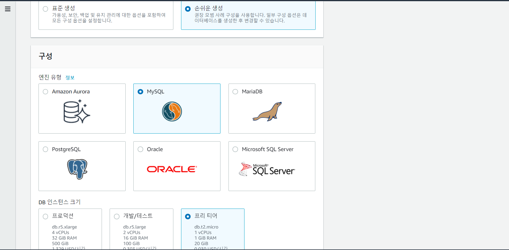
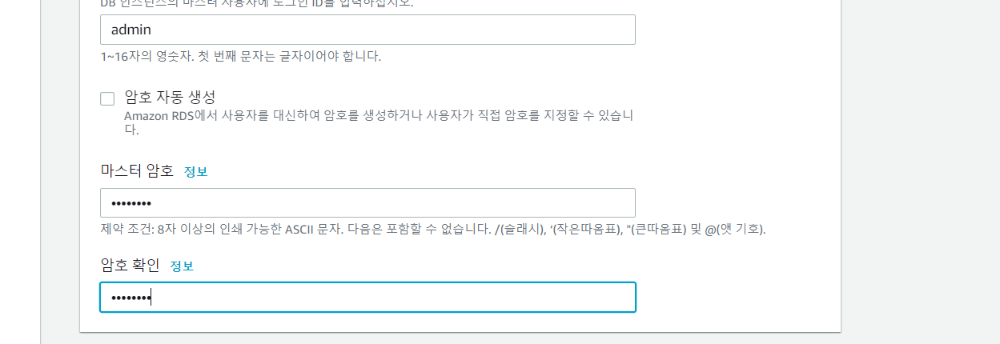
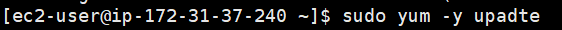
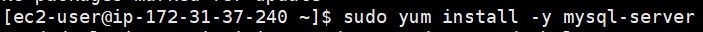
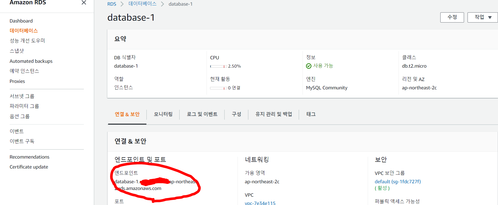
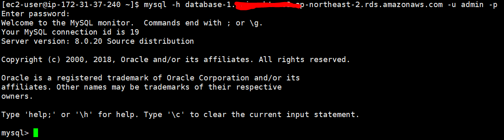
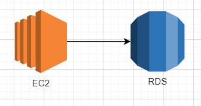

### 작업환경

Windows10

Aws 프리티어 계정

[AWS EC2 시작 및 SSH 접속하기](https://jeonghoon.netlify.app/AWS/Aws/markdown/) 완료상태

<br/>

## RDS MySQL 생성

먼저 RDS로 가서 데이터베이스를 생성해주자.



<br/>

아래와 같이 손쉬운생성, MySQL, 프리티어로 설정하고



<br/>

비밀번호만 작성 후 생성해준다.



<br/>

<br/>

## EC2와 RDS 연결

EC2로 가서 `MySQL-Server`를 설치해줘야한다.

```
sudo yum -y update # yum 명령어 업데이트, -y는 yes 옵션
sudo yum install -y mysql-server # mysql 서버 설치
```






<br/>

그리고 본인이 만든 데이터베이스에 들어가 엔드포인트를 확인하고



<br/>

EC2에서 접속해준다.

```sh
mysql -h[엔드포인트] -u[만들었던 ID] -p
Enter password : [MySQL만들 때 생성한 비밀번호 입력]
```



<br/>

현재 아키텍처는 다음과 같다.

