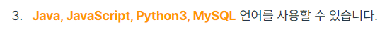

갑자기 자바로 코테를 준비하는 이유는, 백 엔드 부분에서 C++을 안 보는 기업이 있어서다.




<br/>

## 테스트 환경

IntelliJ

```java
// 라이브러리
import java.util.*;

// 프로그래머스 문제
class Solution {
    public int solution(int bridge_length, int weight, int[] truck_weights) {
        int answer = 0;
        return answer;
    }
}

//메인
public class test {
    static int[] p = {7,4,5,6};
    public static void main(String[] args) throws IOException {
        Solution solution = new Solution();
        System.out.println(solution.solution(2,10,p));
    }
}
```

<br/>

## 문자열

```java

```


<br/>


## 해시

프로그래머스 - 완주하지 못한 선수

```java
// 라이브러리 전부 가져옴
import java.util.*;

class Solution {
    public String solution(String[] participant, String[] completion) {
        String answer = "";
        
        // HashMap 객체 선언
        HashMap<String, Integer> map = new HashMap<>();
        
        // 아래와 같이 사용도 가능
        // for (String player : participant) map.put(player, map.getOrDefault(player, 0) + 1);
        for(int i=0;i<participant.length;++i){
            
            // 키 값이 없으면 기본값을 반환, 0일 때 못 가져오기 때문
            map.put(participant[i], map.getOrDefault(participant[i], 0) + 1);
        }
        for(int i=0;i<completion.length;++i){
            map.put(completion[i], map.get(completion[i])-1);
        }
        
        // HashMap에서 반복자 사용법
        for(String key : map.keySet()){
            if(map.get(key) == 1){
                answer = key;
                break;
            }
        }
        return answer;
    }
}
```

<br/>


## 스택/큐

C++의 vector를 ArrayList로 표현 가능

```java

```

<br/>

## 힙

```java

```


<br/>

## 정렬

프로그래머스 K번째 수

```java
import java.util.*;

class Solution {
    public int[] solution(int[] array, int[][] commands) {
        
        // 동적할당
        int[] answer = new int[commands.length];
        
        for(int i=0;i<commands.length;++i){
            
            int[] temp = new int[commands[i][1] - commands[i][0] + 1];
            for(int j=0; j<temp.length; ++j){
                temp[j] = array[j+commands[i][0] - 1];
            }
            
            // 정렬
            Arrays.sort(temp);
            answer[i] = temp[commands[i][2] - 1];
        }
        return answer;
    }
}
```

<br/>

## BFS / DFS

```java

```


