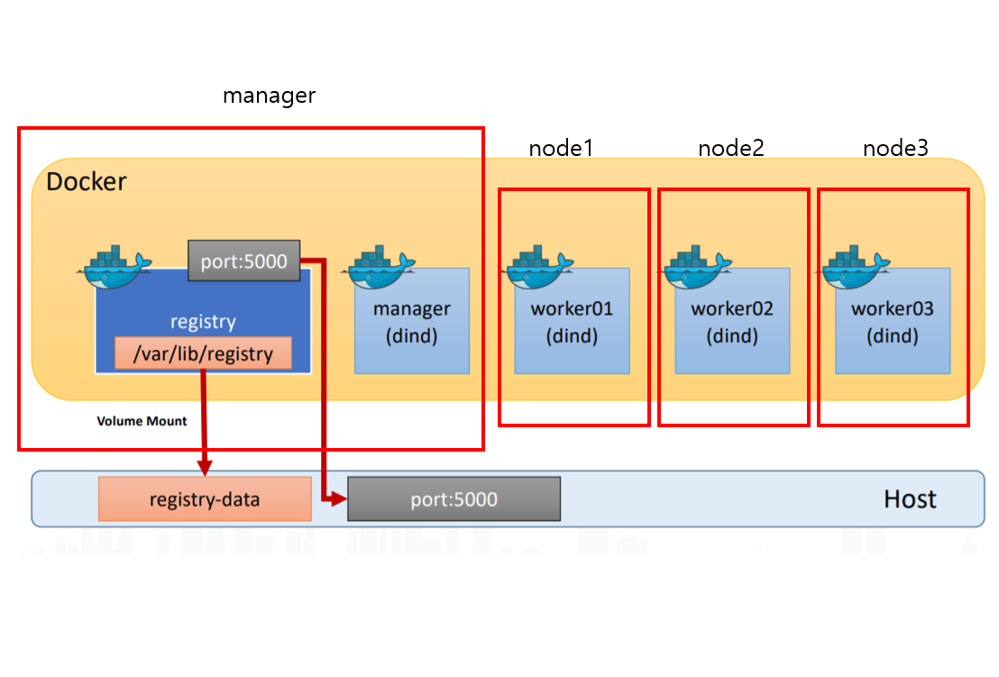

# Swarm

스웜을 위해 다음과 같이 vagrantfile 변경

```shell
Vagrant.configure("2") do |config|
  # Jenkins (node1)
  config.vm.define:"node1" do |cfg|
    cfg.vm.box = "centos/7"
    cfg.vm.provider:virtualbox do |vb|
        vb.name="node1"
        vb.customize ["modifyvm", :id, "--cpus", 2]
        vb.customize ["modifyvm", :id, "--memory", 1024]
    end
    cfg.vm.host_name="node1"
    cfg.vm.synced_folder ".", "/vagrant", type: "nfs"
    cfg.vm.network "private_network", ip: "192.168.56.11", bridge: "en0: Wi-Fi (AirPort)"
    cfg.vm.network "forwarded_port", guest: 22, host: 19211, auto_correct: false, id: "ssh"
    cfg.vm.network "forwarded_port", guest: 8080, host: 18080
    cfg.vm.network "forwarded_port", guest: 80, host: 18000 # guest는 리눅스, host는 윈도를 뜻함
    cfg.vm.network "forwarded_port", guest: 3306, host: 13306 # guest는 리눅스, host는 윈도를 뜻함
    cfg.vm.network "forwarded_port", guest: 9000, host: 19000
    cfg.vm.network "forwarded_port", guest: 8000, host: 18888
    cfg.vm.provision "shell", path: "bash_ssh_conf_4_CentOS.sh"
  end

  # Tomcat (node2)
  config.vm.define:"node2" do |cfg|
    cfg.vm.box = "centos/7"
    cfg.vm.provider:virtualbox do |vb|
        vb.name="node2"
        vb.customize ["modifyvm", :id, "--cpus", 2]
        vb.customize ["modifyvm", :id, "--memory", 1024]
    end
    cfg.vm.host_name="node2"
    cfg.vm.synced_folder ".", "/vagrant", type: "nfs"
    cfg.vm.network "private_network", ip: "192.168.56.12", bridge: "en0: Wi-Fi (AirPort)"
    cfg.vm.network "forwarded_port", guest: 22, host: 19212, auto_correct: false, id: "ssh"
    cfg.vm.network "forwarded_port", guest: 8080, host: 28080
    cfg.vm.network "forwarded_port", guest: 80, host: 28000
    cfg.vm.network "forwarded_port", guest: 3306, host: 23306
    cfg.vm.network "forwarded_port", guest: 9000, host: 29000
    cfg.vm.network "forwarded_port", guest: 8000, host: 28888
    cfg.vm.provision "shell", path: "bash_ssh_conf_4_CentOS.sh"
  end

  # Docker (node3)
  config.vm.define:"node3" do |cfg|
    cfg.vm.box = "centos/7"
    cfg.vm.provider:virtualbox do |vb|
        vb.name="node3"
        vb.customize ["modifyvm", :id, "--cpus", 2]
        vb.customize ["modifyvm", :id, "--memory", 1024]
    end
    cfg.vm.host_name="node3"
    cfg.vm.synced_folder ".", "/vagrant", type: "nfs"
    cfg.vm.network "private_network", ip: "192.168.56.13", bridge: "en0: Wi-Fi (AirPort)"
    cfg.vm.network "forwarded_port", guest: 22, host: 19213, auto_correct: false, id: "ssh"
    cfg.vm.network "forwarded_port", guest: 8080, host: 38080
    cfg.vm.network "forwarded_port", guest: 80, host: 38000
    cfg.vm.network "forwarded_port", guest: 3306, host: 33306
    cfg.vm.network "forwarded_port", guest: 9000, host: 39000
    cfg.vm.network "forwarded_port", guest: 8000, host: 38888
    cfg.vm.provision "shell", path: "bash_ssh_conf_4_CentOS.sh"
  end

  # Manager (node0)
  config.vm.define:"manager" do |cfg|
    cfg.vm.box = "centos/7"
    cfg.vm.provider:virtualbox do |vb|
        vb.name="manager"
        vb.customize ["modifyvm", :id, "--cpus", 2]
        vb.customize ["modifyvm", :id, "--memory", 2048]
    end
    cfg.vm.host_name="manager"
    cfg.vm.synced_folder ".", "/vagrant", type: "nfs"
    cfg.vm.network "private_network", ip: "192.168.56.14", bridge: "en0: Wi-Fi (AirPort)"
    cfg.vm.network "forwarded_port", guest: 22, host: 19214, auto_correct: false, id: "ssh"
    cfg.vm.network "forwarded_port", guest: 8080, host: 48080
    cfg.vm.network "forwarded_port", guest: 80, host: 48000
    cfg.vm.network "forwarded_port", guest: 3306, host: 43306
    cfg.vm.network "forwarded_port", guest: 9000, host: 49000
    cfg.vm.network "forwarded_port", guest: 8000, host: 48888
    cfg.vm.provision "shell", path: "bash_ssh_conf_4_CentOS.sh"
  end
end
```

 Dockerfile 작성

```shell
$ vi Dockerfile
FROM ubuntu:latest
RUN apt-get update && apt-get install -y -q nginx
COPY index.html /usr/share/nginx/html/
CMD ["nginx", "-g", "daemon off;"]

$ vi index.html # 임의의 index 작성
$ docker build -t webap . # Dockerfile에 설정된대로 이미지 build

$ docker exec -it [컨테이너ID] bash # 터미널 접속
$ docker image inspect webap # 이미지 상세정보 확인	
```

---

### 도커 허브가 아닌 로컬을 레파지토리로 사용하기(레지스트리 로컬로 등록)

### Private repository 구축

새로 추가한 manager에 도커 설치하고 /etc/hosts 파일(node1~3도)을 변경해준다

```shell
192.168.56.11   node1
192.168.56.12   node2
192.168.56.13   node3
192.168.56.14   manager
$ ssh node1 # manager에서 node1로 접속도 가능

# 허브에서 registry 가져오자
$ docker pull registry # registry pull
$ docker run --rm -d -p 5000:5000 --name registry registry # 프로세스 생성
$ curl -X GET http://localhost:5000/v2/_catalog # 연결확인

$ vi Dockerfile # 아래내용

FROM ubuntu:latest
RUN apt-get update && apt-get install -y -q nginx
COPY index.html /var/www/html/
CMD ["nginx", "-g", "daemon off;"]

$ vi index.html # 아무내용
$ docker build -t docker-nginx . # 내용 기반 빌드
$ docker tag docker-nginx localhost:5000/example/docker-nginx # 태그 이름 다른 이미지 생성
$ docker push localhost:5000/example/docker-nginx # localhost:5000 로컬에 push 
$ curl -X GET http://localhost:5000/v2/_catalog # 올라간 것 확인
```

이제 다른 노드(node1~3)에서 가져오자

```shell
$ docker pull manager:5000/example/docker-nginx # private registrey인 manager에서 가져오기

#다음과 같은 에러가 뜨는데 https를, 즉 보안이 걸려있기 때문이다. 인증서를 만들거나 http로 접근하도록 우회하는 방법밖에 없다.
Error response from daemon: Get https://manager:5000/v2/: http: server gave HTTP response to HTTPS client

$ cd /etc/docker/ # 경로이동
$ vi daemon.json # json 생성 및 내용입력

{
  "insecure-registries": ["manager:5000"]
}

$ systemctl restart docker # docker 재시작
$ docker pull manager:5000/example/docker-nginx # 다시 가져오면 된다

# manager와 node3에서 이미지 ID를 확인해보면 같은 것을 확인할 수 있다!
$ docker run --rm -d -p 80:80 manager:5000/example/docker-nginx # localhost:38000에서 확인하면 정상적으로 돌아가는 것을 확인할 수 있다.

$ curl -X GET http://manager:5000/v2/_catalog # 연결 확인. manager 대신 192.168.56.14 가능
```

이렇게 로컬  레지스트리를 만들 수 있다. 이러한 방식으로 S3를 저장소로 사용하면 유용하게 사용가능함

---

### Dokcer 네트워크

node1~3번 알아보자

```shell
$ docker network ls

a0ef57ae8b71        bridge              bridge              local
cf5e18aa635e        host                host                local
617f61e1dc0b        none                null                local
```

<br/>

### 네트워크 생성

```sh

```

<br/>

---

## Dcoker Compose

컨테이너끼리의 접속

### 설치

```shell
$ curl -L "https://github.com/docker/compose/releases/download/1.24.1/docker-compose-$(uname -s)-$(uname -m)" -o /usr/local/bin/docker-compose
$ chmod +x /usr/local/bin/docker-compose
$ ln -s /usr/local/bin/docker-compose /usr/bin/docker-compose
$ docker-compose -version 
```

이제 yml파일 생성

manager의 dockerfile 있는 경로에 docker-compose 만들고 내용 입력

```shell
$ vi docker-compost.yaml
```

```yaml
version: "3"
services: 
  registry:
    container_name: registry # run 할 때--name 등록과 같은기능
    image: registry:latest # dockerfile FROM 역할
    ports: 
      - 5000:5000 # -p 와 같은 기능. 포트포워딩
    volumes: 
      - "./registry-data:/var/lib/registry" # -v와 같은 기능 왼쪽 호스트 디렉토리,오른쪽 컨테이너 디렉토리
```

```shell
$ docker-compose up # yml파일 내용 실행, -d 붙이면 백그라운드에서 실행
$ docker-compose down # 종료, ps -a에서도 사라짐
$ docker logs [컨테이너ID] # 이렇게 로그 확인해도 되지만,
$ docker-compose logs # 훨씬 간편하게 출력해준다
$ ls -l # yaml파일에 볼륨걸어놓은 registry-data 디렉토리가 생성된 것을 확인(이제 컨테이너 삭제해도 프라이빗 레파지토리에 있는 데이터 안날아감)

$ docker push localhost:5000/example/docker-nginx # 위에서 push한놈 다시 올리고
$ docker-compose down # 볼륨 작동하는지 테스트하기 위해 다운
$ docker-compose up # 다시 실행하고

# node1~3또는 manager(localhost)에서
$ curl -X GET http://manager:5000/v2/_catalog # 지웠다가 다시 실행했는데 프라이빗 레파지토리에 잘 올라가있는것 확인 가능
```

---

오케스트레이션 :  컨테이너를 클러스터로 묶어 관리하는 것을 의미

compose : 단일호스트 오케스트레이션

Swarm : 멀티호스트 오케스트레이션

service :  스웜에서 클러스터 안의 서비스(컨테이너 하나 이상의 집합)들을 관리

Stack : 스웜에서 여러 개의 서비스를 합한 전체 애플리케이션을 관리

<br/>

하지만 kubenetis에서 위의 기능들을 모두 작업할 수 있다

---

### 현재 작업상황



지금까지 compose를 사용했으므로, 이제 manager에서 swarm을 사용해볼차례

```shell
$ docker swarm init # 초기화, 아래와 같은 에러 뜬다 ip를 선택해야한다.

rror response from daemon: could not choose an IP address to advertise since this system has multiple addresses on different interfaces (10.0.2.15 on eth0 and 192.168.56.14 on eth1) - specify one with --advertise-addr

$ docker swarm init --advertise-addr 192.168.56.14 # ip 선택

# 출력된 명령어를 복사해둔다. 그리고 각각의 노드에 붙여넣기를 하면 워커로 등록된다
docker swarm join --token SWMTKN-1-2917vxy9ywifbgyvdu17y91gy6unejms7mpd8ni13bpat2m2v6-2kxfpw5l6e061lsbq6i7jte0l 192.168.56.14:2377

# 정상적으로 참여하면 다음과 같은 메세지가 출력된다
This node joined a swarm as a worker.

# 이제 manager에 가서
$ docker node ls # 스웜 클러스터에 등록된 리더와 워커들을 확인할 수 있다
```

이제 node1~3에서 프라이빗 레파지토리에 있는 이미지를 가져온다

```shell
$ docker pull manager:5000/example/docker-nginx # 위에서 사용한 명령어
```

다시 manager로 가서 service를 만들어 배포할 작업을 한다.

```shell
$ docker service create --replicas 1 --publish 80:80 --name my-nginx manager:5000/example/docker-nginx # --replicas 는 복제 개수, 여기서는 1개 복제

# 다음처럼 출력되면 성공한 것
verify: Service converged

# node1~3, manager에서 어디에 배포되었는지 확인해보자
$ docker ps -a # 나는 manager에 올라가있다

# 서비스가 어떤 노드에 올라갔는지 이름이 달라져있다. 서비스네임을 부여했기 때문이다(서비스 안에 컨테이너가 들어가있는것)
NAMES : my-nginx.1.7ilyhyixxjgs1sbt5u24heb64
```

이제 레플리카 수를 변경해보자

```shell
$ docker service scale my-nginx=6 # 6으로 변경
$ docker service ls # 6/6뜨는거 확인 가능

# 이제 node1~3과 manager의 어디에 만들어졌는지 확인
$ docker ps -a # 확인해보니 1번 1, 2번 2 , 3번 2, manager 1개 만들어짐
$ docker service ps my-nginx # 매니저에서 확인가능
```

###  즉, nginx라는 서비스 6개를 배포한 것임

삭제

```shell
$ docker service rm my-nginx # 이제 각 노드의 ps를 확인해봐도 없다

# 각 노드, manager에서
$ docker swarm leave # 떠나야함.
```

swarm이 구성된 상황에서 아무 프로세스 하나 강제로 종료해보겠음

```powershell
# 컨테이어 ID가 e7로 시작하는 놈 죽이겠음
$ docker stop e7 && docker rm e7
$ docker service ps my-nginx # 지워진 프로세스가 어딘가에 다시 실행된 것을 확인할 수 있다
```
