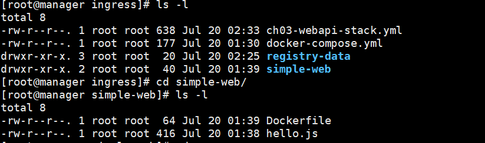
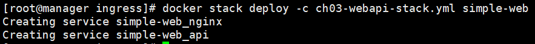
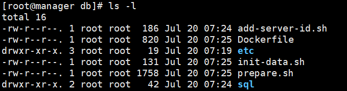
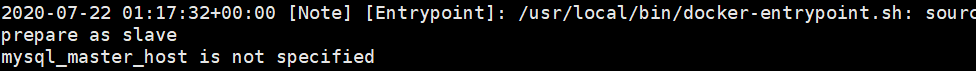
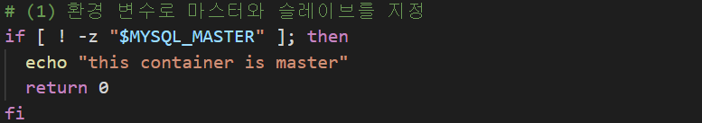
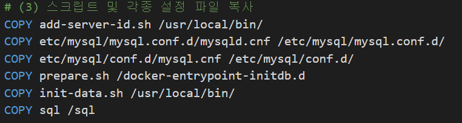
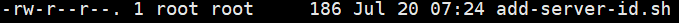
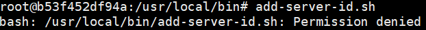
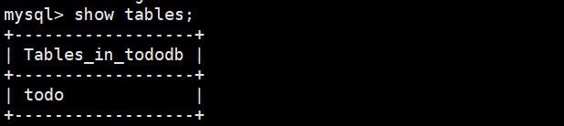

# Docker

## STACK

하나 이상의 서비스를 그룹으로 묶은 단위

briget network : 하나의 호스트에서만 작동하는 네트워크

overlay network : 여러 호스트 사이에서 작동하는 네트워크, 스택을 사용해 배포된 서비스 그룹이 여기에 속함

<br/>

### overlay network 생성

```powershell
$ docker network create --driver=overlay --attachable ch03 # ch03이라는 overlay network 생성
```

기존에 있던 registry 삭제하고 yml 실행

```powershell
$ docker service rm my-nginx # 레지스트리 삭제(이름이 중복됨)
$ mkdir ingress
$ cd ingress
$ mkdir simple-web
```

만든 simple-web에서 다음 파일 생성

```powershell
$ vi Dockerfile #아래 내용

FROM node:slim

EXPOSE 8000

COPY hello.js .

CMD node hello.js


$ vi hello.js # 아래 내용

var http = require('http');
var os = require("os");
var hostname = os.hostname();

var content = function(req, resp) {
 var ip = req.headers['x-forwarded-for'] ||
     req.connection.remoteAddress ||
     req.socket.remoteAddress ||
     req.connection.socket.remoteAddress;

 resp.end("Hello Docker and Swarm - " + ip + ", " + hostname); 
 resp.writeHead(200);
}
var w = http.createServer(content);
w.listen(8000);
```

ingress로 와서 파일 생성

```powershell
$ docker-compose.yml

version: "3"
services:
  registry:
    container_name: registry
    image: registry:latest
    ports:
      - 5000:5000
    volumes:
      - "./registry-data:/var/lib/registry"


$ vi ch03-webapi-stack.yml

version: "3"
services:
    nginx:
        image: gihyodocker/nginx-proxy
        deploy:
            replicas: 3 # 레플리카 수
            placement: 
                constraints: [node.role != manager] # 매니저가 아닌곳에 설치하겠다
        environment: 
            BACKEND_HOST: simple-web_api:8000 # 앞에 있는게 우리가 만들 서비스 이름, simple-web은 스택이름 api는 서비스이름이다. 뒤엔 실행될 포트번호
        depends_on:
            - api   # api가 실행되어야 nginx를 실행하겠다는 의미
        networks:
            - ch03
        ports:
            - 80:80
    api:
        image: manager:5000/example/simple-web:latest   # api라는 서비스는 이 이미지를 갖고 만들어짐            
        deploy:
            replicas: 3
            placement:
                constraints: [node.role != manager]
        networks:
            - ch03
networks:
    ch03:
        external: true
```

현재 갖고있는 파일 및 폴더



이미지 생성, 레지스트리 등록

```powershell
$ docker build -t simple-web:latest . # 도커파일 기반 이미지 생성
$ docker tag simple-web manager:5000/example/simple-web # example/simple-web 기반localhost:5000/example/simple-web 라는 이름의 이미지 생성
$ docker push manager:5000/example/simple-web # 레지스트리에 등록
```

스택 생성

```powershell
$ docker stack deploy -c ch03-webapi-stack.yml simple-web
```

스택이름(simple-web) + 이름(nginx, api)으로 서비스가 만들어지는 것을 확인할 수 있다



```powershell
$ docker stack ls # 서비스 목록 보기
$ docker stack services simple-web # 서비스별 확인
$ docker stack ps simple-web # 이름으로 상세확인
$ docker service ps simple-web_ # 서비스별 이름으로 확인
```

이중화 테스트

```powershell
$ curl -X GET http://192.168.56.13:80 # 실행할 때마다 node1~3에 있는 적당한 리소스를 찾아 할당해주는 것을 확인할 수 있다
```

### Visualizer 설치

```powershell
# ingress에서
$ vi visualizer.yml

version: "3"

services:
  app:
    image: dockersamples/visualizer
    ports:
      - "9000:8080"		# 9000 들어오면 8080으로 리턴
    volumes:
      - /var/run/docker.sock:/var/run/docker.sock
    deploy:
      mode: global
      placement:
        constraints: [node.role == manager]	# 매니저에 설치하라는 뜻
        
$ docker stack deploy -c visualizer.yml visualizer # visualizer 스택 생성 [파일이름] [만들이름]
```

### 이제 [localhost:49000](http://localhost:49000)에 접속하면 비주얼라이저 확인 가능

---

### 문제

```dockerfile
FROM ubuntu:latest
RUN apt-get update && apt-get install -y -q nginx
COPY index.html /usr/share/nginx/html/
CMD ["nginx", "-g", "daemon off;"]
```

1. 위 dockerfile을 이미지화 하고, private registry(my-web)에 업로드(push)

2. docker swarm에 배포

   replicas 4개로 해서 배포

   모든 my-web은 nginx-proxy를 통해 접속되도록 수정

   my-web서비스는 replicas 4개

   nginx-proxy 서비스는 replicas 2개

풀이, private repository니까 node1~3에서 이미지 빌드하거나 manager에서 하거나 상관없음

```powershell
$ docker build -t test .
$ docker tag test manager:5000/example/test
$ vi ch03-webapi-stack.yml

version: "3"
services:
    nginx:
        image: gihyodocker/nginx-proxy
        deploy:
            replicas: 2 # 레플리카 수
            placement: 
                constraints: [node.role != manager] # 매니저가 아닌곳에 설치하겠다
        environment: 
            BACKEND_HOST: test_my-web:80 # 앞에 있는게 우리가 만들 서비스 이름, simple-web은 스택이름 api는 서비스이름이다. 뒤엔 실행될 포트번호
        depends_on:
            - my-web   # api가 실행되어야 nginx를 실행하겠다는 의미
        networks:
            - ch03
        ports:
            - 80:80
    my-web:
        image: manager:5000/example/test:latest   # api라는 서비스는 이 이미지를 갖고 만들어짐            
        deploy:
            replicas: 4
            placement:
                constraints: [node.role != manager]
        networks:
            - ch03
networks:
    ch03:
        external: true
        
$ docker push manager:5000/example/test
```

---

## Swarm을 이용한 실전 애플리케이션 개발

manager에서

```powershell
$ yum install -y tree # 설치하면 현재디렉토리 아래 속한 트리 나옴
$ tree
.
├── etc
│   └── mysql
│       ├── conf.d
│       └── mysql.conf.d
└── sql
```

이제 깃에서 받은 tododb 디렉토리 밑의 내용을 모두 복사한다



todo-mysql.yml파일을 바꿔준다

```yml
todo-mysql.yml
version: "3"

services:
  master:
    image: registry:5000/ch04/tododb:latest
    deploy:
      replicas: 1
      placement:
        constraints: [node.role != manager]
    environment:
      MYSQL_ROOT_PASSWORD: gihyo 
      MYSQL_DATABASE: tododb 
      MYSQL_USER: gihyo 
      MYSQL_PASSWORD: gihyo 
      MYSQL_MASTER: "true"
    networks:
      - todoapp

networks:
  todoapp:
    external: true
```

빌드 및 푸시

```powershell
$ docker build -t tododb .
$ docker push manager:5000/example/tododb
$ curl -X GET http://manager:5000/v2/_catalog
$ docker network create --driver=overlay --attachable todoapp
$ docker stack deploy -c todo-mysql.yml todo-mysql

# 근데 에러가 발생한다
$ docker service logs [컨테이너ID] # 오류로그 확인

todo-mysql_master.1.e6aoqpodxskl@node3    | !! exec: "add-server-id.sh": executable file not found in $PATH # 파일을 찾을 수 없다고 뜸

>> 이미지를 직접 실행시켜보자

# 역시 에러가 발생한다. Dockerfile의 entryPoint 부분을 주석으로 막고 다시 빌드
$ docker build --no-cache -t tododb . # --no-cache는 캐시 삭제, 즉 이전 빌드에서 생성된 캐시를 사용하지 않음. Docker는 이미지 생성 시간을 줄이기 위해서 Dockerfile의 각 과정을 캐시하는데, 이 캐시를 사용하지 않고 처음부터 다시 이미지를 생성.

$ docker tag tododb manager:5000/example/tododb # 태그 붙이고
$ docker push manager:5000/example/tododb # 레지에 푸시

# 또 에러발생하면 로그 확인하고 mysqld.conf 맨 밑에 다음 내용 추가
server-id=1

# 다시 위 build 명령어 실행하고 run
$ docker run -d -p 3306:3306 -e MYSQL_ALLOW_EMPTY_PASSWORD=true manager:5000/example/tododb
```


그럼 또 에러뜸



마스터를 찾을 수 없다고 뜬다. prepare.sh 파일에 나타나있는 것처럼



MYSQL_MASTER를 true로 바꿔줘야 한다

```powershell
$ docker run -d -p 3306:3306 -e MYSQL_MASTER=true -e MYSQL_ALLOW_EMPTY_PASSWORD=true manager:5000/example/tododb
```

이제 mysql이 올라가긴했다 그럼 뭐가 문제였을까?

다음 도커파일 내용을 보자



먼저 add-server-id.sh가 복사되는 파일 경로를 살펴보자

```powershell
$ docker exec -it [mysql 컨테이너 ID] bash # mysql 배시 접속
root@b53f452df94a:/usr/local/bin$ ls -l # add-server-id.sh 파일을 확인해보면
```





다음과 같이 권한이 없는 것을 알 수 있다

마찬가지로 다른 파일들 역시 권한이 없을 것이다.  다시 manager로 돌아와서 권한 추가해주자

```powershell
$ chmod +x add-server-id.sh
$ chmod +x init-data.sh 
$ chmod +x prepare.sh
```

그리고 mysql 실행을 위해 임의로 설정했던 서버id를 해제한다

```powershell
mysqld.conf에서
#servser-id=1 주석처리한다

Dockerfile
# entrypoint부분 주석처리 모두 해제해준다
```

todo-mysql.yml에 슬레이브 추가해준다

```yml
# master랑 들여쓰기 맞춰야함!!
  slave:
    image: manager:5000/example/tododb:latest
    deploy:
      replicas: 2
      placement:
        constraints: [node.role != manager]
    depends_on:
      - master
    environment:
      MYSQL_MASTER_HOST: master
      MYSQL_ROOT_PASSWORD: gihyo 
      MYSQL_DATABASE: tododb 
      MYSQL_USER: gihyo 
      MYSQL_PASSWORD: gihyo 
      MYSQL_ROOT_PASSWORD: gihyo 
      MYSQL_REPL_USER: repl 
      MYSQL_REPL_PASSWORD: gihyo 
    networks:
      - todoapp
```

다시 빌드하고 푸시해준다. 그리고 마스터 노드 찾아내 접속

```powershell
$ docker exec -it [컨테이너ID] bash
root@296f74136813:/$ init-data.sh # 불러올 테이블 실행
root@296f74136813:/$ mysql -uroot -p # 비밀번호 gihyo
```

이제 tododb라는 테이블이 마스터노드 뿐만 아니라 슬레이브에서도 보이는 것을 확인할 수 있다(연동됨)

- 마스터



- 슬레이브

