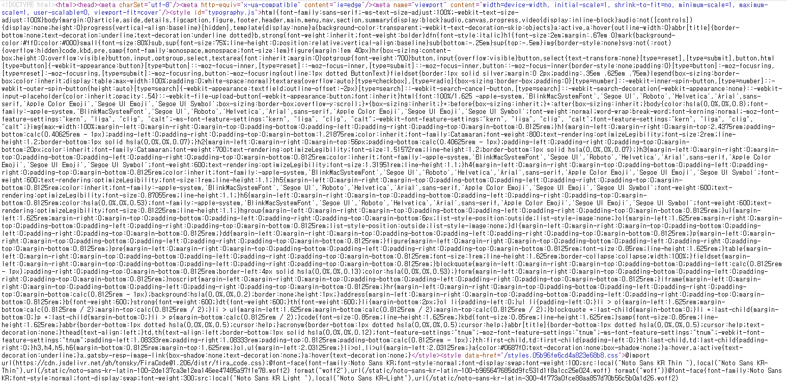

앞에서 만든 Gatsby 정적사이트를 Netlify를 통해 배포하는 과정이다.

### Git add, commit, push

먼저 [여기]()를 참고하여 Github repository를 생성해준다.

### Netlify 에 배포하기

먼저 Netlify에 가입한다.

https://netlify.com

 

`New site from Git`을 눌러 새 사이트를 배포하자.

 

단 3개의 과정으로 정적사이트를 배포 할 수 있다.

git provider와 연결하고

 

배포 할 repository 를 선택한 후

 

빌드옵션을 세팅하고 배포하면 된다. 이제 터미널, powershell에서 build 명령어 입력하고(여기서는 gatsby build) git repository에 push하면 netlify가 감지하고 자동으로 배포해준다.  

 

여기서 의문이 생겼는데, gatsby build는 왜 해줄까? gatsby docs에 다음과 같이 나와있다. 쉽게 말해서 컨텐츠를 각 페이지의 정보를 하나에 모아 배포하여 따로 서버가 필요하지 않게 된다는 것이다. 또한 페이지 내에 모든 컨텐츠가 있으니 검색엔지에 노출되기 쉬운 장점도 있다.

 

따라서 gatsby로 만든 페이지소스를 보면 `실전압축` 되어있다.

 

아무튼 build하고 repository에 push 해주자.

 

S3에도 정적사이트를 배포하는 기능이 있지만, 버킷도 만들어야 하고 권한도 설정해야 하고 HTTPS 인증도 받아야 하고 캐싱을 위한 CloudFront 설정도 해야한다. Netlify 는 이런 번거로운 과정을 생략하고 배포할수 있어서 굉장히 편했다.

배포 성공

 

본인만의 도메인이 없다면, 본인이 설정한 이름 + netlify.app 이 도메인이 된다.

 

이제 배포된 사이트에 접속해보자

 

이제 할 일은?

본인의 블로그를 꾸며주면 된다!