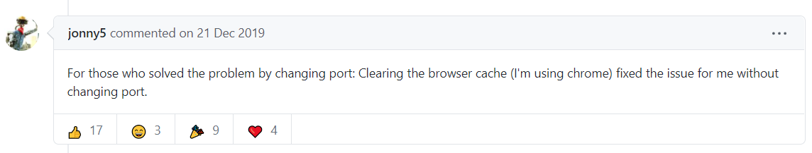

로컬에 빌드하는데 자꾸 다음과 같은 에러가 발생했다.

이 에러를 시작으로


<br/>

이 에러도 뜨고


<br/>

이 에러도 뜨고...


<br/>


스오플에서 다음과 같은 해결책을 발견했다.

1. 먼저 VScode를 종료하고 powershell을 관리자권한으로 실행한다.
2. 캐시를 정리하고 관리자권한으로 npm을 설치 후 다시 캐시를 삭제한다.

```powershell
npm cache clean --force

npm install -g npm@latest --force

npm cache clean --force
```

<br/>

번외) 겸사겸사 이런 에러도 발생했다. 제목에 사용한 콜론 때문에 매핑에러가 발생한듯하다.


<br/>

타이틀에 콜론을 지워 해결하였다.


<br/>

추가) 같은 repo가 집 PC에서는 되고 노트북에서는 안 되는 이상한 일이 계속 발생했다. 포트를 변경하니 해결되었다. 다만 포트 변경이 근본적인  해결책이 아니다. 근본적인 원인은 크롬에서 캐시가 충돌해서 발생한 문제였다. 크롬 캐시를 삭제해주면 된다.



