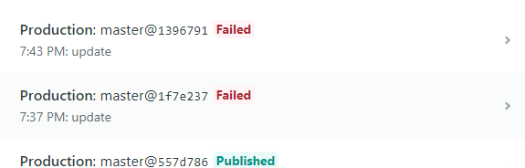
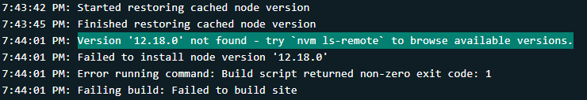
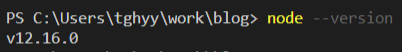
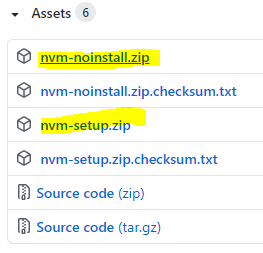
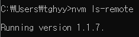
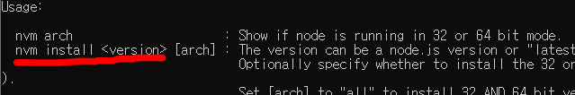
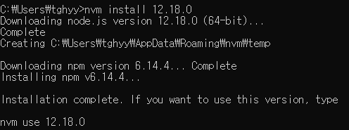
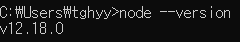

Netlify 배포하는 과정에서 실패를 하였다

사건의 전말은 이렇다.

1. Netlify에서 어제까지만 해도 잘 되던 배포가 fail이 떳다.
2. Version '12.18.0' not found. Failed to install node version. 라는 내용의 에러가 떳다.
3. 내 node 버전이 12.16.0.이라 떠서 버전을 변경해줘야하는줄 알았다.
4. 버전을 변경해줘도 fail이 떴고, Netlify 커뮤니티를 가보니 나와 같은 증상을 호소하는 환자들이 많았다.
5. 네트워크 제공업체의 문제라는 공지가 올라왔다. 아마 CloudFlare 문제인듯싶다.
6. gatsby를 사용 하다가 에러 떴으니 그냥 gatsby 카테고리에 넣어야겠다.

 

에러 내용은 다음과 같았다.  Version '12.18.0' not found. Failed to install node version.

 

왜 찾을수 없지? 내 node 버전을 확인해봤다.

 

알 수 없는 이유로 변경되어있었다...(뭐지...). 일단 버전을 업그레이드 해주자.

위에 뜬 에러 내용대로 nvm ls-remote를 실행했지만 안 먹혔다. nvm을 설치해줘야 할 것 같다.

Windows 환경일 경우 [여기](https://github.com/coreybutler/nvm-windows/releases)서 다운로드 가능하다. zip 파일 안에 .exe만 실행하면 따로 환경설정을 해줘야하는 것 같다. 귀찮아서 setup까지 같이 받아 실행했다.

 

다시 확인해보면 설치된 것을 확인할 수 있다.

 

다음과 같이 사용하는 것 같다.

 

굿

 

이제 명령어 하나로 12.16.0 버전을 12.18.0버전으로 변경할 수 있다(반대도 가능).

당연한 얘기지만 내 문제가 아니었기에 배포는 fail이 떴다. 아마 시간이 조금 지나면 개발팀이 빠르게 복구하겠지.