이런 저런 삽질 끝에 설치하였다.. EC2를 실행하고 어떠한 작업도 안 한 상태라 가정하겠다. Docker 이미지로 올리는 방법도 있지만 여기서는 직접 설치하는 방법으로 해보겠다.

<br/>

### 1. 먼저 터미널에 접속한다.

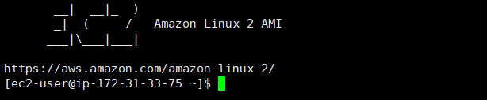

<br/>

### 2. sudo 치기 귀찮으므로 root로 변경

```
sudo su
```

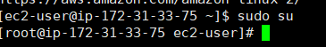

<br/>

### 3. 패키지 업데이트

```
yum update -y
```

<br/>

### 4. 자바 패키지 설치

```
yum -y install java-1.8.0-openjdk
```

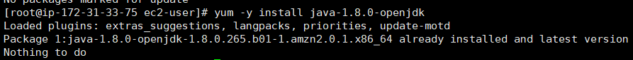

<br/>

이미 설치가 돼 있다고 뜬다. 잘 되었나 버전한번 확인해보자

```
java -version
```

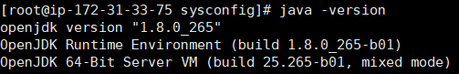

<br/>

### 5. 자바 환경변수 설정

참고로 `java-1.8.0-openjdk-1.8.0.265.b01-1.amzn2.0.1.x86_64` 이 부분은 본인의 버전에 맞게 작성해줘야한다.

```
JAVA_HOME=/usr/lib/jvm/java-1.8.0-openjdk-1.8.0.265.b01-1.amzn2.0.1.x86_64/jre/bin/java
```

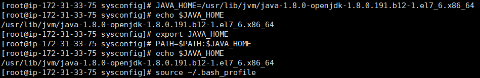

<br/>

### 6. 젠킨스 설치

먼저 Repository를 다운로드하고

```
wget -O /etc/yum.repos.d/jenkins.repo https://pkg.jenkins.io/redhat-stable/jenkins.repo
```

<br/>

키파일을 가져와 설치해주자

```
rpm --import https://pkg.jenkins.io/redhat-stable/jenkins.io.key
```

<br/>

그리고 젠킨스 설치

```
yum -y install jenkins
```

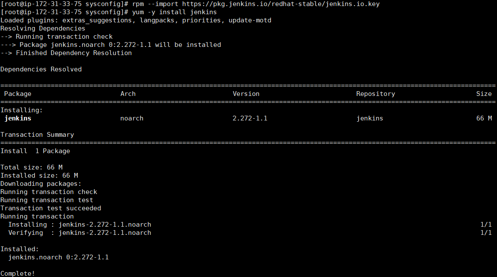

<br/>

### 7. 젠킨스 실행 및 확인

active(running)가 뜨면 정상적으로 실행되는 것이다.

```
systemctl start jenkins
systemctl status jenkins
```

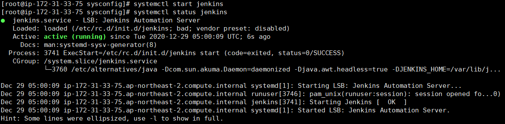

<br/>

### 설치는 되었고 접속해보자

방금 만든 EC2의 보안그룹이 디폴트이기 때문에 웹에서 접속이 안 된다. 아래와 같이 8080포트의 인바운드 규칙에 내 IP를 허용하였다. 참고로 8080포트가 젠킨스의 디폴트 포트번호.

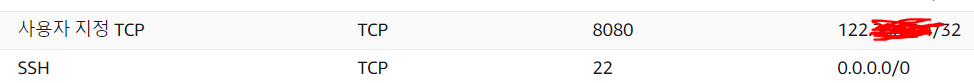

<br/>

`퍼블릭 IP:포트번호`로 본인의 젠킨스에 접속해보자.


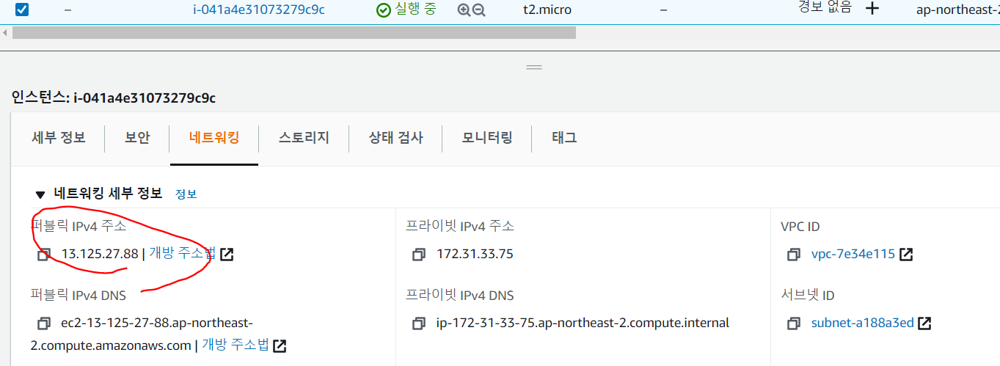

<br/>

붉은 글씨 경로 파일에 들어있는 패스워드를 입력해주자.

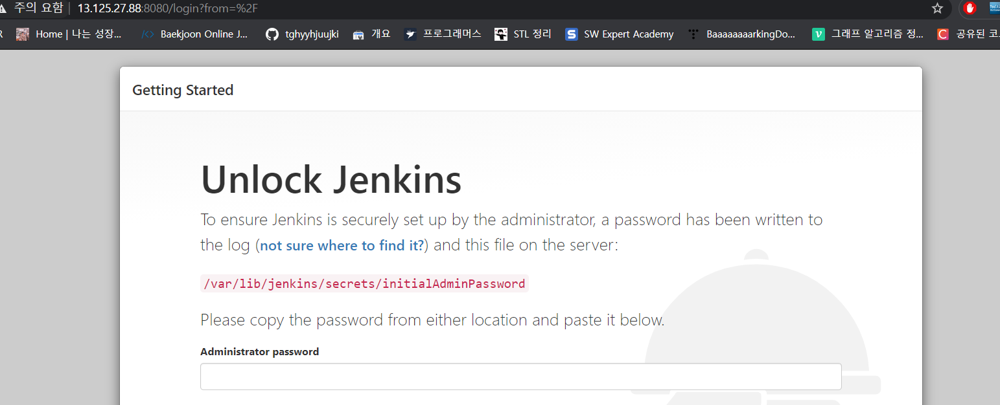

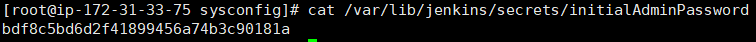

<br/>

기본적인 플러그인을 설치해주자.

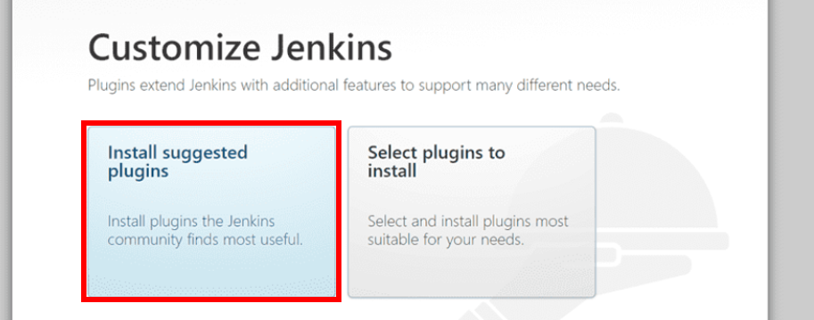

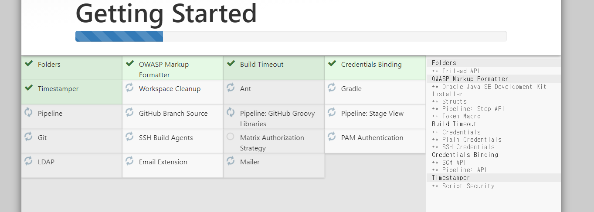<br/>

계정을 만들어주고 접속!

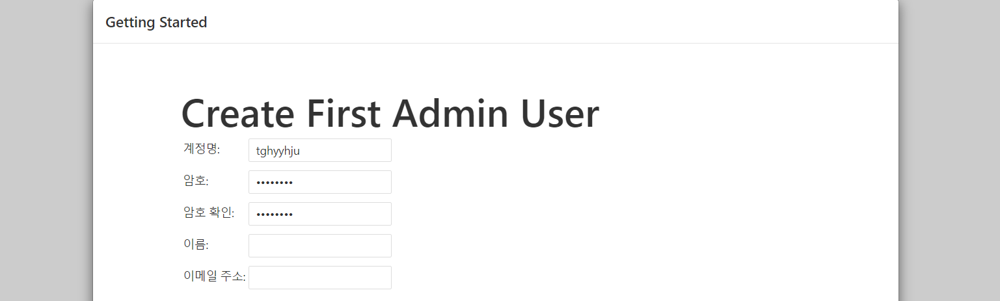

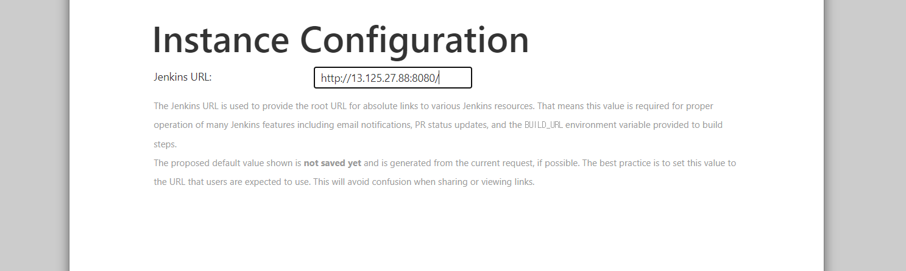

<br/>

굿!

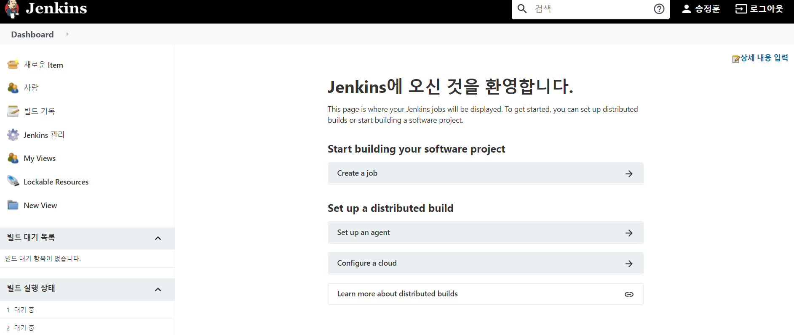