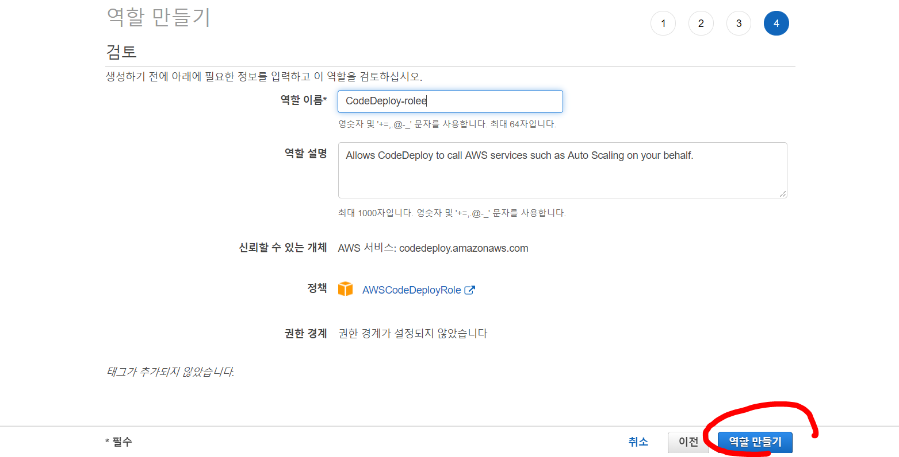
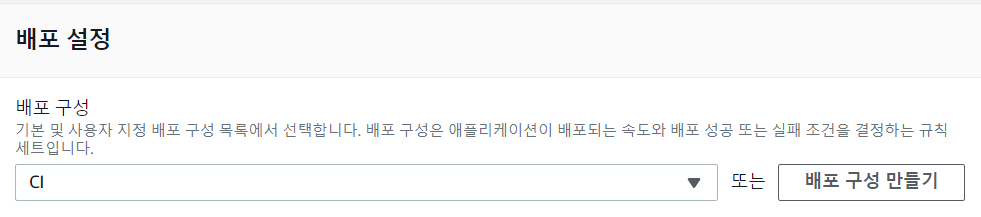

---

title: Jenkins) AWS Codeploy와 S3, Github를 이용해 Jenkins CI 구축하기(1)
date: 2020-12-29 17:21:22
category: Jenkins
draft: false
---

### 개발환경

Spring boot 2.4.1

Gradle

Jenkins

AWS EC2, S3, CodeDeploy, ALB

<br/>

[이전 포스트](https://jeonghoon.netlify.app/Jenkins/aws_jenkins/)에서 젠킨스 서버를 구축하였다. 이 젠킨슨서버와 S3, Codeploy, Github를 활용해 다음과 같은 CI 파이프라인을 구축하는 것이 목표이다.


<br/>

### Jenkins 서버

기존에 생성한 젠킨스 서버에 CodeDeploy 플러그인만 따로 설치해주자. 


<br/>

### App Server 역할생성

먼저 CodeDeploy와 S3에 접근가능한 권한을 만들어주자.  IAM > 역할 > 역할만들기에서 EC2를 선택 후


<br/>

두 가지 정책을 선택 후 역할을 생성해준다.


<br/>

### App Server 생성

새로운 EC2를 만들고 자바를 실행하기 위한 `JDK`, Code Deploy와의 연동을 위한 `codedeploy agent`를 설치해야한다.

두개의 App Server를 다른 서브넷 안에 둬야 가용성이 향상된다. 인스턴스 생성시 아래와 같이 두개의 인스턴스에 서로 다른 서브넷을 선택 후 위에서 만든 IAM역할을 부여하자.


<br/>

보안그룹은 AppServer라는이름으로 생성했다. 두번째 인스턴스도 얘를 선택하면 된다.


EC2 생성 후 터미널로 넘어가서, 편의를 위해 root로 변경하고 혹시몰라 업데이트를 해줬다.

```
sudo su
yum -y update
```

<br/>

JDK11 설치

```
rpm --import https://yum.corretto.aws/corretto.key 
curl -L -o /etc/yum.repos.d/corretto.repo https://yum.corretto.aws/corretto.repo
yum install -y java-11-amazon-corretto-devel
```


<br/>

Code Deploy Agent 설치

```
yum install -y ruby
curl -O https://aws-codedeploy-us-east-2.s3.us-east-2.amazonaws.com/latest/install
chmod +x ./install
./install auto
```

<br/>

설치가 되면 다음과 같이 codedeploy-agent 가 서비스 목록에 있는 것을 확인할 수 있다.

```
systemctl list-units --type=service
```


<br/>

이와 같은 방법으로 인스턴스 하나 더 만들자. 이미지를 복사해도 되고, 그냥 새로 만들어도 된다. 생성 후 CI-AppServer1,2라고 태그를 달았다.


<br/>

### Load Balancer 생성

EC2 > 로드밸런서 > 로드밸런서 생성을 클릭하자.


<br/>

ALB를 선택하고


<br/>

인스턴스를 만들었던 가용영역을 선택한다.


<br/>

기존에 만들었던 보안그룹을 선택한다.


<br/>

대상그룹을 생성하고


<br/>

앱서버 두개를 선택해준다.


<br/>

<br/>

### CodeDeploy 생성

CodeDeploy 항목으로 이동하여 배포구성을 만들어준다.


<br/>

배포구성 최소값을 1로 설정하고 생성.


<br/>

그리고 애플리케이션을 생성해준다


<br/>

배포 전 CodeDeploy역할을 만든다. IAM > 역할 > 역할만들기




<br/>

배포그룹을 생성해준다


<br/>

위에서 만든 배포를 선택한다



<br/>

위에서 만든 대상그룹을 선택한다.


<br/>

지금까지 EC2와 CodeDeploy의 틀만 만들었다. 다음 포스트에서 Github 및 S3, SpringBoot 애플리캐이션까지 다뤄보겠다. 

