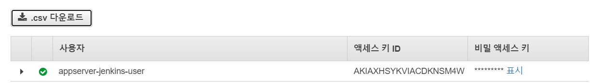
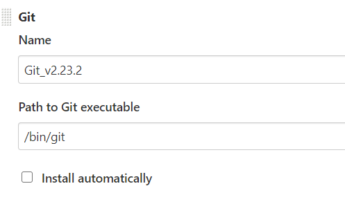
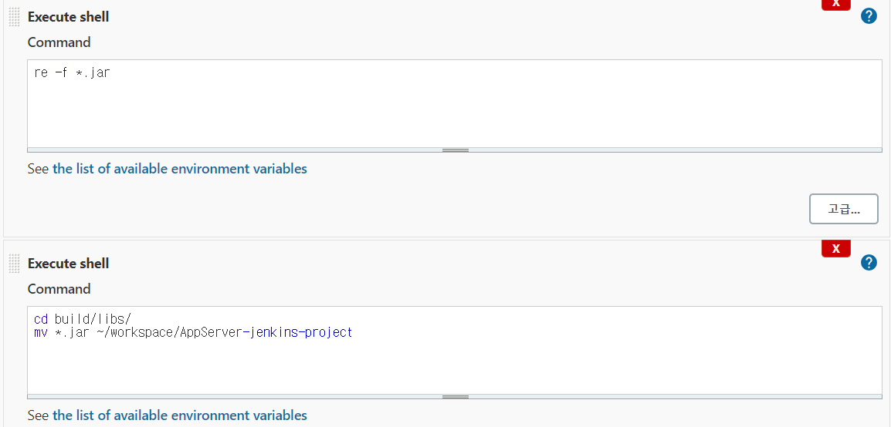
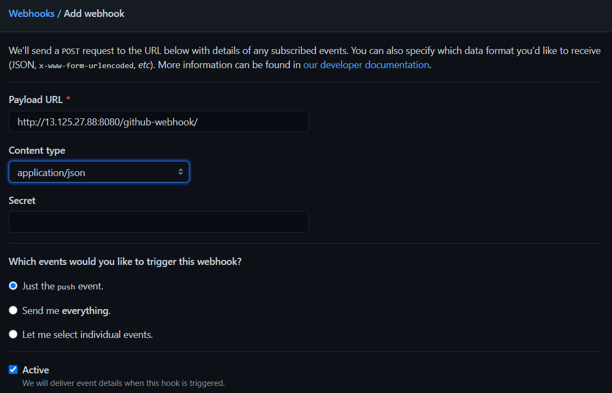
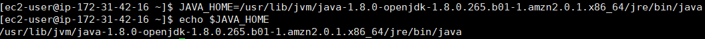

---

title: Jenkins) AWS Codeploy와 S3, Github를 이용해 Jenkins CI 구축하기(2)
date: 2020-12-30 09:21:22
category: Jenkins
draft: false
---


### 개발환경

Spring boot 2.4.1

Gradle

Jenkins

AWS EC2, S3, CodeDeploy, ALB

<br/>

[지난 포스트](https://jeonghoon.netlify.app/Jenkins/jenkins-codedeploy/)에서 구축한 서버들을 토대로 CI를 구축해보겠다. 붉은 네모의 내용을 구축하고 전체적으로 연동테스트를 진행한다.


<br/>

### GitHub Repository

파이프라인을 보면, 처음 단계가 GitHub에 커밋하는 것이다. Github 레파지토리가 필요한데, 나는 기존에 공부용으로 사용하던 Spring boot 앱서버를 가져왔다.

<br/>

### App 서버 수정

Spring boot 프로젝트에 몇가지 추가를 해야한다. 먼저 루트에 appspec.yml파일을 만들어준다. 그리고 ec2 내부에서 실행될 shell 파일을 만들어준다. 


<br/>

appspec.yml 을 만들어준다. 각각의 파일을 훅하는 기능을 갖는다.

```yaml
version: 0.0
os: linux

files:
  - source: /
    destination: /home/ec2-user

hooks:
  ApplicationStop:
    - location: Scripts/kill_process.sh

  BeforeInstall:
    - location: Scripts/remove_before.sh

  ApplicationStart:
    - location: Scripts/run_process.sh
```

<br/>

kill_process.sh 은 기존의 실행되던 jar를 죽인다.

```sh
#! /bin/bash
sudo pkill -f 'java -jar'
```

<br/>

remove_before.sh 은 이전 배포에서 생성된 파일을 제거한다.

```sh
#! /bin/bash
find /opt/codedeploy-agent/deployment-root/deployment-instructions/* -maxdepth 0 -type 'd' | grep -v
$(stat -c '%Y:%n' /opt/codedeploy-agent/deployment-root/deployment-instructions/* | sort -t: -n | tail -1 | cut -d: -f2- | cut -c 3-) | xargs rm -rf
sudo rm -rf /home/ec2-user/*
```

<br/>

run_process.sh 은 배포한 jar를 실행한다.

```sh
#! /bin/bash
cd /home/ec2-user
sudo java -jar *.jar > /dev/null 2> /dev/null < /dev/null &
```

<br/>

### S3 생성 및 IAM 사용자 생성

S3버킷은 디폴트로 간단하게 생성해주고,


<br/>

IAM으로 가서 사용자를 생성해준다. 여기서 `프로그래밍방식 액세스`에 체크해준다.


<br/>

그리고 S3와 CodeDeploy의 모든 접근 권한을 부여한다.


<br/>

사용자를 생성하면 액세스키 ID와 비밀액세스키를 확인할 수 있다. 생성할 때에만 확인 가능하므로 .csv파일을 다운받아놓거나 따로 적어놓는 것이 좋다.



<br/>

### Jenkins 프로젝트 생성

어느정도 준비가 되었고, 젠킨스 프로젝트를 생성해보자.


<br/>

깃 주소를 넣는데 다음과 같은 에러가 발생했다.


<br/>

생각해보니 젠킨스 서버에 Git 설치를 안했다. ec2 젠킨스 서버 터미널에서 git을 다운받아주자.

```
yum install git
```


<br/>

그 다음 젠킨스에서 Jenkins 관리 > Global Tool Configuration > Git 으로 이동해서 git.exe가 있는 경로를 입력해줘야한다.



<br/>

에러가 사라졌다. 그리고 Add > Jenkins를 눌러서 계정을 등록해주자.


<br/>

이어서 옵션들을 선택해준다. GitHub hook trigger for GITScm polling를 체크해주자. 훅을 사용할 거다.


<br/>

빌드 탭에서 Invoke Gradle script를 선택한다. Use Gradle Wrapper, Make gradlew executeble에 체크하고 Wrapper location에 ${workspace}, Tasks에 bootJar를 입력해 jar파일을 생성할 명령어를 입력해준다.


<br/>

마찬가지로 Execute shell을 추가하여 두개의 명령 쉘을 추가했다. 

기존 jar파일 제거

```
re -f *.jar
```

생성된 jar파일을 옮김

```
cd build/libs/
mv *.jar ~/workspace/AppServer-jenkins-project
```



<br/>

빌드 후 조치에서 Deploy an application to AWS CodeDeploy 선택하고,


<br/>

다음과 같이 S3, CodeDeploy, 리전정보를 입력해준다. Include Files에서 번들링 할 파일을 선택한다.

```
*.jar, appspec.yml, Scripts/*
```


<br/>

마지막으로 Use Access/Secret keys를 선택하고 IAM 계정을 생성하고 나온 ID와 시크릿키를 입력해준다. 그리고 설정하고 저장.


<br/>

### GitHub Webhook 설정하기

본인의 레파지토리의 Settings > Webhooks > Add webhook으로 웹훅을 생성해준다.


<br/>

본인이 실행중인 젠킨스의 도메인:포트번호/github-webhook/ 을 URL에 입력하고 application/json을 선택해준다.



<br/>

하면 연결이 되어야 하는데.. 계속 502 배드게이트가 떴다ㅎㅎㅎㅎㅎ


<br/>

여러번의 삽질 끝에 EC2의 보안그룹에서 포트개방 문제임을 깨달았다.


<br/>

이제 정상적으로 작동하는 것을 확인할 수 있다.


<br/>

### 연동 테스트

이제 푸시하여 정상적으로 작동되는지 확인해보자.

<br/>

커밋과 동시에 젠킨스 서버에서 빌드가 진행중인 게 보이는데,


<br/>

문제가 있어 보인다..ㅎㅎ


<br/>

데몬이 충돌? 하는 에러가 떠서 해결 하다가 잘못만졌고, 밀고 서버를 재구축했는데, 아래와 같은 에러가 또 발생했다. compileJava 부터 통과를 못한다.

```
Could not find tools.jar. Please check that /usr/lib/jvm/java-1.8.0-openjdk-1.8.0.265.b01-1.amzn2.0.1.x86_64/jre contains a valid JDK installation.
```


<br/>

위에서 tools.jar를 찾지 못한다는 메세지가 떴다. 자바는 멀쩡하게 설치되어 있는 걸 보니 환경변수가 잘못된 지점을 가리키고 있는 것 같다.


<br/>

환경변수를 재설정하고

```
JAVA_HOME=/usr/lib/jvm/java-1.8.0-openjdk-1.8.0.265.b01-1.amzn2.0.1.x86_64/jre/bin/java
echo $JAVA_HOME
```



<br/>

실행하였더니 일단 compoileJava는 통과했다. 쉘스크립트에서 에러가 떴는데, 다시보니 rm이 re로 오타가 있었다.


<br/>

오타를 수정했더니 드디어 Success가 떴다. 젠킨스 서버의 workspace를 확인해보니Github에 올렸던 파일들이 고스란히 올라와있었다.


<br/>

그리고 S3를 확인해보니 집파일도 올라왔다.


<br/>

하지만 CodeDeploy에 배포는 실패했다. 한 번에 될리가 없지.


<br/>

로그를 확인해보니 알수없는 운영체제라고 떴다. lunux...ㅋㅋㅋㅋ


<br/>

appspec.yml에 오타가 있었고 linux로 바꿔줬다.


<br/>

드디어 배포에 성공했고, 로드밸런서의 DNS로 접속해주면 배포한 앱서버의 내용이 나온다!


