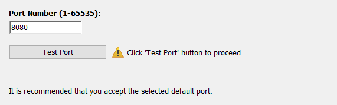

---

title: Jenkins) Window10에서 Jenkins 설치 및 환경설정
date: 2020-12-29 09:21:22
category: Jenkins
draft: false
---

## Jenkins 설치 및 환경설정

### 설치환경

Window10

 

### Jenkins 설치

https://www.jenkins.io/download/에서 윈도10에 맞는 젠킨스를 선택해 설치한다.

설치 과정에서 젠킨스를 실행할 포트를 선택해주어야하는데, 나는 8000이 블로그, 스프링부트가 8088이므로 8080으로 해도 문제 없었다. Travis CI와 달리 젠킨스는 내가 직접 서버를 운영하는 것 같았다.

 

설치가 되면 자동으로 웹에서 실행이 된다. 만약 처음에 아래와 같은 에러가 뜬다면, 붉은 글씨로 표시된 경로에 저장된 비밀번호를 입력해야한다. 난 내가원하는 비밀번호를 설정하는 줄 알고 파일 자체를 변경했다가 다시 설치하는 불상사가 발생했다(...)

 

기본적으로 제공하는 플러그인을 설치하였다.

 

설치가 되면 바로 계정생성하는 창에 뜬다.

 

정상적으로 설치가 되었다!

