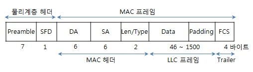

## OSI  1계층

케이블이 연결되어 있는 기기에 신호를 전달하는 것이 1계층의 역할

통신매체에는 유선과 무선이 있고 유선에는 동선 UTP와 광파이버가 있음

 

### NIC(network interface card)

LAN용 케이블에 접속하기 위한 인터페이스

### DEC(data circuit terminating equipment)

WAN을 처리할 때 사용. PC가 DEC로 신호를 보내면 WAN에 맞는신호로 변환

 

### 신호와 충돌

신호에 발생하는 문제점

1. **신호의 감쇠**.긴 케이블을 지나는 동안 신호가 약해짐
2. **노이즈, 간섭**. 고온의 물체 옆이나 근처에 케이블이 있는 경우
3. 신호가 가는 도중에 다른 신호와의 **충돌**. 해결법은 아래 2계층에서 설명

 

### 허브

허브에 케이블로 연결되어 있는 기기는 동일 케이블에 연결되어 있는 것과 같은 취급을 받음. 허브에 연결된 기기끼리 통신이 가능하며, 따라서 여러개의 허브를 연결해 네트워크를 구축할 수 있다.

 

### 플러딩

허브에서 수신한 포트 이외의 모든 포트에 수신한 신호를 송신하는 것. 

 

### 충돌도메인

플러딩을 하면서 허브에 연결된 기기끼리 충돌이 발생할 수 있다. 이 범위를 충돌 도메인이라고 한다. 이 충돌도메인을 줄이는 역할을 **스위치**가 담당함.

 

 

## 2계층 : 데이터링크 계층

인접기기 사이에서 데이터전송을 제어한다. 위에서 언급한 것처럼 데이터를 전송하면 충돌이 발생한다. 이 충돌을 막기 위해 신호의 송신 전이나 수신 후에 바르게 데이터를 송수신하는 순서가 필요하게 되었다. 신호가 닿는 범위(세그먼트:케이블 분배기로 연결되는 범위)에서의 데이터 전송에 관해 2계층에서 처리한다.

1계층에서 LAN이나 WAN을 사용하는 것에 따라 2계층에서 규칙이 달라진다(3계층 부터는 같음). 여기서는 LAN의 표준인 이더넷에 대해 알아보자.

 

일단 프레이밍과 프리엠블에 대해 살펴보자.

### 프레이밍

1계층에서 받은 신호를 비트화해 의미를 갖게 함. 프레임화라고 생각하면 된다.(참고로 프레임은 2계층의 PDU)

 

### 프리엠블(preamble)

'지금부터 프레임이 시작된다' 라는 뜻을 가짐. 비트를 신호화 할 때 일정한 신호의 폭이 존재함. 이것을 제대로 다루기 위해서는 비트를 읽는 타이밍이 송신측과 수신측이 일치해야한다. 안 그러면 수신측이 비트 중간에서 읽기 시작할 수도 있다.

 

### 주소

그럼 2계층의 이더넷에서는 어떻게 신호를 수신할까? **주소** 가지고 규칙을 정할 수 있으며 주소로 데이터 전송방법은 다음과 같이 3가지가 존재한다.

 

### 1. 유니캐스트

- 1:1 데이터 통신
- 각각의 기기는 유니캐스트 주소를 적어도 하나씩 가지고 있음
- 라우터 같은 복수의 인터페이스를 가진 기기는 인터페이스마다 유니캐스트를 가짐. 
- 유니캐스트 주소는 유일

 

### 2. 멀티캐스트 

- 1 : 다수의 데이터통신
- 같은 주소가 여러개 있어도 된다(그룹이라 생각하면 됨)
- 그룹에게 데이터를 전송

 

### 3. 브로드캐스트

- 1 : 전체 데이터 통신. 
- 2계층의 브로드캐스트는 세그먼트 내의 모든기기가 된다.

 

### MAC 주소

이더넷에서 사용되는 주소로, 인터페이스에 지정된 고정주소.(멀티캐스트 그룹에 속해 있는 기기는 유니캐스트와 멀티캐스트 주소 2개를 갖고 있음)

 

### 이더넷

2계층의 LAN에서 적용되는 규칙. 캡슐화 된 프레임 상태에서 MAC주소를 분석하여 데이터가 '누구로부터' '어디로'갈지 결정함. 아래는 이더넷 프레임

 

### FCS(Frame Check Swquence)

에러를 체크하는 이더넷 트레일러. 문제가 생겨서 정확하게 읽을 수 없거나 0과 1을 반대로 읽어버리는 에러를 체크함. 에러가 있는 프레임은 파기되고 송신측에는 알리지 않음.

 

### 이더넷 동작방식

허브는 수신한 포트 이외의 모든 포트를 통해 신호를 송신하는 **플러딩**에 의해 충돌이 발생한다. 멀티액세스 네트워크의 경우, 모든 기기에 데이터가 도달한다. 그래서 이더넷에서 자기에게 온 **MAC주소 이외의 다른 모든 프레임을 파기**한다.

 

### 이더넷은 충돌을 어떻게 해결할까? -> 

### CSMS/CD(Carrier Sense Multiple Accexx/Collision Deetection)로 완화

신호를 보내는 타이밍을 겹치지 않도록 비켜나게 함으로써 되도록 충돌이 일어나지 않게 한다. 여기서 **CSMS/CS라는 액세스제어**를 사용. CS(신호감지)는 누군가가 송신중이라면 송신하지 않고, MA(다중 액세스)는 아무도 송신하고 있지 않다면 송신할 수 있고, CD(충돌 검사)는 송신 후에 충돌이 일어나면 다시 재송신 한다는 의미.

그럼 왜 누군가 송신중인지 체크한 후에 충돌은 왜 일어날까? 동시에 보내는 경우가 있기 때문에 그렇다.

 

### 스위치로 충돌 방지

신호가 지나가는 길을 나누어 충돌을 방지함.그럼 충돌은 어디서 발생할까? 일단 UTP나 공파이버 케이블은 송신신호와 수신신호가 물리적으로 나뉘어있다. 충돌은 허브에서 일어난다. 스위치는 허브처럼 복수의 포트를 가질 수있다. 허브 대신 스위치를 사용하며, 스위치에서는 MAC주소 필터링과 버퍼링으로 충돌을 방지한다.

**또한 스위치를 사용하면 충돌도메인을 줄일 수 있다!**

 

### MAC주소 필터링

학습과 스위칭이라는 동작으로 이루어져있다. 먼저 학습은, 받은 프레임을 보낸 MAC주소를 기록한다. 이렇게 스위치는 포트에 연결되어 있는 컴퓨터의 MAC주소를 기억.  이 테이블을 **어드레스 테이블**이라고 함.

스위칭동작은 프레임의 수신처 MAC주소를보고 프레임을 송신한다. 아무튼 어드레스 테이블이 필요하기 때문에 학습은 처음에 반드시 한 번 일어나야한다.

 

### 버퍼링

각각 다른 기기에서 스위치로 프레임을 보내면 동시에 발생하는 충돌이 생긴다. 이를 방지하기 위해 버퍼링을 사용한다. 버퍼링은 충돌할 것 같은 프레임을 버퍼에 일시적으로 저장한다.

 

### 백프레셔/IEEE802.3x

버퍼가 가득 찼을 때 송신을 중지시킴

 

### 전이중 이더넷

반이중 통신 : 누군가가 송신중일 때는 송신 불가능/ 자기가 송신중일 때는 수신 불가능. 참고로 **CSMA/CD는 반이중 통신**

전이중 통신 : 송신과 수신 동시에 가능 

스위치가 전이중 통신이다. 스위치를 사용하면 CSMA/CD를 사용할 필요가 없고 전송량도 나눌 필요가 없다! 그래서 스위치를 이용한 이더넷이 상용화된 것.