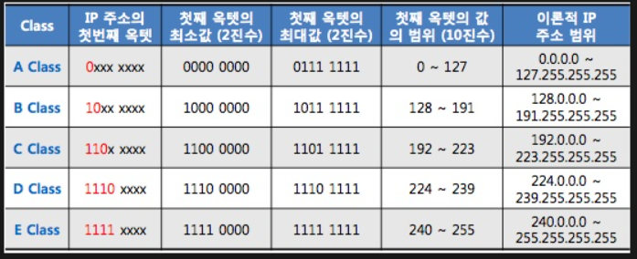

### 3계층의 역할

세그먼트 : 라우터없이 연결되어 있는 범위. 즉, 라우터와 라우터 사이의 범위이다.

이 세그먼트 내에서 데이터 송수신이 2계층의 역할이었다. 

**3계층은, 세그먼트와 세그먼트 사이에서 데이터를 송수신 하는 것이다.**

또한 스위치는 브로드캐스트를 제어하지 않는데, 라우터에서 라우터를 넘어서는 브로드캐스트는 일어나지 않게 한다.

참고로 인터넷 작업에 필요한 것이 어드레싱과 라우팅이다.

 

### 라우팅

3계층의 두번째 역할. 수신처까지 어떤 라우터를 거쳐서 가면 되는지를 결정

 

### IP(internet protocol)

3계층에는 논리주소가 필요한데 이 규칙을 IP라고 함.

 

### IP 데이터그램

IP헤더가 붙은 PDU

 

### IP주소

- MAC주소는 변경이 불가능하지만, IP주소는 네트워크 관리자가 컴퓨터에 할당하며 필요에 따라 자유롭게 변경 가능. 즉 유동적
- 소속 네트워크가 바뀌면 논리주소인 IP주소도 당연히 바뀜
- 논리주소도 유니캐스트, 멀티캐스트, 브로드캐스트가 있으며 **네트워크 내에서는 유일**해야함.
- 32비트로 이루어져 있으며 옥텟(8비트 덩어리)마다 10진수로 변환해서 단락에 점을 찍는다
  - ex) 11000000 10101000 00101010 00000001 > 192.168.42.1

 

### IP주소 클래스

A~E의 5개 클래스로 나뉘어있다.

 

| 클래스 | 규모                   | 네트워크의 수   | 1개의 네트워크가  가진 IP주소의 수 |
| ------ | ---------------------- | --------------- | --------------------------------------- |
| A      | 정부, 연구기관, 대기업 | 128(2^7)        | 16,777,216(2^24)                        |
| B      | 대~중규모 기업         | 16,384(2^14)    | 65,536(2^716)                           |
| C      | 중~소규모 기업         | 2,097,152(2^20) | 256(2^8)                                |

 

아 진짜 이상하네