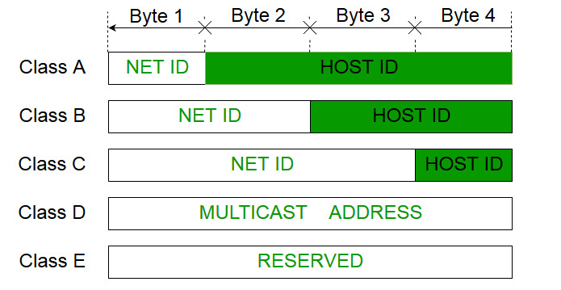
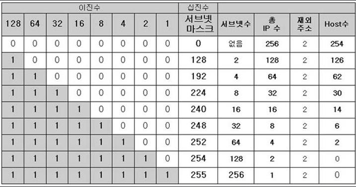

### 3계층의 역할

세그먼트 : 라우터없이 연결되어 있는 범위. 즉, 라우터와 라우터 사이의 범위이다.

이 세그먼트 내에서 데이터 송수신이 2계층의 역할이었다. 

**3계층은, 세그먼트와 세그먼트 사이에서 데이터를 송수신 하는 것이다.**

또한 스위치는 브로드캐스트를 제어하지 않는데, 라우터에서 라우터를 넘어서는 브로드캐스트는 일어나지 않게 한다.

참고로 인터넷 작업에 필요한 것이 어드레싱과 라우팅이다.

 

### 라우팅

3계층의 두번째 역할. 수신처까지 어떤 라우터를 거쳐서 가면 되는지를 결정

 

### IP(internet protocol)

3계층에는 논리주소가 필요한데 이 규칙을 IP라고 함.

 

### IP 데이터그램

IP헤더가 붙은 PDU

 

### IP주소

- MAC주소는 변경이 불가능하지만, IP주소는 네트워크 관리자가 컴퓨터에 할당하며 필요에 따라 자유롭게 변경 가능. 즉 유동적
- 소속 네트워크가 바뀌면 논리주소인 IP주소도 당연히 바뀜
- 논리주소도 유니캐스트, 멀티캐스트, 브로드캐스트가 있으며 **네트워크 내에서는 유일**해야함.
- 32비트로 이루어져 있으며 옥텟(8비트 덩어리)마다 10진수로 변환해서 단락에 점을 찍는다
  - ex) 11000000 10101000 00101010 00000001 > 192.168.42.1

 

### IP주소 클래스(클래스풀 어드레싱)

A~E의 5개 클래스로 나뉘어있다.

 

A~C클래스 각각은 1,2,3옥텟의 네트워크 범위를 갖는다. 따라서 호스트의 개수가 각각 3,2,1 옥텟으로 줄어드는 것이다.

 

일단 모든 클래스에서, IP주소의 첫번째 옥텟의 고정 비트 + 네트워크 수 + 1개의 네트워크가 가진 IP주소의 수를 다 더하면 항상 2^32가 나와야한다(생각해보면 당연하다). D와 E클래스는 특수하다.

| 클래스 | 규모                   | 네트워크의 수   | 1개의 네트워크가  가진 IP주소의 수 |
| ------ | ---------------------- | --------------- | --------------------------------------- |
| A      | 정부, 연구기관, 대기업 | 128(2^7)        | 16,777,216(2^24)                        |
| B      | 대~중규모 기업         | 16,384(2^14)    | 65,536(2^716)                           |
| C      | 중~소규모 기업         | 2,097,152(2^20) | 256(2^8)                                |

D클래스 : 멀티캐스트용

E클래스 : 연구용

 

### 호스트 번호

네트워크에 번호를 할당하는 것. 또한 네트워크 주소와 브로드캐스트 주소가 있다. 이건 할당하면 안된다.

네트워크 주소 : 호스트 번호가 모두 0. 네트워크 자체를 표시할 때 사용

ex) C클래스에서 192.168.10.0

브로드캐스트 주소 : 호스트 번호가 모두 1.  네트워크에 속한 모든 호스트들이 듣게 되는 주소

ex) C클래스에서 192.168.10.255

 

### 서브넷 

말 그대로 부분망이다. 네트워크를 분할하여 서브넷을 구성하면 관리하기가 수월해진다(마치 서울시에 구가 나뉘어있는 것처럼). 

 

### 서브넷 마스크

호스트 번호의 일부분을 서브넷 번호로 사용하고 나머지 번호를 호스트 번호로 사용하여 구성한다.

 

서브넷 마스크는 네트워크 번호와 서브넷 번호의 비트 수를 나타내기 위해 IP주소와 함께 기술한다. 간단히 말하자면, 서브넷 마스크의 비트가 1인 부분이 네트워크 번호이다. 즉, 서브넷 마스크와 IP주소를 조합하면 그 IP주소의 네트워크 번호와 서브넷 번호의 비트수를 알 수 있다.

예를 들어 172.16.4.1 이라는 IP주소와 225.225.252.0 이라는 서브넷 마스크가 있다고 가정하자.

2진수로 바꾸면 아래와 같고 AND연산을 하면 네트워크 주소를 얻을 수 있다. 이 주소에 서브넷마스크의 호스트 번호 범위(여기서는 10비트)에 해당하는 부분을 1로 바꾸면 브로드캐스트 주소를 얻을 수 있다. 10진수로변환은... 생략한다.

 

172.16.4.1 :       10101100 00010000 00000100 0000001

225.225.252.0 : 11111111 11111111 11111100 00000000

네트워크 주소 : 10101100 00010000 00000000 00000000

브로드캐스트 주소 : 10101100 00010000 00000011 11111111	

 

### 클래스리스 어드레싱

사실 위에서 보여준 클래스풀 어드레싱은 현재 사용하지 않는 구식 기술이다. 예를 들어 IP가 1000개 필요한데 C클래스를 사용하면 742개가 부족하고 B클래스를 사용하면 6.4만개의 IP가 낭비되는 문제가 생긴다. 이처럼 IPv4의 수가 부족해지고 IP의 미사용을 막고자 **클래스리스 어드레싱**이 나오게되었다. 가장 큰 특징은, 클래스에 따른 고정된 할당을 하지 않고 자유롭게 할당할 수 있다는 것이다.

 

### 슈퍼넷

21비트를 네트워크로 할당하면 11비트를 호스트번호로 사용할 수 있어 2048개의 IP주소를 얻을 수 있다. 이는 C클래스가 8개 모인 것으로, **슈퍼넷**이라고 한다. 

 

### 프리픽스 길이

클래스리스 어드레싱은 어디까지 네트워크 번호인지 알 수 없다는 단점이 존재한다. 따라서 IP주소에 /(슬래시)를 하고 네트워크번호의 비트 수를 기술한다. 이는 서브넷 마스크의 기능과 같다.

ex) 192.168.32.0 / 21의 서브넷 마스크는

11111111 11111111 11111000 00000000이 될 것이다(네트워크 번호가 21비트).

 

### DHCP(Dynamic host configuration protocol)

일단 헤더에 주소는 총 4개가 필요하다.  보내는 쪽은 MAC주소, IP주소 그리고 받는 쪽의 MAC주소 IP주소이다. 여기서 보내는 쪽의 MAC주소는 보내는 인터페이스의 고정된 주소를 사용한다. 그리고 보내는 쪽의 IP주소는 DHCP로 할당 받거나 수동으로 설정한다.

DHCP는 IP주소가 자동으로 컴퓨터에 할당될 때 사용하는 프로토콜이다. IP할당은 DHCP 서버에서 일어나며, 대여기간을 정해놓고 부여한다. 호스트가 이동하거나 고장나서 IP주소를 사용하지 않아도 사용하는 것으로 인식할 수 있기 때문이다.

참고로 DHCP는 IP주소 뿐만 아니라 다른 네트워크의 설정정보도 보낼 수 있다. 그래서 **호스트설정 프로토콜**인 것이다. 그리고 송수신은 브로드캐스트를 사용한다.

 

### ARP(Address resolution protocol)

DHCP에서 보내는 쪽의 주소는 모두 처리했다. 이제 받는 쪽의 주소를 정해야 한다. 일단 받는 쪽의 IP주소가 결정되어야 받는 쪽의 MAC주소도 결정할 수 있다. 여기서는 받는 쪽의 MAC주소가 어떻게 정해지는지 먼저 살펴보자. 

ARP는 주소해결 프로토콜로 받는쪽 IP주소의 호스트에게 MAC주소를 물어보는 프로토콜이다.

 

### ARP 테이블

하지만 IP주소만 알고 MAC주소는 모르는 상태에서 어떻게 호스트에게 MAC주소를 물어볼 수 있을까?  IP주소와 MAC주소의 대응표인 ARP테이블을 사용하면 된다.

처음에는 테이블이 작성되어 있지 않기 때문에, ARP 요청을 통해 브로드캐스트로 네트워크 내의 모든 컴퓨터에 MAC주소를 알려달라고 송신한다. 그러면 요청 받은 컴퓨터 중 지정된 IP주소를 갖는 컴퓨터만 응답한다. 또한 ARP 테이블에 기재된 **IP주소와 MAC주소는 일정기간이 지나면 파기된다**. 이렇게 하는 이유는, MAC는 고정주소라서 기기가 변경되면 바뀌기 때문이다.

 

### DNS

이름과 IP주소를 대응시킨 시스템. 

 

정리하자면,

송신처 MAC 주소는 NIC를 장치하면 자동적으로 알 수 있고,

송신처 IP주소는 DHCP로 할당 받고,

수신처 IP는 DNS로 알 수 있고,

수신처 MAC는 ARP로 알 수 있다.