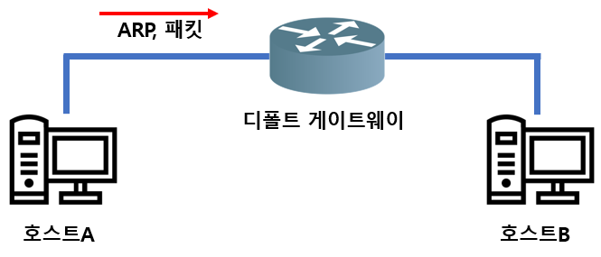
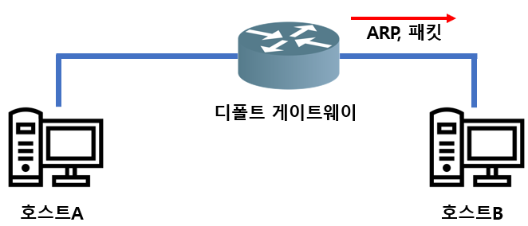
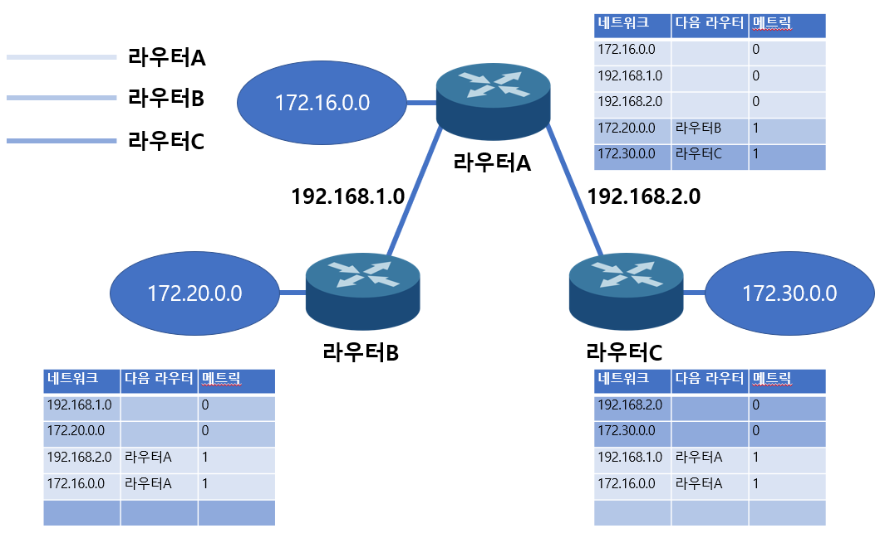
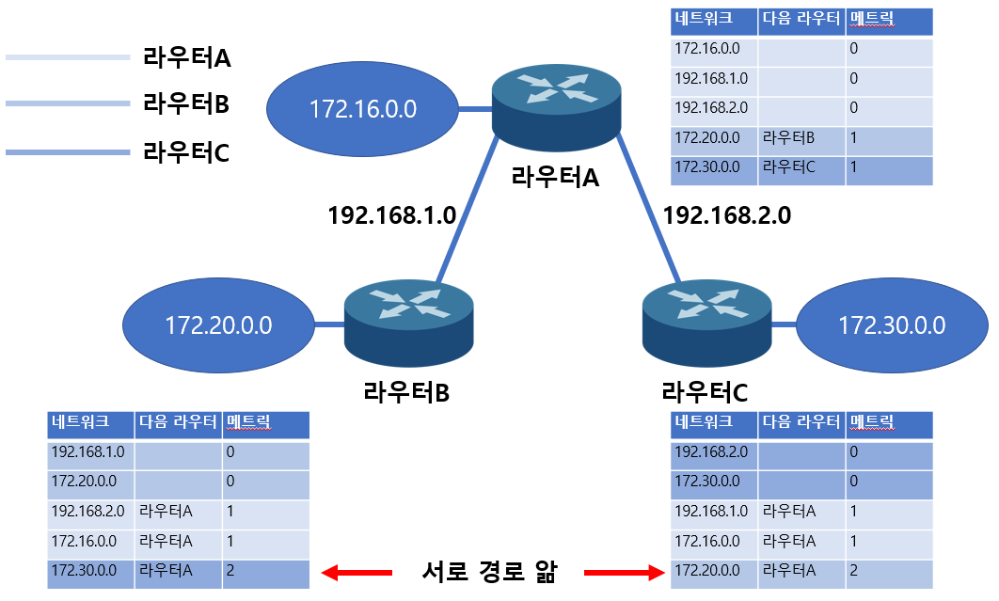

###  MAC주소와 IP주소의 기능적 차이

MAC주소는 다음 수신처이다. 반면 IP주소는 최종 수신처이다. 즉, 목표하는 IP까지 도달하기 위해서는 각 라우터의 MAC주소를 거쳐서 가는 것이라 할 수 있다.

 

### 홉 바이 홉

경로를 찾을 때 MAC주소와 IP주소를 가지고 반복해서 다음 길(라우터)로 나아간다. 이것을 홉 바이 홉이라고 한다. 홉이란 라우팅에서 라우터를 가르킴.

 

### 라우터

네트워크와 네트워크의 경계상에 배치되는 장치로, 다른 네트워크에 데이터그램을 보내는 역할을 하기 때문에 복수의 인터페이스를 가진다(라우터에 여러 개의 네트워크가 연결된 것을 생각해보면 됨).

또한 특정 조건에서 데이터그램을 파기하는 필터링을 하기도 함.

 

### 라우팅 테이블

최적의 경로지도라고 생각하면 된다. 이 테이블에는 수신처네트워크까지의 거리, 다음에 도달하는 라우터, 그 라우터에 연결되어있는 자신의 인터페이스 등이 기재되어 있다.

 

### 브로드캐스트 도메인

브로드캐스트의 범위. 라우터가 네트워크를 나누기 때문에 브로드캐스트 도메인 = 네트워크라고 생각해도 된다. 그리고 앞에서 나온 충돌 도메인과 비슷하지만 아래와 같은 차이가 있다.

충돌도메인 : 스위치가 구분

브로드캐스트 도메인 : 라우터가 구분

 

### 디폴트 게이트웨이

MAC주소는 ARP를 이용하여 알아낼 수 있다. 또한 브로드캐스트는 라우터를 넘어서 전송할 수 없다고 했었다. 하지만 ARP는 브로드캐스트라서 라우터를 넘지 못한다. 그럼 MAC주소를 알 방법이 없을까? 

디폴트 게이트웨이라는 네트워크의 출입문이 존재한다. 컴퓨터가 최초로 데이터를 보내는 수신처는 이 디폴트 게이트웨이가 된다. 즉 컴퓨터는 다른 네트워크에 데이터를 송신할 때 디폴트 게이트웨이로 ARP를 수행해서 최종 목적지까지 도달할 수 있다. 

좀 더 자세히 알아보자면,

먼저 호스트A는 ARP로 디폴트 게이트웨이의 MAC주소를 알아낸다(디폴트 게이트웨이로 갔다가 다시 호스트A로 돌아옴). 그 정보를 가지고 다시 라우터에 패킷을 보낸다.

 

그러면 패킷은 다음과 같은 정보를 가질 것이다.

| 수신처MAC | 송신처MAC | 송신처IP | 수신처IP |
| --------- | --------- | -------- | -------- |
| 라우터    | 호스트A   | 호스트A  | 호스트B  |

 

수신 받은 디폴트 게이트웨이는 다시 수신받을 상대에게 ARP를 수행한다.

 

그러면 패킷은 다음과 같은 정보를 갖고 있을 것이다.

| 수신처MAC | 송신처MAC | 송신처IP | 수신처IP |
| --------- | --------- | -------- | -------- |
| 호스트B   | 라우터    | 호스트A  | 호스트B  |

참고로 디폴트 게이트웨이의 IP주소를 알고 있어야 홉 바이 홉을 통해 최종 목적지까지 도달할 수 있다.

 

### 동적 라우팅

수신처 네트워크까지 최적의 경로를 찾아야 할 때, 다른 네트워크의 모든 경로를 알아야할 필요가 있다. 이렇게 알고 있는 경로중 최적의 경로를 선택해서 라우팅 테이블을 작성하게 된다. 정적 라우팅은 말 그대로 수동이라서 네트워크에 장애가 생기면 수동으로 변경해줘야 한다. 반면 동적 라우팅은 모든 경로 중에서 자동으로 최적의경로를 선택해서 라우팅 테이블에 작성하는것이다.

하지만 몇몇의 단점이 존재한다. 먼저, 저속 회선이고 라우터의 처리능력이 부족할 경우, 서로 교환한 정보를 가지고 최적의 경로를 계산해야 하기 때문에 더 느릴 수 있다. 

 

### 컨버전스

동적라우팅의 최대의 단점은, 모든 라우터가 동일한 정보를 가져야한다는 것이다. 이를 컨버전스라고 부른다. 하지만 자동으로 장애를 제거할 수 있는 것은 그만큼 중요하다.

 

### 라우팅 프로토콜

동적 라우팅을 실현하는 프로토콜로, 근접해 있는라우터 간의 네트워크 정보를 교환하기 위한 규칙. AS(Autonomous System)라는 자율화 시스템이 존재한다. 하나의 단체에 관리 받는 네트워크집합체 정도로 보면 된다. 아무튼 크게 AS간 라우팅용(EGP)과 AS 내부 라우팅용 두가지가 있음.

- EGP(Exterior Gatsway Protocol): EGP, BGP
- IGP(Interior Gatsway Protocol): RIP, OSPF, IS-IS, EIGRP

 

### 메트릭

최적의 경로를 결정할 때 판단기준

 

### 디스턴스 벡터(벨만 포드 알고리즘)

디스턴스벡터란, 거리와 방향만으로 목적지까지 찾아가는 알고리즘을 말한다. 대표적으로 RIP가 있다. 홉 카운터(통과하는 라우터의 수)와 방문할 인접라우터에 대한정보만 저장한다. 라우팅 테이블에 목적지까지의 모든 정보를 저장할 필요가 없기 때문에 메모리를 절약할 수 있고 표준으로 사용하고 있다. 하지만 정해진 시간마다 라우팅 테이블 정보를 교환하기 때문에 트래핑 낭비가 생기고 그만큼의 시간이 소요된다. 

그래서 대규모 네트워크보단 소규모 네트워크에 적합. 그리고 정기적으로 라우팅 테이블 정보를 교환하기 때문에 라우터에 문제 발생시 루핑(Looping)이 생길 수 있다.

 

### 링크 스테이트(다익스트라 알고리즘)

한 수신처 라우터에서 목적지 라우터까지 모든 경로를 알고 있기 때문에 중간에 변화가 생겨도 알아차리는데 걸리는 시간이 짧다. 낭비되는 트래픽도 없다. 하지만 라우팅 테이블에서 모든 정보를 관리해야 하기 때문에 라우터의 메모리와 CPU를 과소비한다. 따라서 대규모의 고용량 네트워크에 적합하다. 대표적인 알고리즘은 OSPF가 있다.

 

### RIP(Routing Infomation Protocol)

대표적인 디스턴스벡터 라우팅 프로토콜. 다음과 같은 라우팅 테이블이 있다. 현재 인접한 라우터에 대한 정보가 갱신되었다. B와 C는 서로 모른다.

 

갱신된 정보가 송수신되면 다음과 같이 B와 C가 서로를 알 수 있다.

 

간단히 말해서 자기가 모르는 네트워크를 테이블에 추가한다. 또한 새로운 경로 쪽의 메트릭이 작으면 그쪽을 테이블에 기재하는 형식으로, 최적의 경로를 찾는다.

