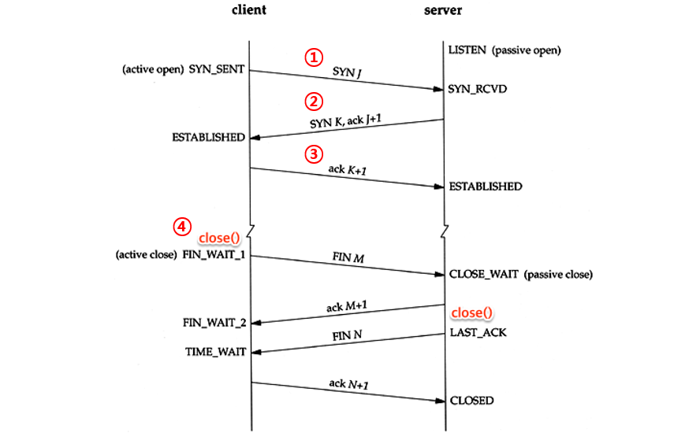

## 4계층의 역할

우리는 3계층까지 해서 데이터를 전달 받았다.  4계층에서는 이 데이터를 가지고 통신하기 위한 처리를 한다. 4계층은 데이터에 문제가 있을 경우 **에러를 복구**한다. 데이터를 받지 못하면 다시 달라고 송신측에 요청하는 것이다. 

 

### 흐름 제어

에러 복구는 흐름 제어를 통해 수행된다. 전송된 데이터를 한 번에 받지 못하는 경우, 임시공간에 보관하고 가득 차면(over flow) 송신을 일시적으로 중지하게 한다. stop and wait 방식과 슬라이딩 윈도 방식이 존재한다.

 

### 애플리케이션 식별

또 다른 기능으로 **애플리케이션 식별**이 있다. 받은 데이터가 메일인지, 게임 패킷인지 구분을 해야한다. 이것은 포트번호를 부여하여 식별할 수 있다.

 

## TCP(Transmission Control Protocol)

간단히 말하면, 

### 커넥션

가상적인 데이터의 길. TCP는 데이터를 확실하게 주고받아야한다. 따라서 데이터를 전송하기 전에 연결이 안정적이라는 확답을 받을 필요가 있다. 이 확답을 받는 과정을  3way handshake라고 부른다.

 

### 3Way Handshake

SYN : 상대에 대한 접속요청인 것을 나타냄

ACK : 상대의 통신응답인 것을나타냄

FIN : 접속을 종료하는 것을 나타냄

닫혀있을 때 > 열기

1. 커넥션 확립 요청
2. 커넥션 확립응답 + 확립요청
3. 커넥션 확립응답

4. 열려 있을 때 > 닫기

 

### MSS와세그먼트 / 시퀀스 번호

TCP는 애플리케이션으로부터 받은 데이터를 세그먼트로 캡슐화 한다. 캡슐화 할 때 한 개의 데이터를 MSS(Max Segment Size)로 데이터를 분할하고, 그 선두에 번호를 부여하는데, 이를 시퀀스 번호라고 한다.

 

### 에러 복구

시퀀스 번호는 어디에 쓸까? 바로 이 시퀀스번호를 사용해서 에러를 복구한다. 받는 측에서 보낸 측에게 받았다는 확인 메세지를 보내야 데이터가 잘 전달 됐는지 알 수 있다.  이 때 다음에 받을 예정인 시퀀스 번호를 보내면 확인응답 + 받을 번호를 동시에 알릴 수 있다. 

 

### 슬라이딩 윈도 방식

매번 전송한 패킷에 대해 확인을 받는 stop and wait 방식과 달리, 슬라이딩 윈도 방식은, 수신측에서 설정한 윈도의 크기만큼 전송할 수 있게 하여 데이터 흐름을 동적으로 조절하는 기법이다. 설정한 윈도의 크기만큼 전송하면, 수신측의 버퍼가 넘칠 일이 없기 때문에 확실하게 전달할 수 있다.

 

### Well Known 포트번호

1~1023번까지 정해져있는 애플리케이션의 포트번호

 

### UDP

TCP는 커넥션이나 흐름제어 등을 사용해서 확실하게 데이터를 전송하는 프로토콜이었다. 하지만 속도면에서 불리하다. UDP는 확실하게 데이터를 전송하지는 않지만 속도는 보장한다. 때문에 동영상 스트리밍이나 VoIP 등에 사용된다. 또한 브로드캐스트가 필요한 애플리케이션도 UDP를 사용.

 

### NAT(Network Address Translation)

네트워크 주소 변환. 글로벌 IP로는 모든 네트워크를 표현하기에 한계가 있다. 따라서 NAT라는 사설 IP주소를 사용하여 이러한 문제를 해결한다. 내부 네트워크는 사설IP주소를할당하는데, 이는 내부에서 TCP/IP통신을 하기 위함이다. 외부로 나갈 때는 다시 글로벌 IP로 변환한다.

A클래서 사설 IP주소 00001010 >> 10.0.0.0

B클래서 사설 IP주소 10101100 0001xxxx >> 172.16.0.0 ~ 172.31.0.0

C클래서 사설 IP주소 11000000 101010000 >> 192.168.0.0 ~ 192.168.255.0

 

하지만 NAT에도 단점은 존재한다. 동시접속하는 경우, 글로벌 IP주소의 수만큼만 접속할 수 있다.

 

### NAPT(Network Address Port Translation)

이러한 문제를 NATP로 해결한다. 구분 가능한 포트를 추가하여 하나의 글로벌 IP주소로 여러 대의 컴퓨터를 접속 가능하게 만든다. 또한 보안측면에서 큰 장점이 있다. 

하지만 이것은 NAPT의 단점이기도 한데, NAPT 테이블에 저장되어 있지 않는 것은 LAN 내부에 들어오지 못함. 또한 FTP사용이 불가능하다. FTP는 데이터 부분에도 송신처의 IP주소가 기록된다. 만약 이것이 사설 IP주소로 되어 있다면, 인터넷에서 사설IP주소로 보내는 꼴이 된다. 즉 보낼 수 없다. 따라서 기기에서 FTP를 지원하는지 따져봐야한다.