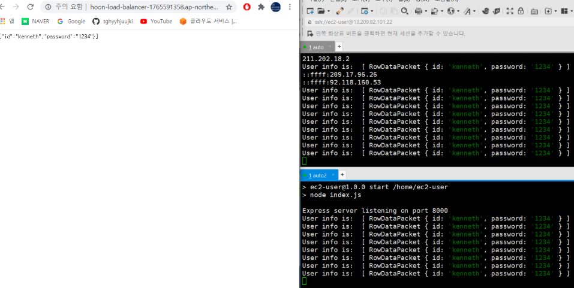

### 작업환경

Windows10

Aws 프리티어 계정

지난 글까지 완성 ([RDS - Master, slave 생성](https://jeonghoon.netlify.app/Project/miniproject/mini_rds/)참고)

---

<br/>

## 토이프로젝트 - Car Dealership

목표1 : 로컬에서 MySQL, python으로 CRUD 쿼리 처리 가능한 2티어 아키텍처 구축

1. [개요 및 MySQL Workbench를 이용하여 DataBase 쿼리 생성](https://jeonghoon.netlify.app/Project/miniproject/mini_query/)

2. [Python으로 클라이언트 용  스크립트 작성](https://jeonghoon.netlify.app/Project/miniproject/mini_python/)

목표 2 : Docker로 MySQL, python 이미지 생성 후 compose 구성

1. [MySQL, Python 이미지 생성 / compose.yml 작성 및 구축(1)](https://jeonghoon.netlify.app/Project/miniproject/mini_docker_images/)
2. [MySQL, Python 이미지 생성 / compose.yml 작성 및 구축(2)](https://jeonghoon.netlify.app/Project/miniproject/mini_docker_compose/)

목표 3 : AWS, node.js를 추가하여 자동 확장 가능한 3티어 아키텍처 구축

3. [RDS - Master, slave 생성](https://jeonghoon.netlify.app/Project/miniproject/mini_rds/)
4. [RDS와 클라이언트 연결하는 Rest API node 서버 만들기](https://jeonghoon.netlify.app/Project/miniproject/mini_node/)
5. [**<u>AutoScaling 그룹 생성 및 ELB(elastic Load Balancer) 연결</u>**](https://jeonghoon.netlify.app/Project/miniproject/mini_autoscaling/)

<br/>

## 개요 

드디어 프로젝트의 마지막이다. 이번에는 지금까지 만든 아키텍처에 로드밸런서와 Auto Scaling를 붙여서 특정 프로세스가 임계치를 초과하면 자동으로 서버가 확장되도록 구축할 것이다.


<br/>

<br/>

## Auto scaling Group 생성

먼저 현재 실행중인 EC2 인스턴스의 스냅샷을 뜬다.


<br/>

시작템플릿을 만들어준다. 인스턴스의 시작을 자동화 할 수 있게 만들어주기 때문에 필요하다.


<br/>

VPC를 선택하고 기존에 사용하던 보안그룹을 선택한다.


<br/>

Auto Scaling 그룹을 생성한다.


<br/>

1단계에서 이름을 입력하고 방금 만든 시작템플릿을 선택한다.


<br/>

2단계에서 서브넷을 3개정도 선택해준다


<br/>

3단계에서 로드밸런싱 활성화를 선택해준다. 그리고 대상그룹을 선택해줘야하는데 만약 없다면 만들어주자.


<br/>

### 대상그룹 생성

실행시킬 포트를 설정해주고 


헬스체크를 위해 검사경로를 설정해준다


그리고 인스턴스 추가하고 대상그룹 생성


<br/>

다시 Auto Scaling Group 생성 3단계로 돌아와서 대상그룹을 지정해준다.

4단계에서 자동으로 스케일링 될 인스턴스 개수를 설정할 수 있다. 원하는용량은 처음에 생성될 EC2의 개수를 말하고, 최소용량과 최대용량은 말 그대로 최소 최대로 만들 수 있는 EC2의 개수를 말한다.


<br/>

조정 정책에서 `대상 추적 조정 정책`을 선택하여 네트워크 입출력, CPU 사용률에 따라 스케일링 되도록 설정할 수 있다. 나는 CPU를 50% 이상 사용하면 EC2가 자동으로 생성되도록 설정하였다. 그리고 5단계 알림추가와 6단계 태그는 필요하면 추가해준다. 그리고 생성해주자.


<br/>

최소값을 1로 설정했으므로 그룹을 생성하는 순간 자동으로 1개의 복제된 인스턴스가 실행된다.

이제 자동확장이 되는지 테스트해보자. 현재 최소값인 1개의 인스턴스만 실행중이다.


<br/>

다음과 같이 스트레스를 강제로 줘서 cpu의 사용률을 높인다.

```shell
sudo yum install stress -y # 설치
stress --cpu 1 --timeout 600 # 스트레스 시작
```

<br/>

원하는 용량을 1로 설정했지만 CPU 사용량의 상승으로 인해 2로 변경된 것을 확인할 수 있다.


<br/>

EC2 인스턴스는 그에 맞게 1개 더 추가된 것을 확인할 수 있다.


<br/>

여기서 스트레스 테스트를 종료하면 CPU의 사용량이 낮아져1개의 EC2는 종료된다.


<br/>

<br/>

## 로드밸런서 추가

이제 로드밸런서만 추가해주면 된다. 

현재 최소 인스턴스를 2개로 설정했다면 대상그룹에서 다음과 같이 뜰 것이다. 로드밸런서에 이 대상그룹을 연결해주자.


<br>로드밸런서의 DNS이름으로 호출하면 직접 호출할 필요가 없다.


<br/>

AWS의 로드밸런서는 디폴트가 round robbin 방식이라서 두개의 인스턴스가 마치 번갈아가면서 호출되는 것처럼 보일 것이다.



<br/>

드디어 아래와 같은 아키텍처를 구축하였다.


<br/>

이번 토이프로젝트를 하면서 생각보다 난관이 많았다. 분명 저번에는 됐는지 할 때마다 새로운 문제의 연속이었다. 그래도 이렇게 마치고 나니 뿌듯하다 ㅎㅎ. 

이 다음으로는 스프링부트와 Travis CI, CodePloy를 활용해서 CI/CD를 구축하는 미니프로젝트를 생각하고 있다. 아니면 스프링으로 MSA를 구축하는 프로젝트도 구상중이다. 시간이 좀 난다면 두 개의 프로젝트를 섞어도 괜찮을거 같다. 아무튼 이번 미니프로젝트는 여기까지! 