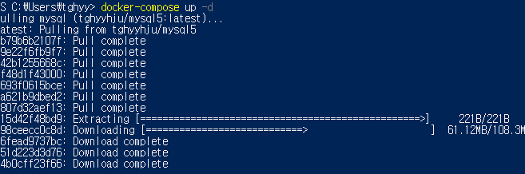
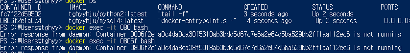
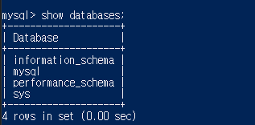

### 작업환경

Windows10

---

<br/>

## 토이프로젝트 - Car Dealership

목표1 : 로컬에서 MySQL, python으로 CRUD 쿼리 처리 가능한 2티어 아키텍처 구축

1. [개요 및 MySQL Workbench를 이용하여 DataBase 쿼리 생성](https://jeonghoon.netlify.app/Project/miniproject/mini_query/)

2. [Python으로 클라이언트 용  스크립트 작성](https://jeonghoon.netlify.app/Project/miniproject/mini_python/)

목표 2 : Docker로 MySQL, python 이미지 생성 후 compose 구성

1. [MySQL, Python 이미지 생성 / compose.yml 작성 및 구축(1)](https://jeonghoon.netlify.app/Project/miniproject/mini_docker_images/)
2. [**<u>MySQL, Python 이미지 생성 / compose.yml 작성 및 구축(2)</u>**](https://jeonghoon.netlify.app/Project/miniproject/mini_docker_compose/)

목표 3 : AWS, node.js를 추가하여 자동 확장 가능한 3티어 아키텍처 구축

3. [RDS - Master, slave 생성](https://jeonghoon.netlify.app/Project/miniproject/mini_rds/)
4. [RDS와 클라이언트 연결하는 node 서버 만들기](https://jeonghoon.netlify.app/Project/miniproject/mini_node/)
5. AutoScaling 그룹 생성 및 ELB(elastic Load Balancer) 연결
6. CloudWatch, AWS SNS 연동
7. CodeDeploy를 통한 배포 구축

<br/>

---

## 개요

앞에서 MySQL과 파이썬 컨테이너를 연동해보고 이미지를 생성하였다. 이제 Docker Compose로 어디서든 클러스터를 구축할 수 있게 만들 것이다.

<br/>

## Docker-compose.yml 작성

다음과 같이 docker-compose.yml을 작성했다.

```yaml
version: "3"
services:
  mysql:
    image: tghyyhju/mysql5:latest 
    ports:
      - 3306:3306 
    environment:
      MYSQL_ALLOW_EMPTY_PASSWORD: "true" # 비밀번호 무시
    network_mode: "host"

  python:
    image: tghyyhju/python2:latest
    network_mode: "host"
    command: tail -f
```

살펴보면, 테스트를 위해 비밀번호는 무시했다. 또한 네트워크를 호스트 브릿지로 구성하여 파이썬에서 localhost에 접속가능하도록 설정하였다.

<br/>

이제 compose로 클러스터를 구축해보자. yml파일이 있는 디렉토리에서 아래 명령어를 입력한다.

```powershell
docker-compose up -d # compose 데몬으로 실행
```

<br/>

이미지가 없다고 가정하면 다음과 같이 도커 허브에서 이미지를 내려받고 클러스터를 구축한다.



<br/>

하지만 MySQL이 계속 죽는 문제가 발생했다.



<br/>

구글링을 통해 yml에 다음과 같은 코드를 추가하여 죽어도 다시 시작되도록 구성하였다.

```yaml
restart: always
```

<br/>

하지만 파이썬이 실행되지 않았다. DB를 확인해보니 만들어뒀던 mydb가 없는 것을 확인할 수 있었다. 



<br/>

이미지를 새롭게 커밋하여도 MySQL에 데이터가 보존되지 않았다.

스택오버플로에서 다음과 같은 해답을 얻을 수 있었다.


<br/>

그리고 데이터가 손실되지 않도록 볼륨마운트를 추가한 MySQL용 Dockerfile을 작성해야 함을 알게되었다.

```dockerfile
FROM mysql:5.7

RUN mkdir /var/lib/mysql-no-volume
CMD ["--datadir", "/var/lib/mysql-no-volume"]
```

<br/>

위 도커파일 기반으로 새로운 MySQL 이미지를 생성했다. 실행 후 다시 들어가 데이터를 넣어주고 commit을 해주었다.

```powershell
docker build -t mysql-volumeless:5.7 . # mysql-volumeless이름의 임시 컨테이너 생성
docker run --name mysql-test -d -p 3306:3306 -e MYSQL_ROOT_PASSWORD=root mysql-volumeless:5.7 # mysql-test라는 이름으로 실행

docker exec -it [컨테이너ID] bash # 컨테이너에 접속
root@47b95a5b717e> mysql -uroot -p # mysql 접속
docker commit 47b95a5b717e tghyyhju/mysql5 # 커밋
docker push tghyyhju/mysql5 # 푸쉬
```

<br/>

최종적으로 다음과 같은 yml 파일을 만들었다.

```yaml
version: "3"
services:
  mysql:
    image: tghyyhju/mysql4:latest 
    ports:
      - "3306:3306" #포트번호
    environment:
      MYSQL_ALLOW_EMPTY_PASSWORD: "true" # 비밀번호 무시
    network_mode: "host"
    restart: always
 
  python:
    image: tghyyhju/python2:latest
    network_mode: "host"
    command: tail -f
```

<br/>

이제 compose로 클러스터를 구축하면,  정상적으로 실행된다!


<br/>


<br/>


