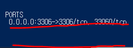

### 작업환경

Windows10

---

<br/>

## 토이프로젝트 - Car Dealership

목표1 : 로컬에서 MySQL, python으로 CRUD 쿼리 처리 가능한 2티어 아키텍처 구축

1. [개요 및 MySQL Workbench를 이용하여 DataBase 쿼리 생성](https://jeonghoon.netlify.app/Project/miniproject/mini_query/)

2. [Python으로 클라이언트 용  스크립트 작성](https://jeonghoon.netlify.app/Project/miniproject/mini_python/)

목표 2 : Docker로 MySQL, python 이미지 생성 후 compose 구성

1. [MySQL, Python 이미지 생성 / compose.yml 작성 및 구축(1)](https://jeonghoon.netlify.app/Project/miniproject/mini_docker_images/)
2. [**<u>MySQL, Python 이미지 생성 / compose.yml 작성 및 구축(2)</u>**](https://jeonghoon.netlify.app/Project/miniproject/mini_docker_compose/)

목표 3 : AWS, node.js를 추가하여 자동 확장 가능한 3티어 아키텍처 구축

3. [RDS - Master, slave 생성](https://jeonghoon.netlify.app/Project/miniproject/mini_rds/)
4. [**RDS와 클라이언트 연결하는 node 서버 만들기**](https://jeonghoon.netlify.app/Project/miniproject/mini_node/)
5. AutoScaling 그룹 생성 및 ELB(elastic Load Balancer) 연결
6. CloudWatch, AWS SNS 연동
7. CodeDeploy를 통한 배포 구축

<br/>

---

## 개요

앞에서 MySQL과 파이썬 컨테이너를 연동해보았다. 이제 Docker Compose로 어디서든 클러스터를 구축할 수 있게 만들 것이다.

<br/>

## Docker-compose.yml 작성

다음과 같이 docker-compose.yml을 작성했다.

```yaml
version: "3"
services:
  mysql:
    image: tghyyhju/mysql4:latest 
    ports:
      - 3306:3306 #포트번호
    environment:
      MYSQL_ALLOW_EMPTY_PASSWORD: "true" # 비밀번호 무시

  python:
    image: tghyyhju/python2:latest
    depends_on: # mysql이 실행되어야만 python 실행 가능
      - mysql
```

살펴보면, MySQL이 실행 되어야만 파이썬을 실행하도록 구성했다. 또한 MySQL의 비밀번호를 무시하고 접속하도록 구성했다. 네트워크를 구성하지 않으면 디폴트 브릿지에 연결된다.

<br/>

이제 compose로 클러스터를 구축해보자. yml파일이 있는 디렉토리에서 아래 명령어를 입력한다.

```powershell
docker-compose up -d # compose 데몬으로 실행
```

<br/> 

이미지가 없다고 가정하면 다음과 같이 도커 허브에서 이미지를 내려받고 클러스터를 구축한다.


<br/>

하지만 MySQL이 계속 죽는 문제가 발생했다.


<br/>

여기 저기 찾아보면서 처음에는 이렇게 시도했다. 하지만 죽고 실행되고를 반복하였다.

```yaml
restart: always
```

<br/>

또 찾아보면서 yml파일에 다음을 추가하여 죽는 것을 방지하였다.

```yaml
command: tail -f
```

<br/>

그렇게 죽는 것을 방지했지만.....

 파이썬도


MySQL도 작동하지 않았다....


<br/>

이것 저것 하다가 포기하고 가상머신 위의 리눅스로 돌리기로 했다.


작동 되었던 MySQL과 비교해보면서 문제를 찾을 수 있었다.


<br/>

작동되는 MySQL은 포트가 연결되어있었지만, compose로 만든 MySQL은 포트가 연결되어 있지 않았다. 파이썬이 MySQL에 의존적이었기 때문에 같이 작동하지 않았다.



<br/>

하지만 yml 파일에 포트를 명시했기 때문에 뭐가 문제인지 찾지 못하였으나, 다음과 같은 글을 발견했다.


<br/>

MySQL 인스턴스의 IP는 로컬호스트가 될 수 없다는 것이다.  network_mode에 주석을 달고 실행해보았다.

```yaml
version: "3"
services:
  mysql:
    image: tghyyhju/mysql5:latest 
    ports:
      - 3306:3306 #포트번호
    environment:
      MYSQL_ALLOW_EMPTY_PASSWORD: "true" # 비밀번호 무시
    network_mode: "host"
    command: tail -f

  python:
    image: tghyyhju/python2:latest
    depends_on: # mysql이 실행되어야만 python 실행 가능
      - mysql
    network_mode: "host"
    command: tail -f
```

<br/>

이전과 다르게 포트가 붙은 것을 확인할 수 있었다. 굿!

