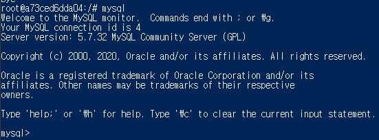
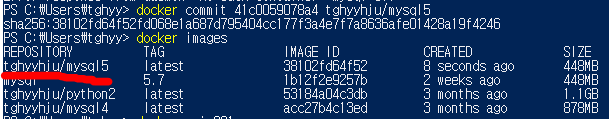
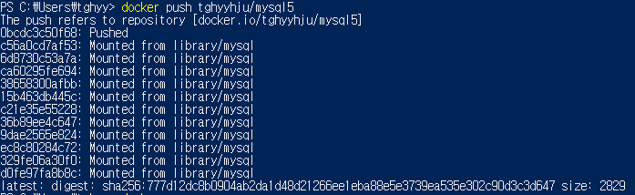
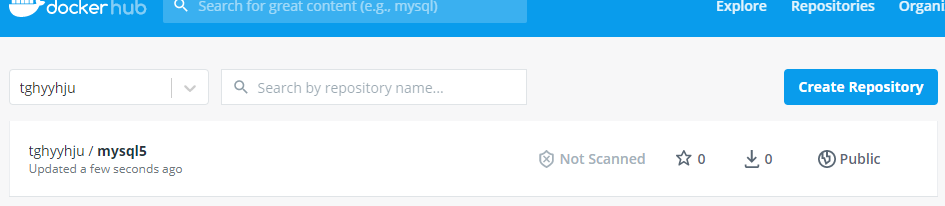

### 작업환경

Windows10

---

<br/>

## 토이프로젝트 - Car Dealership

목표1 : 로컬에서 MySQL, python으로 CRUD 쿼리 처리 가능한 2티어 아키텍처 구축

1. [개요 및 MySQL Workbench를 이용하여 DataBase 쿼리 생성](https://jeonghoon.netlify.app/Project/miniproject/mini_query/)

2. [Python으로 클라이언트 용  스크립트 작성](https://jeonghoon.netlify.app/Project/miniproject/mini_python/)

목표 2 : Docker로 MySQL, python 이미지 생성 후 compose 구성

1. [**<u>MySQL, Python 이미지 생성 / compose.yml 작성 및 구축(1)</u>**](https://jeonghoon.netlify.app/Project/miniproject/mini_docker_images/)
2. [MySQL, Python 이미지 생성 / compose.yml 작성 및 구축(2)](https://jeonghoon.netlify.app/Project/miniproject/mini_docker_compose/)

목표 3 : AWS, node.js를 추가하여 자동 확장 가능한 3티어 아키텍처 구축

3. [RDS - Master, slave 생성](https://jeonghoon.netlify.app/Project/miniproject/mini_rds/)
4. [RDS와 클라이언트 연결하는 node 서버 만들기](https://jeonghoon.netlify.app/Project/miniproject/mini_node/)
5. AutoScaling 그룹 생성 및 ELB(elastic Load Balancer) 연결
6. CloudWatch, AWS SNS 연동
7. CodeDeploy를 통한 배포 구축

<br/>

---

## 개요

앞서 DB쿼리와 클라용 파이썬 파일을 만들었다. 로컬에서는 충분히 작동하도록 만들었지만, 이번에는 로컬이 아니라 Docker를 이용해 컨테이너에서 MySQL과 파이썬을 연동하는 것이 목표다. 여기에서는  Docker Compose를 사용해보겠다.

<br/>

---


## MySQL 이미지 만들기

먼저 MySQL이다. 다음 명령어로 MySQL을 실행해주었다. 

```powershell
docker run -p 3306:3306 -e MYSQL_ALLOW_EMPTY_PASSWORD=true --name mysql mysql:5.7
```

<br/>

파워쉘을 하나 더 키고 MySQL에 접속해보았다.

```powershell
docker ps # 실행중인 도커 컨테이너 확인
docker exec -it [컨테이너 ID] bash # bash로 컨테이너에 접속
```



<br/>

DB를 확인해보니 기본적인 것만 들어있다.


<br/>

지난번 글에 있던 쿼리를 복사하여 그대로 붙여넣고 다시 DB를 확인하면, 아래와 같이 mydb가 생성 된 것을 확인할 수 있다.

<details> <summary>생성된 쿼리 보기</summary> <div markdown="1">


```sql
-- MySQL Workbench Forward Engineering

SET @OLD_UNIQUE_CHECKS=@@UNIQUE_CHECKS, UNIQUE_CHECKS=0;
SET @OLD_FOREIGN_KEY_CHECKS=@@FOREIGN_KEY_CHECKS, FOREIGN_KEY_CHECKS=0;
SET @OLD_SQL_MODE=@@SQL_MODE, SQL_MODE='ONLY_FULL_GROUP_BY,STRICT_TRANS_TABLES,NO_ZERO_IN_DATE,NO_ZERO_DATE,ERROR_FOR_DIVISION_BY_ZERO,NO_ENGINE_SUBSTITUTION';

-- -----------------------------------------------------
-- Schema mydb
-- -----------------------------------------------------

-- -----------------------------------------------------
-- Schema mydb
-- -----------------------------------------------------
CREATE SCHEMA IF NOT EXISTS `mydb` DEFAULT CHARACTER SET utf8 ;
USE `mydb` ;

-- -----------------------------------------------------
-- Table `mydb`.`sales_person`
-- -----------------------------------------------------
CREATE TABLE IF NOT EXISTS `mydb`.`sales_person` (
  `sales_id` INT auto_increment,
  `sales_name` VARCHAR(45) NULL,
  `sales_phone`  VARCHAR(45) NULL,
  PRIMARY KEY (`sales_id`))
ENGINE = InnoDB;


-- -----------------------------------------------------
-- Table `mydb`.`Car`
-- -----------------------------------------------------
CREATE TABLE IF NOT EXISTS `mydb`.`Car` (
  `car_id` INT auto_increment,
  `car_name` varchar(50),
  `color` VARCHAR(45) NULL,
  `made_by` VARCHAR(45) NULL,
  `sales` varchar(50) default 'onSale',
  PRIMARY KEY (`car_id`))
ENGINE = InnoDB;


-- -----------------------------------------------------
-- Table `mydb`.`Customer`
-- -----------------------------------------------------
CREATE TABLE IF NOT EXISTS `mydb`.`Customer` (
  `cust_id` INT auto_increment,
  `cust_name` VARCHAR(45) NULL,
  `cust_phone` VARCHAR(45) NULL,
  `cust_birth` int NULL,
  PRIMARY KEY (`cust_id`))
ENGINE = InnoDB;


-- -----------------------------------------------------
-- Table `mydb`.`Sales_invoice`
-- -----------------------------------------------------
CREATE TABLE IF NOT EXISTS `mydb`.`Sales_invoice` (
  `invoice_number` INT auto_increment,
  `sales_id` INT NOT NULL,
  `cust_id` INT NOT NULL,
  `car_id` INT NOT NULL,
  PRIMARY KEY (`invoice_number`),
  INDEX `fk_Sales_invoice_sales_person1_idx` (`sales_id` ASC) ,
  INDEX `fk_Sales_invoice_Customer1_idx` (`cust_id` ASC) ,
  INDEX `fk_Sales_invoice_Car1_idx` (`car_id` ASC) ,
  CONSTRAINT `fk_Sales_invoice_sales_person1`
    FOREIGN KEY (`sales_id`)
    REFERENCES `mydb`.`sales_person` (`sales_id`)
    ON DELETE NO ACTION
    ON UPDATE NO ACTION,
  CONSTRAINT `fk_Sales_invoice_Customer1`
    FOREIGN KEY (`cust_id`)
    REFERENCES `mydb`.`Customer` (`cust_id`)
    ON DELETE NO ACTION
    ON UPDATE NO ACTION,
  CONSTRAINT `fk_Sales_invoice_Car1`
    FOREIGN KEY (`car_id`)
    REFERENCES `mydb`.`Car` (`car_id`)
    ON DELETE NO ACTION
    ON UPDATE NO ACTION)
ENGINE = InnoDB;


-- -----------------------------------------------------
-- Table `mydb`.`Service_ticket`
-- -----------------------------------------------------
CREATE TABLE IF NOT EXISTS `mydb`.`Service_ticket` (
  `Service_ticket_id` INT auto_increment,
  `price` VARCHAR(45) NULL,
  `cust_id` INT NOT NULL,
  `car_id` INT NOT NULL,
  PRIMARY KEY (`Service_ticket_id`, `car_id`),
  INDEX `fk_Service_ticket_Customer1_idx` (`cust_id` ASC) ,
  INDEX `fk_Service_ticket_Car1_idx` (`car_id` ASC) ,
  CONSTRAINT `fk_Service_ticket_Customer1`
    FOREIGN KEY (`cust_id`)
    REFERENCES `mydb`.`Customer` (`cust_id`)
    ON DELETE NO ACTION
    ON UPDATE NO ACTION,
  CONSTRAINT `fk_Service_ticket_Car1`
    FOREIGN KEY (`car_id`)
    REFERENCES `mydb`.`Car` (`car_id`)
    ON DELETE NO ACTION
    ON UPDATE NO ACTION)
ENGINE = InnoDB;


-- -----------------------------------------------------
-- Table `mydb`.`mechanics`
-- -----------------------------------------------------
CREATE TABLE IF NOT EXISTS `mydb`.`mechanics` (
  `mechanic_id` varchar(45) not null,
  `mechanic_name` VARCHAR(45) NULL,
  `MON` VARCHAR(45) NULL,
  `TUE` VARCHAR(45) NULL,
  `WED` VARCHAR(45) NULL,
  `THU` VARCHAR(45) NULL,
  `FRI` VARCHAR(45) NULL,
  PRIMARY KEY (`mechanic_id`))
ENGINE = InnoDB;


-- -----------------------------------------------------
-- Table `mydb`.`part`
-- -----------------------------------------------------
CREATE TABLE IF NOT EXISTS `mydb`.`part` (
  `part_id` INT auto_increment,
  PRIMARY KEY (`part_id`))
ENGINE = InnoDB;


-- -----------------------------------------------------
-- Table `mydb`.`Used_part`
-- -----------------------------------------------------
CREATE TABLE IF NOT EXISTS `mydb`.`Used_part` (
  `used_part_id`int auto_increment,
  `part_id` INT NOT NULL,
  `Service_ticket_id` INT NOT NULL,
  PRIMARY KEY (`used_part_id`, `part_id`, `Service_ticket_id`),
  INDEX `fk_part_has_Service_ticket_Service_ticket1_idx` (`Service_ticket_id` ASC) ,
  INDEX `fk_part_has_Service_ticket_part1_idx` (`part_id` ASC) ,
  CONSTRAINT `fk_part_has_Service_ticket_part1`
    FOREIGN KEY (`part_id`)
    REFERENCES `mydb`.`part` (`part_id`)
    ON DELETE NO ACTION
    ON UPDATE NO ACTION,
  CONSTRAINT `fk_part_has_Service_ticket_Service_ticket1`
    FOREIGN KEY (`Service_ticket_id`)
    REFERENCES `mydb`.`Service_ticket` (`Service_ticket_id`)
    ON DELETE NO ACTION
    ON UPDATE NO ACTION)
ENGINE = InnoDB;


-- -----------------------------------------------------
-- Table `mydb`.`service`
-- -----------------------------------------------------
CREATE TABLE IF NOT EXISTS `mydb`.`service` (
  `service_id` INT auto_increment,
  PRIMARY KEY (`service_id`))
ENGINE = InnoDB;


-- -----------------------------------------------------
-- Table `mydb`.`mechanics_service`
-- -----------------------------------------------------
CREATE TABLE IF NOT EXISTS `mydb`.`mechanics_service` (
  `mechanics_service_id` int auto_increment,
  `mechanic_id` varchar(45) not null,
  `ticket_Service_ticket_id` INT NOT NULL,
  `service_service_id` INT NOT NULL,
  PRIMARY KEY (`mechanics_service_id`, `mechanic_id`, `ticket_Service_ticket_id`, `service_service_id`),
  INDEX `fk_mechanics_has_Service_ticket_Service_ticket1_idx` (`ticket_Service_ticket_id` ASC) ,
  INDEX `fk_mechanics_has_Service_ticket_mechanics1_idx` (`mechanic_id` ASC) ,
  INDEX `fk_mechanics(1)_service1_idx` (`service_service_id` ASC) ,
  CONSTRAINT `fk_mechanics_has_Service_ticket_mechanics1`
    FOREIGN KEY (`mechanic_id`)
    REFERENCES `mydb`.`mechanics` (`mechanic_id`)
    ON DELETE NO ACTION
    ON UPDATE NO ACTION,
  CONSTRAINT `fk_mechanics_has_Service_ticket_Service_ticket1`
    FOREIGN KEY (`ticket_Service_ticket_id`)
    REFERENCES `mydb`.`Service_ticket` (`Service_ticket_id`)
    ON DELETE NO ACTION
    ON UPDATE NO ACTION,
  CONSTRAINT `fk_mechanics(1)_service1`
    FOREIGN KEY (`service_service_id`)
    REFERENCES `mydb`.`service` (`service_id`)
    ON DELETE NO ACTION
    ON UPDATE NO ACTION)
ENGINE = InnoDB;


SET SQL_MODE=@OLD_SQL_MODE;
SET FOREIGN_KEY_CHECKS=@OLD_FOREIGN_KEY_CHECKS;
SET UNIQUE_CHECKS=@OLD_UNIQUE_CHECKS;
```

</div> </details>


<br/>

이제 exit로 빠져 나와서 commit로 이미지를 만들어주자. Docker hub에 올리기 위해 아이디/태그명으로 이미지를 만들어야한다.

```powershell
docker commit [컨테이너 ID] [DockerID/태그명]
```



<br/>

이제 허브에 올린다. 

```powershell
docker push [이미지 이름]
```



<br/>

허브에서 내 이미지를 확인할 수 있다. 나중에 Compose를 구성 할 때, 여기에서 이미지를 가져온다.



<br/>

## Python 이미지 만들기

먼저 이미지를 가져오고 실행하자

```powershell
docker run --name python python:latest
```

<br/>

이미지에 bash로 접속하고 python.py 파일을 만들어 전에 만들었던 파이썬 코드를 붙여넣어주자.


<br/>

아마 이 상태로 실행하면 안 될 것이다. pip3를 설치해야 한다. 우분투로 되어있기 때문에 apt-get을 사용한다.

```shell
$ apt-get update # 업데이트 및 업글을 해준다.
$ apt-get upgrade
$ apt-get install python3-pip
```

<br/>

이제 실행해보자. 참고로 현재 아까 만든 MySQL이 실행중인 상태이다.

```shell
$ python3 python.py
```

<br/>

정상적으로 작동된다!


<br/>

데이터를 입력하면


<br/>

조회도 가능하다(눈물...)


<br/>

이제 python도 MySQL과 같은 방식으로 이미지로 만들어 Docker hub에 올려주자.


<br/>

### <u>하지만, 이렇게 하면 Compose 할 때 당연히 안 될 것이다 </u>

다음 포스트에서 문제점 및 해결책을 알아보자.