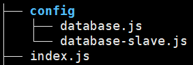
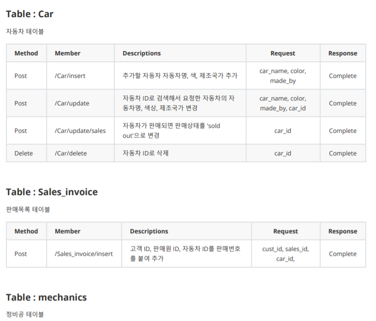

### 작업환경

Windows10

Aws 프리티어 계정

Aws EC2 인스턴스 존재해야함([AWS EC2 시작 및 SSH 접속하기](https://jeonghoon.netlify.app/AWS/Aws/markdown/) 참고)

Aws RDS 존재해야함 ([RDS - Master, slave 생성]()참고)

외부에서 리퀘스트 할 Client 파일 있어야함([클라이언트 용 Python file 작성]()참고)

---

<br/>

## 토이프로젝트 - Car Dealership

목표1 : 로컬에서 MySQL, python으로 CRUD 쿼리 처리 가능한 2티어 아키텍처 구축

1. [개요 및 MySQL Workbench를 이용하여 DataBase 쿼리 생성](https://jeonghoon.netlify.app/Project/miniproject/mini_query/)

2. [Python으로 클라이언트 용  스크립트 작성](https://jeonghoon.netlify.app/Project/miniproject/mini_python/)

목표 2 : Docker로 MySQL, python 이미지 생성 후 compose 구성

1. [MySQL, Python 이미지 생성 / compose.yml 작성 및 구축(1)](https://jeonghoon.netlify.app/Project/miniproject/mini_docker_images/)
2. [MySQL, Python 이미지 생성 / compose.yml 작성 및 구축(2)](https://jeonghoon.netlify.app/Project/miniproject/mini_docker_compose/)

목표 3 : AWS, node.js를 추가하여 자동 확장 가능한 3티어 아키텍처 구축

3. RDS - Master, slave 생성(https://jeonghoon.netlify.app/Project/miniproject/mini_rds/)
4. [**<u>RDS와 클라이언트 연결하는 node 서버 만들기</u>**](https://jeonghoon.netlify.app/Project/miniproject/mini_node/)
5. AutoScaling 그룹 생성 및 ELB(elastic Load Balancer) 연결
6. CloudWatch, AWS SNS 연동
7. CodeDeploy를 통한 배포 구축

<br/>

### RDS와 클라이언트 연결하는 node 서버 만들기

이번 포스트는 EC2 안에서 RDS와 외부 클라이언트(Python)를 연결하는 node 서버를 만드는 것이다. 만들고 보니 간단한 프로젝트를 하기에는 Spring boot보다 node 서버가 구축하기 훨씬 편했다.

아키텍처를 보자면, 다음과 같다. DB를 보면 Master와 Slave로 나뉘어있는데, select는 slave에서, update, insert, delete는 master에서 처리하도록 구성한다. 클라이언트로부터의 요청을 분산시켜 DB의 부하를 줄이기 위해서이다. 또한 Python에서는 requests 모듈을 사용하여, node 쪽으로 Json 형식의 데이터를 보내게 만들어놨다. node file 작성할 때 이 부분들을 고려하자.


작업에 들어가기 전에 [EC2 인스턴스에 node 및 모듈 설치하기](https://jeonghoon.netlify.app/node/node_install/)를 참고하여 node 및 mysql, express, body-parser 모듈을 설치해주자.

<br/>

먼저 pakage.json 파일을 만들어주자. package.json는 패키지가 설치한(의존중인) 모듈들에 대한 정보를 담고 있어서 나중에 배포 시 `npm install` 명령어로 한 번에 설치할 수 있다. 지금은 초기화를 위해 `npm init`을 해주자.

```shell
npm init
```

여러 물음이 나오는, 디폴트로 설정할 예정이므로 엔터로 건너뛰자.

package.json 내용이다. 기본적인 버전과 지난 포스트에서 설치한 body-parser, express, mysql 모듈들이 dependencies에 설치된 것을 볼 수 있다. 하나 추가할 것이, devDependencies 안에 시작명령어를 넣어줘야한다.

```js
"start" : "node index.js",
```


<br/>

이제 index.js를 만들어주고 아래의 내용들을 넣어준다.


node 모듈과 환경설정을 보자면, http method 사용을 위해 node 서버의 표준이 된 express를 임포트하였다. 또한 RDS의 mysql에 연결하기 위해 node의 mysql모듈도 임포트 하였다. 자세한건 주석으로.

```js
const express    = require('express'); //express import
const mysql      = require('mysql'); // mysql import
const dbconfig   = require('./config/database.js'); //master 연결 정보
const dbconfig_slave = require('./config/database-slave.js'); // slave 연결 정보
const connection = mysql.createConnection(dbconfig); // master 연결
const connection_slave = mysql.createConnection(dbconfig_slave); // slave 연결
const bodyParser = require('body-parser') // json 형식으로 받기 위한 body-parser 모듈
const app = express();

app.set('port', process.env.PORT || 8000); // 8000포트로 개방
app.use(bodyParser.urlencoded({ extended: false }));

var res_state='complete'; // 요청이 성공적으로 실행되면 클라이언트에 응답할 문자열
```

<br/>

현재 파일 및 디렉토리 상태이다.



아래의 내용을 config 파일들에게 저장해준다. databases.js에는 master DB 엔드포인트를, database-slave.js에는 slave DB 엔드포인트를 넣는다.

```js
module.exports = {
  host     : '각각의 엔드포인트',
  user     : 'admin',
  password : 'asdf1234',
  database : 'mydb'
}
```

<br/>

### Http Methods

select는 node에서 get 방식,

insert, update는 node에서 post방식

delete는 node에서 delete방식으로 요청과 응답을 하도록 구현하였다.

클라이언트(Python)에서 get방식으로 모든 DML을 날려도 되지만, 그렇게 구현하면 url에 클라이언트가 요청한 모든 정보가 노출되는 엄청난 보안사고가 발생한다(...). 따라서 각 DML에 맞는 Http Method를 사용하는 것이 바람직하다.

다음과 같이 get, post, delete 메소드를 작성해줬다. req는 request로, 클라이언트에서 node쪽으로 보내는 데이터이다. res는 response로, 클라이언트의 요청에 대한 응답이다. 필요에 따라 적절히 사용하면 된다. 참고로 .body로 데이터를 받기 위해서는 `body-parser`를 설치해야한다. 이걸 설치하지 않아 조금 헤맸었다. 아래는 http 메서드의 코드와 주석으로, CRUD에 해당하는 메서드 하나씩만 넣어놨다.

```js
// 전체 고객 데이터를 불러오는 쿼리
app.get('/Customer/select', (req, res) => {
    connection_slave.query('SELECT * from Customer', (error, rows) => {
    // error 처리. 밑의 쿼리에서는 생략
    if (error) throw error;
    console.log('User info is: ', rows);
    res.send(rows);
    });
});

// 고객의 이름과 전화번호, 생년월일을 RDS로 insert하는 쿼리
app.post('/Customer/insert', (req, res) => {
    // 확인해 보면 클라이언트에 날린 데이터가 json 형식으로 출력된다.
    console.log(req.body); 
    // 각 변수 초기화.
    var cust_name = req.body.cust_name;
    var cust_phone = req.body.cust_phone;
    var cust_birth = req.body.cust_birth;

    // sql에 쿼리를 작성하고 변수 할당할 부분은 ?로 놓는다.
    var sql = 'insert into Customer(cust_name,cust_phone,cust_birth) values(?,?,?)';
    connection.query(sql, [cust_name,cust_phone,cust_birth]);
	res.send(res_state);
});

// 고객의 정보 수정
app.post('/Customer/update', (req, res) => {
    console.log(req.body);
    var cust_name = req.body.cust_name;
    var cust_phone = req.body.cust_phone;
    var cust_birth = req.body.cust_birth;
    var cust_id = req.body.cust_id;

    var sql = 'update Customer set cust_name=?, cust_phone=?, cust_birth=? where cust_id=?';
    connection.query(sql, [cust_name, cust_phone, cust_birth,cust_id]);
    res.send(res_state);
});

// 고객의 정보를 삭제하는 delete 쿼리
app.delete('/Customer/delete', (req, res) => {
    console.log(req.body);
    var cust_id = req.body.cust_id;

    var sql = 'delete from Customer where cust_id=?';
    connection.query(sql, [cust_id]);
    res.send(res_state);
});
```

<br/>

### Test

외부에서 Python 파일을 실행하고 테스트해볼 차례. 간단하게 고객 데이터만 갖고 놀아보겠다. 위에서 설정한 `node index.js`명령어로 서버를 실행시키자.


<br/>

그리고 [클라이언트 용 Python file 작성]()에서 만든 test.py를 아무데서나 실행시켜주자. 주의할 것은 외부 다른 컴퓨터에서 실행할 경우, AWS 보안그룹에 외부IP를 추가해줘야한다. 

고객정보 조회를 했더니 데이터가 없어 아무 것도 안나온다.  데이터를 추가해야겠다.


<br/>

고객 정보 입력을 선택하고 데이터를 넣어준다.


<br/>

다시 확인해보면 데이터가 들어가있다.


<br/>

node 서버에서도 정상적으로 출력된다.


<br/>

RDS도 확인해보면 잘 들어가있다.


마찬가지로 고객정보 수정과 삭제도 잘 돌아간다.

<br/>

구현한 코드를 전부 올리기는 너무 많기 때문에 겸사겸사 Rest API 명세서를 작성해봤다.




