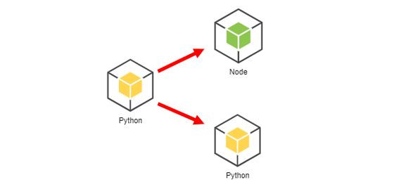
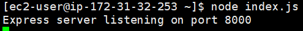

### 작업환경

Windows10

Aws 프리티어 계정

지난 글까지 완성 ([RDS - Master, slave 생성](https://jeonghoon.netlify.app/Project/miniproject/mini_rds/)참고)

---

<br/>

## 토이프로젝트 - Car Dealership

목표1 : 로컬에서 MySQL, python으로 CRUD 쿼리 처리 가능한 2티어 아키텍처 구축

1. [개요 및 MySQL Workbench를 이용하여 DataBase 쿼리 생성](https://jeonghoon.netlify.app/Project/miniproject/mini_query/)

2. [Python으로 클라이언트 용  스크립트 작성](https://jeonghoon.netlify.app/Project/miniproject/mini_python/)

목표 2 : Docker로 MySQL, python 이미지 생성 후 compose 구성

1. [MySQL, Python 이미지 생성 / compose.yml 작성 및 구축(1)](https://jeonghoon.netlify.app/Project/miniproject/mini_docker_images/)
2. [MySQL, Python 이미지 생성 / compose.yml 작성 및 구축(2)](https://jeonghoon.netlify.app/Project/miniproject/mini_docker_compose/)

목표 3 : AWS, node.js를 추가하여 자동 확장 가능한 3티어 아키텍처 구축

3. [RDS - Master, slave 생성](https://jeonghoon.netlify.app/Project/miniproject/mini_rds/)
4. [**<u>RDS와 클라이언트 연결하는 Rest API node 서버 만들기</u>**](https://jeonghoon.netlify.app/Project/miniproject/mini_node/)
5. AutoScaling 그룹 생성 및 ELB(elastic Load Balancer) 연결
6. CloudWatch, AWS SNS 연동
7. CodeDeploy를 통한 배포 구축

<br/>

## 개요 

### RDS와 클라이언트 연결하는 node 서버 만들기

이번 포스트는 EC2 안에서 RDS와 외부 클라이언트(Python)를 연결하는 node 서버를 만드는 것이다. 

아키텍처를 보면 다음과 같다. 먼저 외부에서 파이썬을 통해 접속한다. 기존 파이썬 파일은 DB쿼리 기능까지 갖고 있었다. 이 DB쿼리 부분을 node express로 새롭게 코딩하여 EC2 인스턴스에 올릴 것이다.  DB를 보면 Master와 Slave로 나뉘어있는데, select는 slave에서, update, insert, delete는 master에서 처리하도록 구성해야한다.


<br/>

 지금부터 기존 파이썬 파일을 클라이언트 기능만 가진 파이썬과 서버 기능만 가진 Node로 분리할 것이다. 파이썬은 외부에서, Node는 EC2 인스턴스 안에 들어갈 예정이다.



<br/>

또한 node는 Rset API의 다음 형식을 준수하고자 노력하였다.

```
첫 번째, URI는 정보의 자원을 표현해야 한다.
두 번째, 자원에 대한 행위는 HTTP Method(GET, POST, PUT, DELETE)로 표현한다.
```

<br/>

<br/>

---

### node  환경설정 

작업에 들어가기 전에 [EC2 인스턴스에 node 및 모듈 설치하기](https://jeonghoon.netlify.app/node/node_install/)를 참고하여 node 및 mysql, express, body-parser 모듈을 설치해주자.

<br/>

먼저 pakage.json 파일을 만들어주자. package.json는 패키지가 설치한(의존중인) 모듈들에 대한 정보를 담고 있어서 나중에 배포 시 `npm install` 명령어로 한 번에 설치할 수 있다. 지금은 초기화를 위해 `npm init`을 해주자.

```shell
npm init
```

여러 물음이 나오는, 디폴트로 설정할 예정이므로 엔터로 건너뛰자.

package.json 내용이다. 기본적인 버전과 지난 포스트에서 설치한 body-parser, express, mysql 모듈들이 dependencies에 설치된 것을 볼 수 있다. 하나 추가할 것이, devDependencies 안에 시작명령어를 넣어줘야한다.

```js
"start" : "node index.js",
```


<br/>

이제 index.js를 만들어주고 아래의 내용들을 넣어준다.

node 모듈과 환경설정을 보자면, http method 사용을 위해 node 서버의 표준이 된 express를 임포트하였다. 또한 RDS의 mysql에 연결하기 위해 node의 mysql모듈도 임포트 하였다. 자세한건 주석으로.

```js
const express    = require('express'); //express import
const mysql      = require('mysql'); // mysql import
const dbconfig   = require('./config/database.js'); //master 연결 정보
const dbconfig_slave = require('./config/database-slave.js'); // slave 연결 정보
const connection = mysql.createConnection(dbconfig); // master 연결
const connection_slave = mysql.createConnection(dbconfig_slave); // slave 연결
const bodyParser = require('body-parser') // json 형식으로 받기 위한 body-parser 모듈
const app = express();

app.set('port', process.env.PORT || 8000); // 8000포트로 개방
app.use(bodyParser.urlencoded({ extended: false }));

var res_state='complete'; // 요청이 성공적으로 실행되면 클라이언트에 응답할 문자열
```

<br/>

현재 파일 및 디렉토리 상태이다.


아래의 내용을 config 파일들에게 저장해준다. database.js에는 master DB 엔드포인트를, database-slave.js에는 slave DB 엔드포인트를 넣는다.

```js
module.exports = {
  host     : '각각의 엔드포인트',
  user     : 'admin',
  password : 'asdf1234',
  database : 'mydb'
}
```

<br/>

## 파이썬 환경설정

파이썬에서 기존에 사용하던 pymysql 모듈을 버리고 rest 형식으로 데이터를 주고받기 위해 requests 모듈을 사용해야한다. 또한 URL 형식으로 접근해야 하기 때문에 EC2인스턴스의 url로 접근하기 쉽게 url 변수를 설정하였다. 포트는 8000번으로 통일했다.

```python
import requests

url = 'EC2 인스턴스의 퍼블릭 DNS'
```

<br/>

requests 모듈은 Windows에서 다음과 같이 설치가 가능하다.

```powershell
pip3 install requests
```


<br/>

---

### 파이썬 파일 분리

### Http Methods

select는 node에서 get 방식,

insert, update는 node에서 post방식

delete는 node에서 delete방식으로 요청과 응답을 하도록 구현하였다.

클라이언트(Python)에서 get방식으로 모든 DML을 날려도 되지만, 그렇게 구현하면 url에 클라이언트가 요청한 모든 정보가 노출되는 엄청난 보안사고가 발생한다(...). 따라서 각 DML에 맞는 Http Method를 사용하는 것이 바람직하다.

<br/>

간단하게 파이썬의 select 쿼리를 살펴보자

```python
print('\t현재 고객정보를 조회합니다.')
selectSql="select * from Customer " # 쿼리문
curs.execute(selectSql) # 실행
result=curs.fetchall() # 딕셔너리 형태로 result에 저장
print_customer(result) # 출력
```

<br/>

이것을 클라이언트인 파이썬과 서버인 node로 분리하면 다음과 같다.

파이썬에서는 node가 들어있는 EC2인스턴스에 res를 요청하여 출력한다.

```python
url = 'AWS 인스턴스 주소' # 인스턴스 주소
response = requests.get(url + "/Customer/select") # URI로 정보의 자원을 표현
print_customer(response.json()) # json 형식으로 출력
```

<br/>

node에서는 req(request)로 요청을 받고 res(response)로 응답한다. select이므로 res만 반응. get 메서드로 작동한다.

```js
app.get('/Customer/select', (req, res) => {
    connection_slave.query('SELECT * from Customer', (error, rows) => {
    if (error) throw error;
    console.log('User info is: ', rows);
    res.send(rows);
    });
});
```

<br/>

마찬가지로 post 쿼리를 살펴보자

파이썬에서 아래와 같이 json 형식으로 데이터를 받는다 이 데이터를

```python
cust_name=input('\t이름 : ')
cust_phone=input('\t핸드폰 번호(010-0000-0000) : ')
cust_birth=input('\t생년월일(6자리) : ')

data = {
    'cust_name': cust_name, 
    'cust_phone': cust_phone, 
    'cust_birth': cust_birth
}
res = requests.post(url + "/Customer/insert", data=data)
```

<br/>

node로 보낸다. .body로 데이터를 받기 위해서는 `body-parser`를 설치해야한다. 이걸 설치하지 않아 조금 헤맸었다.

```js
// 고객의 이름과 전화번호, 생년월일을 RDS로 insert하는 쿼리
app.post('/Customer/insert', (req, res) => {
    // 확인해 보면 클라이언트에 날린 데이터가 json 형식으로 출력된다.
    console.log(req.body); 
    // 각 변수 초기화.
    var cust_name = req.body.cust_name;
    var cust_phone = req.body.cust_phone;
    var cust_birth = req.body.cust_birth;

    // sql에 쿼리를 작성하고 변수 할당할 부분은 ?로 놓는다.
    var sql = 'insert into Customer(cust_name,cust_phone,cust_birth) values(?,?,?)';
    connection.query(sql, [cust_name,cust_phone,cust_birth]);
	res.send(res_state);
});
```

<br/>

이러한 방법으로 다음과 같이 두개의 파일로 분리할 수 있었다.

<details> <summary>파이썬 소스코드</summary> <div markdown="1">

```python
import requests

url = 'EC2 인스턴스의 퍼블릭 DNS'
def print_mechanic(result):
    print('[MECHANIC]')
    print("---------------------------------------------------------------------------------------------------------")
    m_info = ['ID', '정비공 이름', 'MON', 'TUE', 'WED', 'THU', 'FRI']
    for m in m_info:
        print(m.center(8, ' '), end='\t')
    print("\n---------------------------------------------------------------------------------------------------------")
    m_codes = ['mechanic_id', 'mechanic_name', 'MON', 'TUE', 'WED', 'THU', 'FRI']
    for r in result:
        for c in m_codes:
            print(str(r[c]).center(8, ' '), end='\t')
        print(" ")
    print("---------------------------------------------------------------------------------------------------------")

def print_customer(result):
    print('[CUSTOMER]')
    print("-----------------------------------------------------------")
    m_info = ['고객ID', '고객명', '전화번호', '생년월일']
    for m in m_info:
        print(m.center(10, ' '), end='\t')
    print("\n-----------------------------------------------------------")
    m_codes = ['cust_id', 'cust_name', 'cust_phone', 'cust_birth']
    for r in result:
        for c in m_codes:
            print(str(r[c]).center(10, ' '), end='\t')
        print(" ")
    print("-----------------------------------------------------------")

def print_car(result):
    print('[CAR]')
    print("--------------------------------------------------------------------------")
    m_info = ['ID', '자동차명', '색상', '제조국가', '판매상태']
    for m in m_info:
        print(m.center(8, ' '), end='\t')
    print("\n--------------------------------------------------------------------------")
    m_codes = ['car_id', 'car_name', 'color', 'made_by','sales']
    for r in result:
        for c in m_codes:
            print(str(r[c]).center(8, ' '), end='\t')
        print(" ")
    print("--------------------------------------------------------------------------")
def print_invoice(result):
    print('[INVOICE]')
    print("-----------------------------------------------")
    m_info = ['구매번호', '직원ID', '고객ID', '자동차ID']
    for m in m_info:
        print(m.center(1, ' '), end='\t')
    print("\n-----------------------------------------------")
    m_codes = ['invoice_number', 'sales_id', 'cust_id', 'car_id']
    for r in result:
        for c in m_codes:
            print(str(r[c]).center(5, ' '), end='\t')
        print(" ")
    print("-------------------------------------------------")

def print_part(result):
    print('[PART]')
    print("-----------------------------------------------")
    m_info = ['부품ID', '부품명', '가격']
    for m in m_info:
        print(m.center(5, ' '), end='\t')
    print("\n-----------------------------------------------")
    m_codes = ['part_id', 'part_name', 'price']
    for r in result:
        for c in m_codes:
            print(str(r[c]).center(5, ' '), end='\t')
        print(" ")
    print("-------------------------------------------------")

while True:
    print('\n=============================================')
    carstr=' CAR DEALER SHOP '
    print(carstr.center(40, ' '),end='\t')
    print('\n=============================================')
    try:
        cmd=int(input('\t1) 고객 정보\n\t2) 자동차 정보\n\t3) 자동차 구매\n\t4) 자동차 서비스\n\t5) 종료 \n\t**번호를 입력해주세요(1~5) -> '))
    except:
        print('**메뉴는 1~5사이의 숫자만 입력해주세요.**')
        continue

    if cmd==1: #고객정보
        print('\n\t<고객정보 메뉴입니다.>')
        try : 
            cmd=int(input('\t1) 고객 정보 입력\n\t2) 고객정보 조회\n\t3) 고객정보 수정\n\t4) 고객정보 삭제\n\t5) 메인으로 이동 \n\t**메뉴를 입력해주세요(1~5) -> '))
        except:
            print('**1~5사이의 숫자만 입력해주세요. **')
            continue

        if cmd==1: #고객입력
            # print('\t신규 고객정보를 입력하세요.')
            cust_name=input('\t이름 : ')
            cust_phone=input('\t핸드폰 번호(010-0000-0000) : ')
            cust_birth=input ('\t생년월일(6자리) : ')

            data = {
                'cust_name': cust_name, 
                'cust_phone': cust_phone, 
                'cust_birth': cust_birth
            }
            res = requests.post(url + "/Customer/insert", data=data)


        elif cmd==2: #고객조회
            print('\t현재 고객정보를 조회합니다.')
            response = requests.get(url + "/Customer/select")
            print_customer(response.json())

        elif cmd==3: #고객수정
            print('\t고객정보를 수정합니다. 현재 데이터를 출력합니다.')
            response = requests.get(url + "/Customer/select")
            print_customer(response.json())

            update=input('\t수정하고 싶은 고객의 ID를 입력해주세요 -> ')
            newName=input('\t새로운 이름을 입력해주세요 -> ')
            newPhone=input('\t새로운 번호를 입력해주세요 -> ')
            newBirth=input('\t새로운 생년월일을 입력해주세요 -> ')
            data = {
                'cust_name': newName, 
                'cust_phone': newPhone, 
                'cust_birth': newBirth,
                'cust_id': update
            }
            res = requests.post(url + "/Customer/update", data=data)
            print('\t{}번 고객의 데이터가 수정되었습니다.'.format(update))
            continue
            
        elif cmd==4:#고객삭제
            cust_id=input('\t고객정보를 삭제합니다. 고객ID를 입력해주세요 ->')
            data = {
                'cust_id': cust_id, 
            }
            response = requests.delete(url + "/Customer/delete", data=data)
            print('\t데이터가 삭제되었습니다. \n\t[현재 고객 정보]')
            response = requests.get(url + "/Customer/select")
            print_customer(response.json())
            continue

        elif cmd==5:
                breakpoint
    
    elif cmd == 2: #자동차정보
        print('\n\t<자동차정보 메뉴입니다.>')
        try:
            cmd_car = int(input('\n\t1) 자동차 등록\n\t2) 자동차 검색 \n\t3) 자동차 정보 변경 \n\t4) 자동차 정보 삭제 \n\t**번호를 입력해주세요(1~4)-> '))
        except:
            print('\t**1~4 사이의 숫자만 입력해주세요.**')
            continue

        if cmd_car==1: #자동차 등록
            
            print('\t신규 자동차 정보를 입력해주세요.')
            # @app.route('Car/insert', methods=['POST'])
            car_name = input('\t자동차 이름 : ')
            color = input('\t색상 : ')
            made_by = input('\t제조국가 : ')
            car_data = {
                'car_name':car_name,
                'color':color,
                'made_by' : made_by
            }
            res = requests.post(url+"/Car/insert", data=car_data)
            # res = requests.post(url_car_insert, data=car_data)
            print("\t해당 데이터의 입력이 완료되었습니다. 현재 데이터를 출력합니다.\n") 
            response = requests.get(url+'/Car/select')
            print_car(response.json())


        if cmd_car==2: #자동차
            try:
                cmd_car_search = int(input('\n\t1) 자동차 전체 보기\n\t2) 특정 자동차 검색\n\t**번호를 입력해주세요(1~2) -> '))
            except:
                print('\t**번호는 1,2번만 입력해주세요.**')
                continue

            if cmd_car_search==1:
                print('\t현재 자동차정보를 조회합니다.')
                response = requests.get(url+'/Car/select')
                print_car(response.json())
                
            elif cmd_car_search == 2: #2-2 특정 검색
                car_name = input('\t**검색할 자동차의 이름을 입력해주세요 : ')
                data={
                    'car_name': car_name
                }
                response = requests.post(url+'/Car/select/name', data=data)
                print_car(response.json())
                # print(response.json())
        
        if cmd_car==3: # 자동차 정보 수정
            print('\t자동차 정보를 수정합니다. 현재 데이터를 출력합니다.')
            response = requests.get(url + "/Car/select")
            print_car(response.json())
            car_id = input('\t수정 할 자동차의 ID를 입력해주세요 : ')
            car_name=input('\t차 모델을 입력해주세요 : ')
            car_color=input('\t차 색상을 입력해주세요 : ')
            made_by=input('\t제조국가를 입력해주세요 : ')
            car_data = {
                'car_name':car_name,
                'color':car_color,
                'made_by' : made_by,
                'car_id' : car_id
            }
            res = requests.post(url+'/Car/update', data=car_data)
            print('\t{}번 자동차의 데이터가 수정되었습니다.'.format(car_id))
            print('\t현재 자동차정보를 조회합니다.')
            response = requests.get(url+'/Car/select')
            print(type(response))
            print_car(response.json())
        
        if cmd_car ==4: #자동차 삭제
            print('\t*** 자동차 정보를 삭제하면 구매목록에서 조회할 수 없습니다. 주의하세요! ***')
            car_id = int(input('\t삭제할 자동차의 ID를 입력해주세요 -> '))
            car_data={
                'car_id':car_id
            }
            response = requests.delete(url+'/Car/delete',data=car_data)
            
            print('\t{}번 자동차 정보가 삭제되었습니다.'.format(car_id))
            response = requests.get(url+'/Car/select')
            print_car(response.json())

    elif cmd==3: #자동차구매
        print('\n\t\t<자동차구매 메뉴입니다.>')
        print('현재 자동차 목록을 조회합니다. Sales 상태인 자동차만 구매 가능합니다.')
        response = requests.get(url + "/Car/select")
        print_car(response.json())

        cmd_car_buy = str(input('\t구매하시겠습니까? [yes] '))
        if cmd_car_buy == 'yes':
            InputCust = input('\t구매자의 ID를 입력하세요 : ')
            InputSalesman = input('\t판매자의 ID를 입력하세요 : ')
            InputCar = input('\t구매할 자동차의 ID를 입력하세요 : ') 
            
            data={
                'car_id': InputCar
            }
            response1 = requests.post(url + "/Car/select/id", data=data)
            print('car_id = ' + InputCar + ' ' + response1.json()[0]["sales"])

            if response1.json()[0]["sales"] == 'onSale' : # 자동차가 판매 중이면
                #Car에 있는 Sales 상태 sold out으로 변경
                res1 = requests.post(url+"/Car/update/sales", data=data)
                res2 = requests.post(url + "/Car/select/id", data=data)
                print_car(res2.json())

                print('\n**구매가 완료되었습니다. 아래 내역을 확인해주세요.')
                data2={
                    'cust_id': InputCust,
                    'sales_id': InputSalesman,
                    'car_id': InputCar
                }
                response3 = requests.post(url + "/Sales_invoice/insert", data=data2)
                response4 = requests.post(url + "/Sales_invoice/select/id", data=data2)
                print_invoice(response4.json())
            
            else : #자동차 sold out
                print('{}번 자동차는 현재 SOLD OUT입니다. 다른 자동차를 선택해주세요'.format(InputCar))
            continue

    elif cmd==4: #서비스
        print('\n\t<자동차서비스 메뉴입니다.>')
        response1 = requests.get(url + "/Sales_invoice/select")
        print_invoice(response1.json())
        invoiceNum=input('\t구매번호를 입력해주세요 : ')
        
        try:
            cmd_rsv = int(input('\n\t1) 예약가능날짜 조회하기 \n\t2) 예약하기 \n\t번호를 입력해주세요(1~2) -> '))
        except:
            print('\t**번호는 1~2사이의 숫자만 입력해주세요.**')
            continue

        if cmd_rsv == 1: #날짜 조회
            print('\t다음주 예약일정을 조회합니다.\n')
            response2 = requests.get(url + "/mechanics/select")
            print_mechanic(response2.json())

        elif cmd_rsv==2: #예약하기
            rsv_day = 0 #날짜 예약
            rsv_mec = 0 #정비공 예약
            print('\t다음주 예약 시간표입니다.')
            while True:
                response3 = requests.get(url + "/mechanics/select")
                print_mechanic(response3.json())
               
                rsv_mec = input('\t기술자를 선택해주세요\n\t1)Mechanic1 \n\t2)Mechanic2 \n\t3)Mechanic3 \n\t4)Mechanic4 \n\t**정비공 번호를 입력해주세요 ->  ')
                if rsv_mec != None:
                    rsv_day = input('\n\t요일을 입력 해주세요 ( MON, TUE, WED, THU, FRI) -> ')
                    
                    if rsv_day=='MON' or rsv_day=='TUE' or rsv_day=='WED' or rsv_day=='THU' or rsv_day=='FRI' :
                        data={
                            'day': rsv_day,
                            'mechanic_name': "Mec"+rsv_mec
                        }
                        response4 = requests.post(url + "/mechanics/select/name", data=data)

                        if response4.json()[0][rsv_day] == 'reserved' :
                            print('\n\t*** 이미 예약된 날짜입니다 다른 날을 선택해주세요 ***')
                            continue
                        break;
                    else:
                        print('\t제대로 입력해주세요\n')
                        continue

                else:
                    print('\t정비공 번호를 제대로 입력해주세요\n')
                    continue
            data2 = {
                'day': rsv_day,
                'mechanic_name': "Mec"+rsv_mec
            }
            response5 = requests.post(url + "/mechanics/update", data=data2)
            
            response6 = requests.get(url + "/mechanics/select")
            print_mechanic(response6.json())
            print('\t**예약이 완료되었습니다.')

    elif cmd ==5:
        quit()

    else:
        print('\n\t**메뉴는 1~5사이의 숫자만 입력해주세요.**')
```

</div> </details>

<details> <summary>Node 소스코드</summary> <div markdown="1">

```js
const express    = require('express');
const mysql      = require('mysql');
const dbconfig   = require('./config/database.js');
const dbconfig_slave = require('./config/database-slave.js');
const connection = mysql.createConnection(dbconfig);
const connection_slave = mysql.createConnection(dbconfig_slave);
const bodyParser = require('body-parser')

const app = express();
app.set('port', process.env.PORT || 8000);
app.use(bodyParser.urlencoded({ extended: false }));

var res_state='complete';
  
app.get('/Customer/select', (req, res) => {
    connection_slave.query('SELECT * from Customer', (error, rows) => {
    if (error) throw error;
    console.log('User info is: ', rows);
    res.send(rows);
    });
});

app.post('/Customer/select/name', (req, res) => {
    console.log(req.body);
    var cust_name = req.body.cust_name;

    var sql = 'select * from Customer where cust_name=?';
    connection_slave.query(sql, [cust_name]);
    res.send(res_state);
});
  
app.post('/Customer/select/id', (req, res) => {
    console.log(req.body);
    var cust_id = req.body.cust_id;

    var sql = 'select * from Customer where cust_id=?';
    connection_slave.query(sql, [cust_id]);
    res.send(res_state);
});

app.post('/Customer/select/phone', (req, res) => {
    console.log(req.body);
    var cust_phone = req.body.cust_phone;

    var sql = 'select cust_phone from Customer where cust_phone=?';
    connection_slave.query(sql, [cust_phone]);
    res.send(res_state);
});

app.post('/Customer/insert', (req, res) => {
    console.log(req.body);
    var cust_name = req.body.cust_name;
    var cust_phone = req.body.cust_phone;
    var cust_birth = req.body.cust_birth;

    var sql = 'insert into Customer(cust_name,cust_phone,cust_birth) values(?,?,?)';
    connection.query(sql, [cust_name,cust_phone,cust_birth]);
    res.send(res_state);
});
  
app.post('/Customer/update', (req, res) => {
    console.log(req.body);
    var cust_name = req.body.cust_name;
    var cust_phone = req.body.cust_phone;
    var cust_birth = req.body.cust_birth;
    var cust_id = req.body.cust_id;

    var sql = 'update Customer set cust_name=?, cust_phone=?, cust_birth=? where cust_id=?';
    connection.query(sql, [cust_name, cust_phone, cust_birth,cust_id]);
    res.send(res_state);
});
  
  
app.delete('/Customer/delete', (req, res) => {
    console.log(req.body);
    var cust_id = req.body.cust_id;

    var sql = 'delete from Customer where cust_id=?';
    connection.query(sql, [cust_id]);
    res.send(res_state);
});

app.get('/Car/select', (req, res) => {
    connection_slave.query('SELECT * from Car', (error, rows) => {
    if (error) throw error;
    console.log('Car info is: ', rows);
    res.send(rows);
    });
  });
  
  app.post('/Car/select/id', (req, res) => {
    console.log(req.body);
    var car_id = req.body.car_id;
  
    var sql = 'select * from Car where car_id=?';
    connection_slave.query(sql, [car_id], (error, rows) => {
        console.log(rows);
        res.send(rows);
    });
  });
  
  app.post('/Car/select/name', (req, res) => {
    console.log(req.body);
    var car_name = req.body.car_name;
  
    var sql = 'select * from Car where car_name=?';
    connection_slave.query(sql, [car_name], (error, rows) => {
        res.send(rows);
    });
  });
  
  app.post('/Car/insert', (req, res) => {
    console.log(req.body);
    var car_name = req.body.car_name;
    var color = req.body.color;
    var made_by = req.body.made_by;
  
    var sql = 'insert into Car(car_name, color, made_by) values(?,?,?)';
    connection.query(sql, [car_name, color, made_by]);
    res.send(res_state);
  });

  app.post('/Car/update', (req, res) => {
    console.log(req.body);
    var car_name = req.body.car_name;
    var color = req.body.color;
    var made_by = req.body.made_by;
    var car_id = req.body.car_id;
  
    var sql = "update Car set car_name=?, color=?, made_by=? where car_id=?";
    connection.query(sql,  [car_name, color, made_by, car_id]);
    res.send(res_state);
  });
  
  app.post('/Car/update/sales', (req, res) => {
    console.log(req.body);
  
    var car_id = req.body.car_id;
  
    var sql = "update Car set sales='sold_out' where car_id=?";
    connection.query(sql,  [car_id]);
    res.send(res_state);
  });
  
  app.post('/Car/update_id', (req, res) => {
    console.log(req.body);
    var car_id = req.body.car_id;
  
    var sql = "update Car set sales='sold_out' where car_id=?";
    connection.query(sql, [car_id]);
    res.send(res_state);
  });
  
  app.delete('/Car/delete', (req, res) => {
    console.log(req.body);
    var car_id = req.body.car_id;
  
    var sql = 'delete from Car where car_id=?';
    connection.query(sql, [car_id]);
    res.send(res_state);
  });
  

app.get('/Sales_invoice/select', (req, res) => {
    connection_slave.query('SELECT * from Sales_invoice', (error, rows) => {
    if (error) throw error;
    console.log('User info is: ', rows);
    res.send(rows);
    });
});

app.post('/Sales_invoice/select/id', (req, res) => {
    console.log(req.body);
    var car_id = req.body.car_id;
    var cust_id = req.body.cust_id;

    var sql = 'select * from Sales_invoice where car_id =? and cust_id=?';
    connection_slave.query(sql, [car_id, cust_id], (error, rows) => {
        console.log(rows);
        res.send(rows);
    });
});
  
app.post('/Sales_invoice/insert', (req, res) => {
    console.log(req.body);
    var cust_id = req.body.cust_id;
    var sales_id = req.body.sales_id;
    var car_id = req.body.car_id;

    var sql = 'insert into Sales_invoice(cust_id,sales_id,car_id) values(?,?,?)';
    connection.query(sql, [cust_id,sales_id,car_id]);
    res.send(res_state);
});

app.get('/mechanics/select', (req, res) => {
    connection_slave.query('SELECT * from mechanics', (error, rows) => {
    if (error) throw error;
    console.log('User info is: ', rows);
    res.send(rows);
    });
});

app.post('/mechanics/select/name', (req, res) => {
    console.log(req.body);
    var day = req.body.day;
    var mechanic_name = req.body.mechanic_name;

    var sql = 'SELECT ? FROM mechanics where mechanic_name=?';
    if(day=='FRI'){
        var sql = "SELECT FRI FROM mechanics where mechanic_name=?";
        connection_slave.query(sql, [mechanic_name], (error, rows) => {
            res.send(rows);
        });
    }
    else if(day=='MON'){
        var sql = "SELECT MON FROM mechanics where mechanic_name=?";
        connection_slave.query(sql, [mechanic_name], (error, rows) => {
            res.send(rows);
        });
    }
    else if(day=='TUE'){
        var sql = "SELECT TUE FROM mechanics where mechanic_name=?";
        connection_slave.query(sql, [mechanic_name], (error, rows) => {
            res.send(rows);
        });
    }
    else if(day=='WED'){
        var sql = "SELECT WED FROM mechanics where mechanic_name=?";
        connection_slave.query(sql, [mechanic_name], (error, rows) => {
            res.send(rows);
        });
    }
    else if(day=='THU'){
        var sql = "SELECT THU FROM mechanics where mechanic_name=?";
        connection_slave.query(sql, [mechanic_name], (error, rows) => {
            res.send(rows);
        });
    }
});

app.post('/mechanics/update', (req, res) => {
    console.log(req.body);
    var day = req.body.day;
    var mechanic_name = req.body.mechanic_name;

    if(day=='MON'){
        var sql = "UPDATE mechanics SET MON = 'reserved' where mechanic_name=?";
        connection.query(sql, [mechanic_name]);
    }
    else if(day=='TUE'){
        var sql = "UPDATE mechanics SET TUE = 'reserved' where mechanic_name=?";
        connection.query(sql, [mechanic_name]);
    }
    else if(day=='WED'){
        var sql = "UPDATE mechanics SET WED = 'reserved' where mechanic_name=?";
        connection.query(sql, [mechanic_name]);
    }
    else if(day=='THU'){
        var sql = "UPDATE mechanics SET THU = 'reserved' where mechanic_name=?";
        connection.query(sql, [mechanic_name]);
    }
    else if(day=='FRI'){
        var sql = "UPDATE mechanics SET FRI = 'reserved' where mechanic_name=?";
        connection.query(sql, [mechanic_name]);
    }
    connection.query(sql, [day, mechanic_name]);
    res.send(res_state);;
});


app.listen(app.get('port'), () => {
    console.log('Express server listening on port ' + app.get('port'));
});
```

</div> </details>

<br/>

## Test

외부에서 Python 파일을 실행하고 테스트해볼 차례. 간단하게 고객 데이터만 갖고 놀아보겠다. 위에서 설정한 `node index.js`명령어로 서버를 실행시키자.



<br/>

그리고 [클라이언트 용 Python file 작성]()에서 만든 test.py를 아무데서나 실행시켜주자. 주의할 것은 외부 다른 컴퓨터에서 실행할 경우, AWS 보안그룹에 외부IP를 추가해줘야한다. 

고객정보 조회를 했더니 데이터가 없어 아무 것도 안나온다.  데이터를 추가해야겠다.


<br/>

고객 정보 입력을 선택하고 데이터를 넣어준다.


<br/>

다시 확인해보면 데이터가 들어가있다.


<br/>

node 서버에서도 정상적으로 출력된다.


<br/>

RDS도 확인해보면 잘 들어가있다.


마찬가지로 고객정보 수정과 삭제도 잘 돌아간다.

<br/>

다음은 현재까지 만들어진 아키텍처의 모습이다.


겸사겸사 Rest API 명세서를 작성해봤다.


