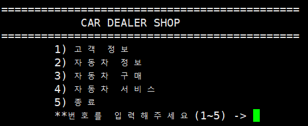
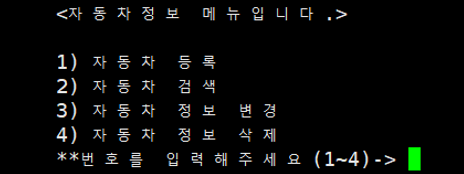
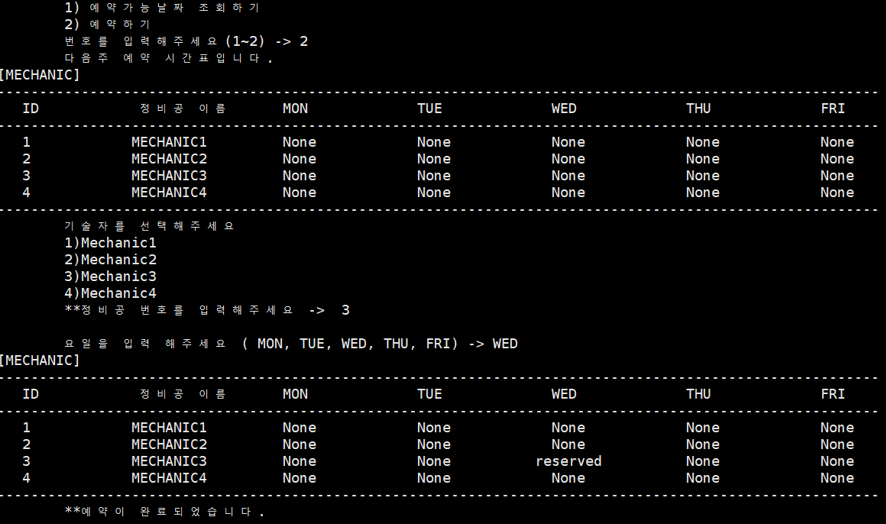

### 작업환경

Windows10

---

<br/>

## 토이프로젝트 - Car Dealership

목표1 : 로컬에서 MySQL, python으로 CRUD 쿼리 처리 가능한 2티어 아키텍처 구축

1. [개요 및 MySQL Workbench를 이용하여 DataBase 쿼리 생성](https://jeonghoon.netlify.app/Project/miniproject/mini_query/)

2. [**<u>Python으로 클라이언트 용  스크립트 작성</u>**](https://jeonghoon.netlify.app/Project/miniproject/mini_python/)

목표 2 : Docker로 MySQL, python 이미지 생성 후 compose 구성

1. [MySQL, Python 이미지 생성 / compose.yml 작성 및 구축(1)](https://jeonghoon.netlify.app/Project/miniproject/mini_docker_images/)
2. [MySQL, Python 이미지 생성 / compose.yml 작성 및 구축(2)](https://jeonghoon.netlify.app/Project/miniproject/mini_docker_compose/)

목표 3 : AWS, node.js를 추가하여 자동 확장 가능한 3티어 아키텍처 구축

3. [RDS - Master, slave 생성](https://jeonghoon.netlify.app/Project/miniproject/mini_rds/)
4. [RDS와 클라이언트 연결하는 node 서버 만들기](https://jeonghoon.netlify.app/Project/miniproject/mini_node/)
5. AutoScaling 그룹 생성 및 ELB(elastic Load Balancer) 연결
6. CloudWatch, AWS SNS 연동
7. CodeDeploy를 통한 배포 구축

<br/>

---

## 개요

앞서 DB 쿼리를 만들었다. 이제 로컬에서 실행되는 MySQL과 연동해야한다. Car Dealership의 CRUD를 구현한 파이썬 파일을 만드는 것이 이번 목표이다. 추후에 Docker에서 실행할 때와 AWS에서 node.js를 추가할 때 코드를 조금 수정해줄 필요가 있다.

<br/>

다음은 완성 될 화면의 모습이다. 토이프로젝트라 쟝고는 사용하지 않았다.



<br/>

각각의 메뉴에 CRUD를 최대한 구현하려 노력하였다. 다음과 같은 기능을 담당한다.

### 고객정보

1. 고객 입력 - 새로운 고객을 추가한다

2. 고객 조회 - 고객을 조회한다.

3. 고객 수정 - 고객 데이터 수정

4. 고객 삭제 - 고객 데이터 삭제

   <br/>

   

### 자동차 정보

1. 자동차 등록 - 입고된 자동차를 등록한다.

2. 자동차 검색 - 출고 가능한 자동차를 검색한다. 전체조회, 특정 자동차 검색이 가능.

3. 자동차 정보 수정 - 자동차 데이터 수정

4. 자동차 정보 삭제 - 자동차 데이터 삭제

   <br/>

### 자동차 구매

구매 - 구매자의 ID, 판매사원의 ID, 자동차의 ID를 입력하여 청구서(Sales_invoice)를 만든다. 판매 된 자동차는 구매 불가능 하도록 Sales/Sold out으로 구분하게 만들었다.

<br/>

### 자동차 정비예약 서비스

1. 예약가능날짜 조회하기 - 예약 가능한 정비공의 요일을 보여준다
2. 예약하기 - 정비공 선택 후 예약을 지정한다.

청구서(Sales_invoice) 테이블의 구매번호(invoice_number)를 입력하고 예약 가능한 정비공(mechanic)을 선택하여 자동차정비 받을 날짜를 예약한다. 이미 예약되어 있다면 다른 날로 유도한다. 주 단위로 예약 받음.



---

## 소스코드 작성

먼저 MySQL과 연동을 위해 pymysql 모듈을 임포트하였다.

```python
import pymysql
```

커넥션 정보를 입력하고

```python
conn=pymysql.connect(host='127.0.0.1', port=3306, 
user='root',password='mysql',db='mydb',charset='utf8')
```

커넥션으로부터 딕셔너리 커서를 생성해준다. cursor 생성시 DictCursor 옵션을 주면, Row 결과를 Dictionary 형태로 리턴한다.

```python
curs = conn.cursor(pymysql.cursors.DictCursor)
```

<br/>

 이제 select, insert, update, delete를 살펴보자.

select 는 읽기전용이라 데이터를 직접 건들 필요가 없다.

```python
selectPhone="select cust_phone from Customer where cust_phone='{}'".format(cust_phone)
curs.execute(selectPhone) # execute는 selectSql 실행
resultPhone=curs.fetchone() # fetchall은 데이터 전부를, fetchone은 데이터 하나를 가져옴
```

하지만 insert, update, delete는 쿼리를 실행하고 서버에 반영해야한다. commit 명령어가 이를 수행

```python
insertSql = "INSERT INTO Customer(cust_name, cust_phone, cust_birth) values('{}','{}',{})".format(cust_name,cust_phone,cust_birth)
curs.execute(insertSql) # 실행
conn.commit() # 커넥팅 된 서버에 반영
```

<br/>

이와 같은 규칙으로 전체 코드를 작성하였다.

<details> <summary>소스코드 보기</summary> <div markdown="1">

```python
import pymysql

conn=pymysql.connect(host='127.0.0.1', port=3306, user='root',password='mysql',db='mydb',charset='utf8')
curs = conn.cursor(pymysql.cursors.DictCursor)

def print_mechanic(result):
    print('[MECHANIC]')
    print("---------------------------------------------------------------------------------------------------------")
    m_info = ['ID', '정비공 이름', 'MON', 'TUE', 'WED', 'THU', 'FRI']
    for m in m_info:
        print(m.center(8, ' '), end='\t')
    print("\n---------------------------------------------------------------------------------------------------------")
    m_codes = ['mechanic_id', 'mechanic_name', 'MON', 'TUE', 'WED', 'THU', 'FRI']
    for r in result:
        for c in m_codes:
            print(str(r[c]).center(8, ' '), end='\t')
        print(" ")
    print("---------------------------------------------------------------------------------------------------------")

def print_customer(result):
    print('[CUSTOMER]')
    print("-----------------------------------------------------------")
    m_info = ['고객ID', '고객명', '전화번호', '생년월일']
    for m in m_info:
        print(m.center(10, ' '), end='\t')
    print("\n-----------------------------------------------------------")
    m_codes = ['cust_id', 'cust_name', 'cust_phone', 'cust_birth']
    for r in result:
        for c in m_codes:
            print(str(r[c]).center(10, ' '), end='\t')
        print(" ")
    print("-----------------------------------------------------------")

def print_car(result):
    print('[CAR]')
    print("--------------------------------------------------------------------------")
    m_info = ['ID', '자동차명', '색상', '제조국가', '판매상태']
    for m in m_info:
        print(m.center(8, ' '), end='\t')
    print("\n--------------------------------------------------------------------------")
    m_codes = ['car_id', 'car_name', 'color', 'made_by','sales']
    for r in result:
        for c in m_codes:
            print(str(r[c]).center(8, ' '), end='\t')
        print(" ")
    print("--------------------------------------------------------------------------")
def print_invoice(result):
    print('[INVOICE]')
    print("-----------------------------------------------")
    m_info = ['구매번호', '직원ID', '고객ID', '자동차ID']
    for m in m_info:
        print(m.center(1, ' '), end='\t')
    print("\n-----------------------------------------------")
    m_codes = ['invoice_number', 'sales_id', 'cust_id', 'car_id']
    for r in result:
        for c in m_codes:
            print(str(r[c]).center(5, ' '), end='\t')
        print(" ")
    print("-------------------------------------------------")

def print_part(result):
    print('[PART]')
    print("-----------------------------------------------")
    m_info = ['부품ID', '부품명', '가격']
    for m in m_info:
        print(m.center(5, ' '), end='\t')
    print("\n-----------------------------------------------")
    m_codes = ['part_id', 'part_name', 'price']
    for r in result:
        for c in m_codes:
            print(str(r[c]).center(5, ' '), end='\t')
        print(" ")
    print("-------------------------------------------------")

while True:
    print('\n=============================================')
    carstr=' CAR DEALER SHOP '
    print(carstr.center(40, ' '),end='\t')
    print('\n=============================================')
    try:
        cmd=int(input('\t1) 고객 정보\n\t2) 자동차 정보\n\t3) 자동차 구매\n\t4) 자동차 서비스\n\t5) 종료 \n\t**번호를 입력해주세요(1~5) -> '))
    except:
        print('**메뉴는 1~5사이의 숫자만 입력해주세요.**')
        continue

    if cmd==1: #고객정보
        print('\n\t<고객정보 메뉴입니다.>')
        try : 
            cmd=int(input('\t1) 고객 정보 입력\n\t2) 고객정보 조회\n\t3) 고객정보 수정\n\t4) 고객정보 삭제\n\t5) 메인으로 이동 \n\t**메뉴를 입력해주세요(1~5) -> '))
        except:
            print('**1~5사이의 숫자만 입력해주세요. **')
            continue

        
        if cmd==1: #고객입력
            print('\t신규 고객정보를 입력하세요.')
            cust_name=input('\t이름 : ')
            cust_phone=input('\t핸드폰 번호(010-0000-0000) : ')
            cust_birth=input('\t생년월일(6자리) : ')
           
            selectPhone="select cust_phone from Customer where cust_phone='{}'".format(cust_phone)
            curs.execute(selectPhone)
            resultPhone=curs.fetchone()
            

            if resultPhone == None : #중복처리 - 핸드폰 번호
                insertSql = "INSERT INTO Customer(cust_name, cust_phone, cust_birth) values('{}','{}',{})".format(cust_name,cust_phone,cust_birth)
                curs.execute(insertSql)
                conn.commit()
                print("\t해당 데이터의 입력이 완료되었습니다.") 
                continue
               
            else : 
                print('\n\t**이미 등록된 고객입니다. 다시 입력해주세요. \n\t**정보수정은 3) 고객정보 수정에서 가능합니다. ')
                continue

        elif cmd==2: #고객조회
            print('\t현재 고객정보를 조회합니다.')
            selectSql="select * from Customer "
            curs.execute(selectSql)
            result=curs.fetchall()
            print_customer(result)
            conn.commit()

        elif cmd==3: #고객수정
            print('\t고객정보를 수정합니다. 현재 데이터를 출력합니다.')
            allselect="SELECT * FROM Customer"
            curs.execute(allselect)
            result=curs.fetchall()
            print_customer(result)

            update=input('\t수정하고 싶은 고객의 ID를 입력해주세요 -> ')
            newName=input('\t새로운 이름을 입력해주세요 -> ')
            newPhone=input('\t새로운 번호를 입력해주세요 -> ')
            newBirth=input('\t새로운 생년월일을 입력해주세요 -> ')
            updateSql= "UPDATE Customer SET cust_name = '{}', cust_phone='{}', cust_birth={} where cust_id = {}".format(newName, newPhone, newBirth, update)
            curs.execute(updateSql)
            conn.commit()
            print('\t{}번 고객의 데이터가 수정되었습니다.'.format(update))
            continue
            
        elif cmd==4:#고객삭제
            cust_id=input('\t고객정보를 삭제합니다. 고객ID를 입력해주세요 ->')
            deleteSql="DELETE FROM Customer where cust_id = {}".format(cust_id)
            curs.execute(deleteSql)
            conn.commit()
            print('\t데이터가 삭제되었습니다. \n\t[현재 고객 정보]')
            allselect="SELECT * FROM Customer"
            curs.execute(allselect)
            result=curs.fetchall()
            print_customer(result)

            continue

        elif cmd==5:
                breakpoint
    
    elif cmd == 2: #자동차정보
        print('\n\t<자동차정보 메뉴입니다.>')
        try:
            cmd_car = int(input('\n\t1) 자동차 등록\n\t2) 자동차 검색 \n\t3) 자동차 정보 변경 \n\t4) 자동차 정보 삭제 \n\t**번호를 입력해주세요(1~4)-> '))
        except:
            print('\t**1~4 사이의 숫자만 입력해주세요.**')
            continue
        if cmd_car==1: #자동차 등록
            print('\t신규 자동차 정보를 입력해주세요.')
            car_name = input('\t자동차 이름 : ')
            car_color = input('\t색상 : ')
            made_by = input('\t제조국가 : ')
            insertSql = "INSERT INTO Car(car_name, color, made_by) VALUES('{}','{}','{}')".format(car_name,car_color,made_by)
            curs.execute(insertSql)
            conn.commit()
            print("\t해당 데이터의 입력이 완료되었습니다.") 
            
        if cmd_car==2: #자동차 검색
            try:
                cmd_car_search = int(input('\n\t1) 자동차 전체 보기\n\t2) 특정 자동차 검색\n\t**번호를 입력해주세요(1~2) -> '))
            except:
                print('\t**번호는 1,2번만 입력해주세요.**')
                continue

            if cmd_car_search == 1: #2-1 전체 조회
                print('\t현재 자동차 목록을 조회합니다.')
                selectAll="select * from Car" 
                curs.execute(selectAll)
                result=curs.fetchall()
                print_car(result)

            elif cmd_car_search == 2: #2-2 특정 검색
                car_name = input('\t**검색할 자동차의 이름을 입력해주세요 : ')
                selectSql = "select * from Car where car_name='{}'".format(car_name)
                curs.execute(selectSql)
                result=curs.fetchall()
                print_car(result)
    
        if cmd_car==3: #자동차 정보 수정
            car_id = input('\t수정 할 자동차의 ID를 입력해주세요 : ')
            selectAll="select * from Car where car_id={}".format(car_id) 
            print('\n\t수정 할 자동차의 현재 정보입니다\n')
            curs.execute(selectAll)
            result=curs.fetchall()
            print_car(result)

            car_name=input('\t차 모델을 입력해주세요 : ')
            car_color=input('\t차 색상을 입력해주세요 : ')
            made_by=input('\t제조국가를 입력해주세요 : ')
            updateSql="update Car set car_name='{}', color='{}', made_by='{}' where car_id={}".format(car_name,car_color,made_by, car_id)
            curs.execute(updateSql)
            conn.commit()
            print('\t{}번 자동차의 데이터가 수정되었습니다.'.format(car_id))
            curs.execute(selectAll)
            result=curs.fetchall()
            print_car(result)
            conn.commit()

        if cmd_car == 4: #자동차 정보 삭제
            print('\t*** 자동차 정보를 삭제하면 구매목록에서 조회할 수 없습니다. 주의하세요! ***')
            car_id = int(input('\t삭제할 자동차의 ID를 입력해주세요 -> '))
            deleteSql1 = "delete from Sales_invoice where car_id='{}'".format(car_id)
            deleteSql2 = "delete from Car where car_id='{}'".format(car_id)
            curs.execute(deleteSql1)
            curs.execute(deleteSql2)
            conn.commit()
            print('\t{}번 자동차 정보가 삭제되었습니다.'.format(car_id))
            selectSql="select * from Car" 
            curs.execute(selectSql)
            result=curs.fetchall()
            print_car(result)
            

    elif cmd==3: #자동차구매
        print('\n\t\t<자동차구매 메뉴입니다.>')
        print('현재 자동차 목록을 조회합니다. Sales 상태인 자동차만 구매 가능합니다.')
        selectAll="select * from Car" 
        curs.execute(selectAll)
        result=curs.fetchall()
        print_car(result)

        cmd_car_buy = str(input('\t구매하시겠습니까? [yes] '))
        if cmd_car_buy == 'yes':
            InputCust = input('\t구매자의 ID를 입력하세요 : ')
            InputSalesman = input('\t판매자의 ID를 입력하세요 : ')
            InputCar = input('\t구매할 자동차의 ID를 입력하세요 : ')

            custSelect="SELECT * FROM Customer where cust_id = {}".format(InputCust)
            curs.execute(custSelect)

            salesmanSelect="SELECT * FROM sales_person where sales_id = {}".format(InputSalesman)
            curs.execute(salesmanSelect)
            
            carSelect="SELECT * FROM Car where car_id = {}".format(InputCar)
            curs.execute(carSelect)
            conn.commit()
            

            carSales="SELECT sales from Car where car_id={}".format(InputCar)
            curs.execute(carSales)
            printSales=curs.fetchone()

            if printSales.get('sales') == 'onSale' : # 자동차가 판매 중이면
                #Car에 있는 Sales 상태 sold out으로 변경
                updateSql_car= "UPDATE Car SET sales = 'sold_out' where car_id = '{}'".format(InputCar)
                curs.execute(updateSql_car)
                conn.commit()
                print('\n**구매가 완료되었습니다. 아래 내역을 확인해주세요.') 
                invoiceUpdate="insert into Sales_invoice(sales_id, cust_id, car_id) values({},{},{})".format(InputSalesman, InputCust, InputCar)
                curs.execute(invoiceUpdate)
                conn.commit()
                
                #invoice update
                invoiceSelect="select * from Sales_invoice where car_id ={} and cust_id={}".format(InputCar, InputCust)
                curs.execute(invoiceSelect)
                result=curs.fetchall()
                print_invoice(result)
                conn.commit()
            
            else : #자동차 sold out
                print('{}번 자동차는 현재 SOLD OUT입니다. 다른 자동차를 선택해주세요'.format(InputCar))
            continue
        
            
    elif cmd==4: #서비스
        print('\n\t<자동차서비스 메뉴입니다.>')

        invoiceNum=input('\t구매번호를 입력해주세요 : ')
        invoiceSql="SELECT * FROM Sales_invoice WHERE invoice_number={}".format(invoiceNum)
        curs.execute(invoiceSql)
        result=curs.fetchall()
        print_invoice(result)
        conn.commit()

        try:
            cmd_rsv = int(input('\n\t1) 예약가능날짜 조회하기 \n\t2) 예약하기 \n\t번호를 입력해주세요(1~2) -> '))
        except:
            print('\t**번호는 1~2사이의 숫자만 입력해주세요.**')
            continue

        if cmd_rsv == 1: #날짜 조회
            print('\t다음주 예약일정을 조회합니다.\n')
            selectSql="SELECT * FROM mechanics"
            curs.execute(selectSql)
            result = curs.fetchall()
            print_mechanic(result)

        elif cmd_rsv==2: #예약하기
            rsv_day = 0 #날짜 예약
            rsv_mec = 0 #정비공 예약
            print('\t다음주 예약 시간표입니다.')
            while True:
                selectSql="SELECT * FROM mechanics"
                curs.execute(selectSql)
                result = curs.fetchall()
                print_mechanic(result)
               
                rsv_mec = input('\t기술자를 선택해주세요\n\t1)Mechanic1 \n\t2)Mechanic2 \n\t3)Mechanic3 \n\t4)Mechanic4 \n\t**정비공 번호를 입력해주세요 ->  ')
                if rsv_mec != None:
                    rsv_day = input('\n\t요일을 입력 해주세요 ( MON, TUE, WED, THU, FRI) -> ')
                    
                    if rsv_day=='MON' or rsv_day=='TUE' or rsv_day=='WED' or rsv_day=='THU' or rsv_day=='FRI' :
                        selectSql="SELECT {} FROM mechanics where mechanic_name='{}'".format(rsv_day, 'MECHANIC'+rsv_mec)
                        curs.execute(selectSql)
                        printDay = curs.fetchone()

                        if printDay.get(rsv_day) != None :
                            print('\n\t*** 이미 예약된 날짜입니다 다른 날을 선택해주세요 ***')
                            continue
                        break;
                    else:
                        print('\t제대로 입력해주세요\n')
                        continue

                else:
                    print('\t정비공 번호를 제대로 입력해주세요\n')
                    continue
            
            updateSql= "UPDATE mechanics SET {} = 'reserved' where mechanic_name='{}'".format(rsv_day, 'MECHANIC'+rsv_mec)
            curs.execute(updateSql)
            conn.commit()
            
            selectSql="SELECT * FROM mechanics"
            curs.execute(selectSql)
            result = curs.fetchall()
            print_mechanic(result)
            print('\t**예약이 완료되었습니다.')

    elif cmd ==5:
        quit()

    else:
        print('\n\t**메뉴는 1~5사이의 숫자만 입력해주세요.**')
```

</div> </details>