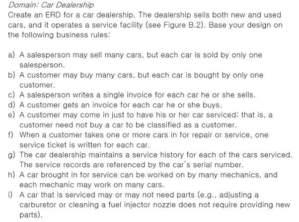
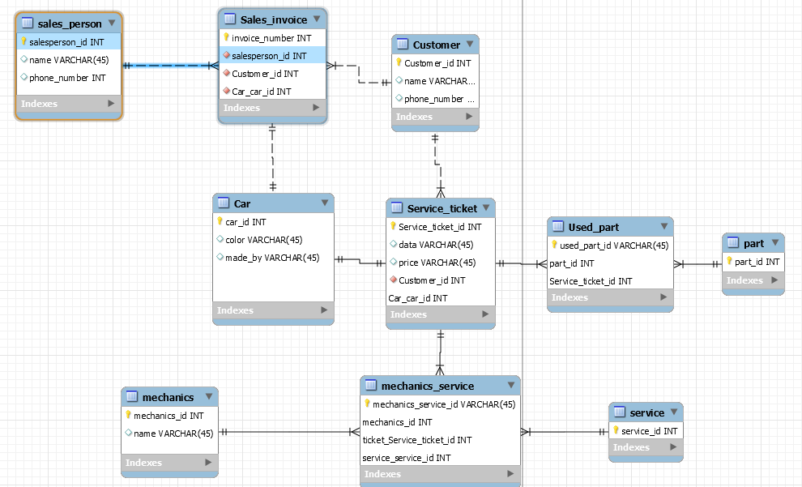
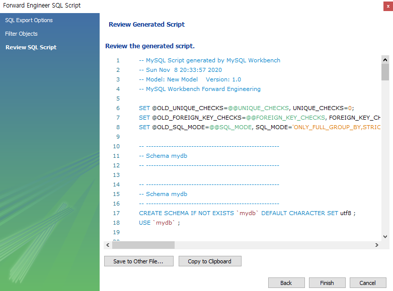
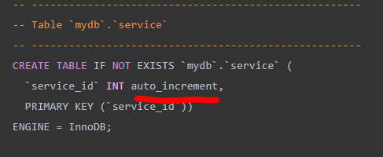

### 작업환경

Windows10

---

<br/>

## 토이프로젝트 - Car Dealership

목표1 : 로컬에서 MySQL, python으로 CRUD 쿼리 처리 가능한 2티어 아키텍처 구축

1. [**<u>개요 및 MySQL Workbench를 이용하여 DataBase 쿼리 생성</u>**](https://jeonghoon.netlify.app/Project/miniproject/mini_query/)

2. [Python으로 클라이언트 용  스크립트 작성](https://jeonghoon.netlify.app/Project/miniproject/mini_python/)

목표 2 : Docker로 MySQL, python 이미지 생성 후 compose 구성

1. [MySQL, Python 이미지 생성 / compose.yml 작성 및 구축(1)](https://jeonghoon.netlify.app/Project/miniproject/mini_docker_images/)
2. [MySQL, Python 이미지 생성 / compose.yml 작성 및 구축(2)](https://jeonghoon.netlify.app/Project/miniproject/mini_docker_compose/)

목표 3 : AWS, node.js를 추가하여 자동 확장 가능한 3티어 아키텍처 구축

3. [RDS - Master, slave 생성](https://jeonghoon.netlify.app/Project/miniproject/mini_rds/)
4. [RDS와 클라이언트 연결하는 node 서버 만들기](https://jeonghoon.netlify.app/Project/miniproject/mini_node/)
5. AutoScaling 그룹 생성 및 ELB(elastic Load Balancer) 연결
6. CloudWatch, AWS SNS 연동
7. CodeDeploy를 통한 배포 구축

<br/>

---

## 개요

구글에 `Car dealership ERD`를 검색해보면 과거 개발자들의 노력을 엿볼 수 있다. 나도 그들의 발자취를 따라가기 위해 Car Dealership을 이번 토이프로젝트 주제로 선정했다. 이 요구사항 명세서를 가지고 docker, AWS에서 CRUD를 구현하는 것이 목표이다.

---

### 엔터티 뽑아내기

아래와 같은 요구사항 명세서가 주어졌다. 고객의 요구사항을 파악하고 이에 맞는 서비스를 구축하기 위해 ERD부터 작성해보겠다. 의역을 좀 추가하여 조건들을 살펴보면,



<br/>

a) 판매원(salesperson)은 다수의 자동차를 팔 수 있지만, 하나의 자동차는 한 명의 판매원이 맡아서 판다.

b) 고객(customer)은 다수의 자동차를 살 수 있지만, 하나의 자동차는 한 명의 고객에게 팔린다.

위 두 조건으로 보아 자동차는 고객, 판매원과 1:N 관계임을 알 수 있다. 엔터티 sales_person, costomer, car를 뽑아냈다.

<br/>

c) 판매원은 판매한 자동차에 대해 하나의 청구서(sales invoice)를 작성한다.

d) 고객은 그가 구입한 자동차의 청구서를 갖는다.

e) 고객은 그의 자동차 서비스를 받기 위해 올 수 있다. 즉 고객은  고객이 되기 위해 자동차를 살 필요가 없다.

고객은 자동차를 사지 않아도 자동차 서비스를 받을 수 있는 것 같다. 엔터티 sales_invoice를 뽑아냈다.

<br/>

f) 고객이 수리 또는 서비스를 위해 하나 이상의 자동차를 가져 갔을 때, 각 자동차에 대해 서비스 티켓(service ticket)이 기록된다.

한명의 고객은 여러번 서비스를 받을 수 있으므로 여러장의 티켓을 가질 수 있다고 해석했다. 엔터티 service_ticket을 뽑아냈다.

<br/>

g) 자동차 대리점은 서비스를받은 각 자동차에 대한 서비스 내역을 유지한다. 서비스 기록은 자동차 일련 번호로 참조된다.

h) 서비스를 위해 가져온 자동차는 많은 정비사(mechanics)가 작업 할 수 있으며, 각 정비사는 많은 자동차에서 작업 할 수 있다.

i) 서비스를 받는 자동차는 부품이 필요할 수도 있고 필요하지 않을 수도 있다. (예를 들어, 기화기를 조정하거나 연료 분사 노즐을 청소할 때 부품을 사용할 필요가 없다).

여기서 정비사가 어떤 서비스를 제공할지 모르기 때문에 이 둘을 연결할 mechanics service 테이블을 만들 필요성을 느꼈다. 또한 부품의 제고도 확인할 필요가 있으므로 part와 used part를 만들었다. 여기서 엔터티 mechanics, service, mechanics_service, used_part, part를 뽑아냈다.

---

### ERD 작성

위 조건들을 고려하여 다음과 같은 ERD가 나왔다. 1:1, 1:N, M:N을 구분하려 노력했다. 점선으로 비식별관계를, 실선으로 식별관계를 나타냈다. 이렇게 키를 설정하면, 나중에 실선으로 연결된 친구는 부모가 없으면 생성이 안 될 거다. 컬럼은 꼭 필요하다고 생각되는 것만 구성했다.



<br/>

---

### 쿼리 생성

ERD로 쿼리를 생성해주자. Workbench에서 `File > export > Forword Enginner SQL Script` 로 들어가면 다음과 같은 창이 나온다. 옵션선택 후 next > Export MySQL Table Object을 하여 테이블을 뽑아내자.



<br/>



추가로 각 튜플이 유니크 할 수 있도록 각 테이블에 auto_increment를 설정하여 id가 1씩 증가하도록 설정하였다.

<br/>

패기롭게 시작했지만.. 사실 제일 재미없는 단계인거 같다. 토이프로젝트 맨 처음에 ERD를 해서 정말 다행이다.

<br/>

<details> <summary>생성된 쿼리 보기</summary> <div markdown="1">

```sql
-- MySQL Workbench Forward Engineering

SET @OLD_UNIQUE_CHECKS=@@UNIQUE_CHECKS, UNIQUE_CHECKS=0;
SET @OLD_FOREIGN_KEY_CHECKS=@@FOREIGN_KEY_CHECKS, FOREIGN_KEY_CHECKS=0;
SET @OLD_SQL_MODE=@@SQL_MODE, SQL_MODE='ONLY_FULL_GROUP_BY,STRICT_TRANS_TABLES,NO_ZERO_IN_DATE,NO_ZERO_DATE,ERROR_FOR_DIVISION_BY_ZERO,NO_ENGINE_SUBSTITUTION';

-- -----------------------------------------------------
-- Schema mydb
-- -----------------------------------------------------

-- -----------------------------------------------------
-- Schema mydb
-- -----------------------------------------------------
CREATE SCHEMA IF NOT EXISTS `mydb` DEFAULT CHARACTER SET utf8 ;
USE `mydb` ;

-- -----------------------------------------------------
-- Table `mydb`.`sales_person`
-- -----------------------------------------------------
CREATE TABLE IF NOT EXISTS `mydb`.`sales_person` (
  `sales_id` INT auto_increment,
  `sales_name` VARCHAR(45) NULL,
  `sales_phone`  VARCHAR(45) NULL,
  PRIMARY KEY (`sales_id`))
ENGINE = InnoDB;


-- -----------------------------------------------------
-- Table `mydb`.`Car`
-- -----------------------------------------------------
CREATE TABLE IF NOT EXISTS `mydb`.`Car` (
  `car_id` INT auto_increment,
  `car_name` varchar(50),
  `color` VARCHAR(45) NULL,
  `made_by` VARCHAR(45) NULL,
  `sales` varchar(50) default 'onSale',
  PRIMARY KEY (`car_id`))
ENGINE = InnoDB;


-- -----------------------------------------------------
-- Table `mydb`.`Customer`
-- -----------------------------------------------------
CREATE TABLE IF NOT EXISTS `mydb`.`Customer` (
  `cust_id` INT auto_increment,
  `cust_name` VARCHAR(45) NULL,
  `cust_phone` VARCHAR(45) NULL,
  `cust_birth` int NULL,
  PRIMARY KEY (`cust_id`))
ENGINE = InnoDB;


-- -----------------------------------------------------
-- Table `mydb`.`Sales_invoice`
-- -----------------------------------------------------
CREATE TABLE IF NOT EXISTS `mydb`.`Sales_invoice` (
  `invoice_number` INT auto_increment,
  `sales_id` INT NOT NULL,
  `cust_id` INT NOT NULL,
  `car_id` INT NOT NULL,
  PRIMARY KEY (`invoice_number`),
  INDEX `fk_Sales_invoice_sales_person1_idx` (`sales_id` ASC) ,
  INDEX `fk_Sales_invoice_Customer1_idx` (`cust_id` ASC) ,
  INDEX `fk_Sales_invoice_Car1_idx` (`car_id` ASC) ,
  CONSTRAINT `fk_Sales_invoice_sales_person1`
    FOREIGN KEY (`sales_id`)
    REFERENCES `mydb`.`sales_person` (`sales_id`)
    ON DELETE NO ACTION
    ON UPDATE NO ACTION,
  CONSTRAINT `fk_Sales_invoice_Customer1`
    FOREIGN KEY (`cust_id`)
    REFERENCES `mydb`.`Customer` (`cust_id`)
    ON DELETE NO ACTION
    ON UPDATE NO ACTION,
  CONSTRAINT `fk_Sales_invoice_Car1`
    FOREIGN KEY (`car_id`)
    REFERENCES `mydb`.`Car` (`car_id`)
    ON DELETE NO ACTION
    ON UPDATE NO ACTION)
ENGINE = InnoDB;


-- -----------------------------------------------------
-- Table `mydb`.`Service_ticket`
-- -----------------------------------------------------
CREATE TABLE IF NOT EXISTS `mydb`.`Service_ticket` (
  `Service_ticket_id` INT auto_increment,
  `price` VARCHAR(45) NULL,
  `cust_id` INT NOT NULL,
  `car_id` INT NOT NULL,
  PRIMARY KEY (`Service_ticket_id`, `car_id`),
  INDEX `fk_Service_ticket_Customer1_idx` (`cust_id` ASC) ,
  INDEX `fk_Service_ticket_Car1_idx` (`car_id` ASC) ,
  CONSTRAINT `fk_Service_ticket_Customer1`
    FOREIGN KEY (`cust_id`)
    REFERENCES `mydb`.`Customer` (`cust_id`)
    ON DELETE NO ACTION
    ON UPDATE NO ACTION,
  CONSTRAINT `fk_Service_ticket_Car1`
    FOREIGN KEY (`car_id`)
    REFERENCES `mydb`.`Car` (`car_id`)
    ON DELETE NO ACTION
    ON UPDATE NO ACTION)
ENGINE = InnoDB;


-- -----------------------------------------------------
-- Table `mydb`.`mechanics`
-- -----------------------------------------------------
CREATE TABLE IF NOT EXISTS `mydb`.`mechanics` (
  `mechanic_id` varchar(45) not null,
  `mechanic_name` VARCHAR(45) NULL,
  `MON` VARCHAR(45) NULL,
  `TUE` VARCHAR(45) NULL,
  `WED` VARCHAR(45) NULL,
  `THU` VARCHAR(45) NULL,
  `FRI` VARCHAR(45) NULL,
  PRIMARY KEY (`mechanic_id`))
ENGINE = InnoDB;


-- -----------------------------------------------------
-- Table `mydb`.`part`
-- -----------------------------------------------------
CREATE TABLE IF NOT EXISTS `mydb`.`part` (
  `part_id` INT auto_increment,
  PRIMARY KEY (`part_id`))
ENGINE = InnoDB;


-- -----------------------------------------------------
-- Table `mydb`.`Used_part`
-- -----------------------------------------------------
CREATE TABLE IF NOT EXISTS `mydb`.`Used_part` (
  `used_part_id`int auto_increment,
  `part_id` INT NOT NULL,
  `Service_ticket_id` INT NOT NULL,
  PRIMARY KEY (`used_part_id`, `part_id`, `Service_ticket_id`),
  INDEX `fk_part_has_Service_ticket_Service_ticket1_idx` (`Service_ticket_id` ASC) ,
  INDEX `fk_part_has_Service_ticket_part1_idx` (`part_id` ASC) ,
  CONSTRAINT `fk_part_has_Service_ticket_part1`
    FOREIGN KEY (`part_id`)
    REFERENCES `mydb`.`part` (`part_id`)
    ON DELETE NO ACTION
    ON UPDATE NO ACTION,
  CONSTRAINT `fk_part_has_Service_ticket_Service_ticket1`
    FOREIGN KEY (`Service_ticket_id`)
    REFERENCES `mydb`.`Service_ticket` (`Service_ticket_id`)
    ON DELETE NO ACTION
    ON UPDATE NO ACTION)
ENGINE = InnoDB;


-- -----------------------------------------------------
-- Table `mydb`.`service`
-- -----------------------------------------------------
CREATE TABLE IF NOT EXISTS `mydb`.`service` (
  `service_id` INT auto_increment,
  PRIMARY KEY (`service_id`))
ENGINE = InnoDB;


-- -----------------------------------------------------
-- Table `mydb`.`mechanics_service`
-- -----------------------------------------------------
CREATE TABLE IF NOT EXISTS `mydb`.`mechanics_service` (
  `mechanics_service_id` int auto_increment,
  `mechanic_id` varchar(45) not null,
  `ticket_Service_ticket_id` INT NOT NULL,
  `service_service_id` INT NOT NULL,
  PRIMARY KEY (`mechanics_service_id`, `mechanic_id`, `ticket_Service_ticket_id`, `service_service_id`),
  INDEX `fk_mechanics_has_Service_ticket_Service_ticket1_idx` (`ticket_Service_ticket_id` ASC) ,
  INDEX `fk_mechanics_has_Service_ticket_mechanics1_idx` (`mechanic_id` ASC) ,
  INDEX `fk_mechanics(1)_service1_idx` (`service_service_id` ASC) ,
  CONSTRAINT `fk_mechanics_has_Service_ticket_mechanics1`
    FOREIGN KEY (`mechanic_id`)
    REFERENCES `mydb`.`mechanics` (`mechanic_id`)
    ON DELETE NO ACTION
    ON UPDATE NO ACTION,
  CONSTRAINT `fk_mechanics_has_Service_ticket_Service_ticket1`
    FOREIGN KEY (`ticket_Service_ticket_id`)
    REFERENCES `mydb`.`Service_ticket` (`Service_ticket_id`)
    ON DELETE NO ACTION
    ON UPDATE NO ACTION,
  CONSTRAINT `fk_mechanics(1)_service1`
    FOREIGN KEY (`service_service_id`)
    REFERENCES `mydb`.`service` (`service_id`)
    ON DELETE NO ACTION
    ON UPDATE NO ACTION)
ENGINE = InnoDB;


SET SQL_MODE=@OLD_SQL_MODE;
SET FOREIGN_KEY_CHECKS=@OLD_FOREIGN_KEY_CHECKS;
SET UNIQUE_CHECKS=@OLD_UNIQUE_CHECKS;
```

</div> </details>