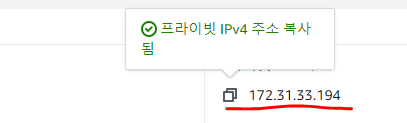

### 작업환경

Windows10

인스턴스 접속용 Xshell

Aws 프리티어 계정

Aws EC2 인스턴스 존재해야함([AWS EC2 시작 및 SSH 접속하기](https://jeonghoon.netlify.app/AWS/Aws/markdown/) 참고)

---

<br/>


## 토이프로젝트 - Car Dealership

목표1 : 로컬에서 MySQL, python으로 CRUD 쿼리 처리 가능한 2티어 아키텍처 구축

1. [개요 및 MySQL Workbench를 이용하여 DataBase 쿼리 생성](https://jeonghoon.netlify.app/Project/miniproject/mini_query/)

2. [Python으로 클라이언트 용  스크립트 작성](https://jeonghoon.netlify.app/Project/miniproject/mini_python/)

목표 2 : Docker로 MySQL, python 이미지 생성 후 compose 구성

1. [MySQL, Python 이미지 생성 / compose.yml 작성 및 구축(1)](https://jeonghoon.netlify.app/Project/miniproject/mini_docker_images/)
2. [MySQL, Python 이미지 생성 / compose.yml 작성 및 구축(2)](https://jeonghoon.netlify.app/Project/miniproject/mini_docker_compose/)

목표 3 : AWS, node.js를 추가하여 자동 확장 가능한 3티어 아키텍처 구축

3. [**<u>RDS - Master, slave 생성</u>**](https://jeonghoon.netlify.app/Project/miniproject/mini_rds/)
4. [RDS와 클라이언트 연결하는 node 서버 만들기](https://jeonghoon.netlify.app/Project/miniproject/mini_node/)
5. AutoScaling 그룹 생성 및 ELB(elastic Load Balancer) 연결
6. CloudWatch, AWS SNS 연동
7. CodeDeploy를 통한 배포 구축

<br/>

## 개요

다음은 이번 토이프로젝트로 만들 아키텍처이다.  파이썬으로 유저가 외부에서 접속하면 트래픽에 따라서 ALB가 자동으로 확장된 서버에 할당한다. 서버의 node express로 작성된 http 메서드가 DB의 데이터를 읽을 때는 Slave, 쓸 때는 Master를 사용하여 부하를 분산시킨다. 


<br/>

### RDS - Master, slave 생성

이번에는 AWS RDS를 이용하여 MySQL master와 slave를 만들 예정이다. 부하를 분산시키기 위해 slave는 select 쿼리를 master는 insert, update, delete 쿼리를 처리한다.


<br/>

먼저 RDS로 가서 데이터베이스를 만들어준다.


<br/>

기본환경을 설정해준다. 나는 MySQL, 그리고 프리티어로 만들었다.


<br/>

MySQL에서 사용할 아이디와 비밀번호를 기입하고 데이터베이스 생성해준다.


<br/>


<br/>

RDS MySQL을 EC2 인스턴스를 통해 접속해보자. 먼저 본인의 EC2 인스턴스의 프라이빗IP를 확인한다. EC2가 아직 없다면 [AWS EC2 시작 및 SSH 접속하기](https://jeonghoon.netlify.app/AWS/Aws/markdown/)를 참고하여 만들어주자.



<br/>

그리고 RDS의 보안그룹으로 가서 다음과 같이 설정하고 나머지 인바운드 규칙은 모두 제거한다. 이렇게 설정하면 인바운드로 EC2인스턴스에서만 접근 가능해진다. 외부에서 RDS로 접속을 막을 수 있어 보안적인 측면에서 유리하다.


<br/>

이제 EC2를 통해서 RDS에 접속해보겠다. 다음과 같이 mysql-server를 설치해준다(참고로 인스턴스 이미지는 linux 1 18.04버전으로 해야한다.)

```sh
sudo yum -y upadte # yum 명령어 업데이트, -y는 yes 옵션
sudo yum install -y mysql-server # mysql 서버 설치
```

<br/>

접속해보자. 엔드포인트는 본인의 MySQL에서 확인 가능하다.

```sh
mysql -h[엔드포인트] -u[만들었던 ID] -p
Enter password : [비밀번호 입력]
```


<br/>

성공적으로 접속되면 다음 화면이 나온다.


<br/>

이제 [개요 및 MySQL Workbench를 이용하여 DataBase 쿼리 생성](https://jeonghoon.netlify.app/Project/miniproject/mini_query/)에서 만든 DB 쿼리문을 입력해준다. mydb가 생성된 것을 볼 수 있다.


<br/>

이제 slave를 만들어 줄 차례이다 굉장히 간단하다. 작업 - 읽기복제본 생성을 클릭한다. 환경설정은 db 이름을 제외하고는 디폴트로 설정했다.  또는 본인이 필요한 것 선택한다.


<br/>

크게 만질 것은 없다. 디폴트로 기본 보안그룹까지 지정되어 있기 때문이다. 가용영역만 선택해주자


<br/>

슬레이브 역시 엔드포인트가 존재하고 동일한 방법으로 접속을 테스트 해주면 된다.


<br/>

다음은 지금까지의 작업 내용이다. 아키텍처라고 하기엔 아직 많이 부족해보인다. 또한 Master와 Slave에 접속할 때마다 각각의 엔드포인트를 바꿔서 접속해줘야한다.


<br/>

다음 포스트에서 인스턴스에 node express를 올리면서 이러한 문제를 해결해보겠다.