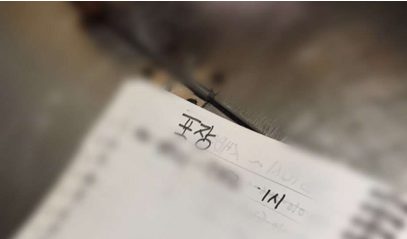

삼성 멀티캠퍼스에서 최종프로젝트로 만들었던 예약서비스 Booker에 대한 글을 블로그형식으로 만들어봤다.

 

## 문제의 발견

2월 즈음 방문했던 성신여대에 위치한 "빙수야" 라는 가게는 아직까지도 수기로 예약을 하는 시스템이었다. 이유는 18시부터 예약을 받는 특수한 환경 때문이었다. 이런 특이한 예약을 커스텀해주는 서비스가 있으면 어떨까? 하는 생각이 예약서비스 Booker를 만드는 계기가 되었다. 그래도 기존서비스와의 차별성이 더 필요해보였고,기존 예약서비스의 단점을 보완하여 우리 서비스에 적용하기로 하였다. 

 

## 기존 서비스 조사

크게 두 가지 서비스에 대하여 조사했다.

1. 네이버 예약
2. WIX

 

### 네이버 예약

먼저 네이버예약은 우리가 추구하는 서비스와 거의 비슷했다. 다만 다음과 같은 한계가 존재했다.

첫 번째는 업종이 한정적이었다. 수백가지의 업종이 존재하지만 서비스는 아래와 같은 **한정적인 업종**만  서비스 할뿐이었다.

 

두 번째는 개인사업자의 사이트라기보단 네이버에 종속됐다는 느낌이 강했다. 우리는 **사업자 자신만의 예약사이트 구축을 원하였다.**

 

세번째는 **예약시스템 커스텀이 어렵다**는 것이었다. 빙수야처럼 18시부터 예약을 하고 싶은 사업자가 있을 수 도 있기 때문에 차별화가 될 것이라 생각했다.

우리는 이러한 단점에 변화를 주고 싶었다.

 

 

### WIX

다음으로 개인 웹사이트 제작 서비스인 WIX에 대해 조사했다. 생각보다 굉장히 규모가 큰 서비스였다(연매출이 1조나 되는..).

WIX를 사용해보니 왜 인기가 있는지 알 수 있었다. 일단 요즘 떠오르는 no code 기반이었다. 템플릿을 선택하고 마우스 클릭 몇번으로 개인 웹사이트 제작이 가능했다.

 

하지만 이 서비스에도 단점은 있었다. 바로 예약기능이 부실하다는 것이었다. 예약모듈이 제공되지만, 정말 기본적인 기능밖에 존재하지 않았다. 즉 본인 가게에 맞는 예약 커스텀이 불가능했다.

 

따라서,

네이버예약의 `적은업종 단점을 보완`하고 

WIX의 `손쉬운 개인 사이트 구축`은 가져오고 `예약기능 커스텀`을 보완하고

다른 서비스가 정지되어도 `개인 웹사이트는 정지되지 않도록 MSA`로 구축할 계획을 세웠다.

(라고 했지만, 사실 어떻게 구현해야할지 막막했다)

 

 

다음과 같이 두 가지에 초점을 맞추기로 하였다.

1. 모든 서비스에 적용 가능
2. 사업자 입맛대로 커스텀 가능

그렇다면 이 기능들은 어떻게 구현해야할까?

비대면이 점점 많아지기 때문에 예약서비스에 대한 수요는 분명 존재할 것이라 생각했다. 

다음은 배포 흐름도이다. 먼저 개발자가 깃에 코드를 올릴때 travis.yml에 설정된 배포정보대로  Travis CI에 배포된다. 그리고

1.  S3에 jar형식의 파일을 배포한다.
2. CodeDeploy에 배포요청을 보낸다.
3. 요청대로 CodeDeploy는 

결과는 겨우 마감기한에 맞춰 제출하는 수준이었다.