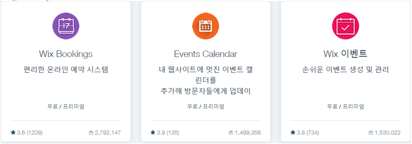
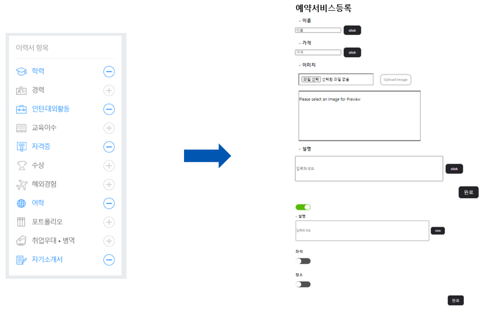
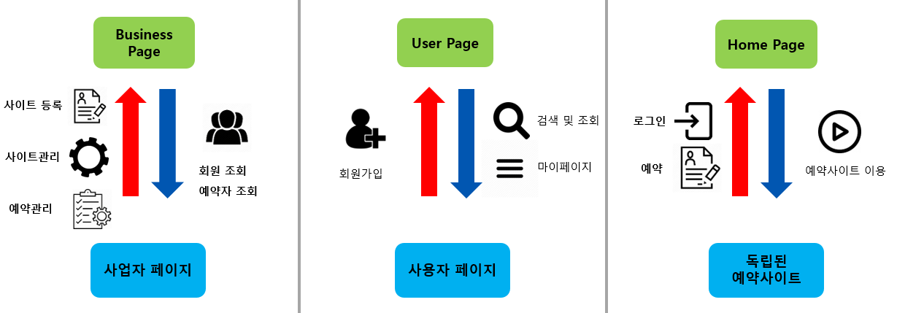
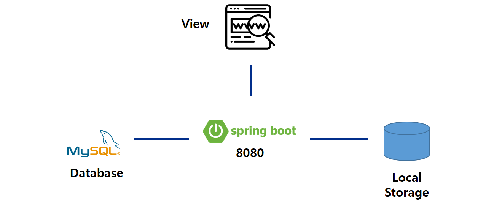
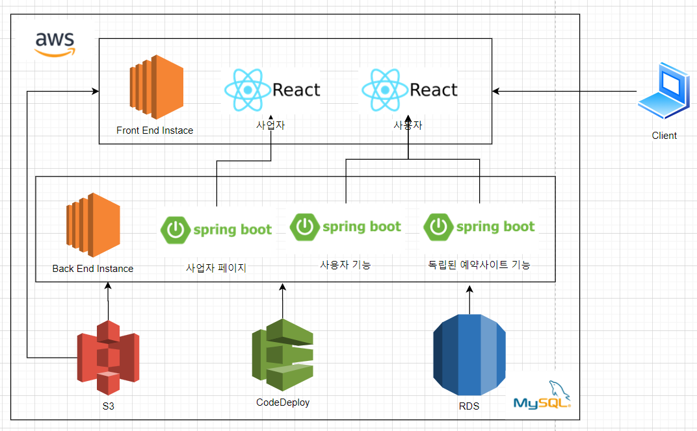

삼성 멀티캠퍼스에서 최종프로젝트로 만들었던 예약서비스 Booker에 대한 글을 블로그형식으로 만들어봤다.

 

## 문제의 발견

2월 즈음 방문했던 성신여대에 위치한 "빙수야" 라는 가게는 아직까지도 수기로 예약을 하는 시스템이었다. 이유는 18시부터 예약을 받는 특수한 환경 때문이었다. 이런 특이한 예약을 커스텀해주는 서비스가 있으면 어떨까? 하는 생각이 예약서비스 Booker를 만드는 계기가 되었다. 그래도 기존서비스와의 차별성이 더 필요해보였고,기존 예약서비스의 단점을 보완하여 우리 서비스에 적용하기로 하였다. 

 

## 기존 서비스 조사

크게 두 가지 서비스에 대하여 조사했다.

1. 네이버 예약
2. WIX

 

### 네이버 예약

먼저 네이버예약은 우리가 추구하는 서비스와 거의 비슷했다. 다만 다음과 같은 한계가 존재했다.

첫 번째는 업종이 한정적이었다. 수백가지의 업종이 존재하지만 서비스는 아래와 같은 **한정적인 업종**만  서비스 할뿐이었다.

 

두 번째는 개인사업자의 사이트라기보단 네이버에 종속됐다는 느낌이 강했다. 우리는 **사업자 자신만의 예약사이트 구축을 원하였다.**

 

세번째는 **예약시스템 커스텀이 어렵다**는 것이었다. 빙수야처럼 18시부터 예약을 하고 싶은 사업자가 있을 수 도 있기 때문에 차별화가 될 것이라 생각했다.

우리는 이러한 단점에 변화를 주고 싶었다.

 

 

### WIX

다음으로 개인 웹사이트 제작 서비스인 WIX에 대해 조사했다. 생각보다 굉장히 규모가 큰 서비스였다(연매출이 1조나 되는..).

WIX를 사용해보니 왜 인기가 있는지 알 수 있었다. 일단 요즘 떠오르는 no code 기반이었다. 템플릿을 선택하고 마우스 클릭 몇번으로 개인 웹사이트 제작이 가능했다.

 

하지만 이 서비스에도 단점은 있었다. 바로 예약기능이 부실하다는 것이었다. 예약모듈이 제공되지만, 정말 기본적인 기능밖에 존재하지 않았다. 즉 본인 가게에 맞는 예약 커스텀이 불가능했다.

 

따라서,

네이버예약의 `적은업종 단점을 보완`하고 

WIX의 `손쉬운 개인 사이트 구축`은 가져오고 `예약기능 커스텀`을 보완하고

다른 서비스가 정지되어도 `개인 웹사이트는 정지되지 않도록 MSA`로 구축할 계획을 세웠다.

(라고 했지만, 사실 어떻게 구현해야할지 막막했다)

 

 

## 서비스 흐름도

기존의 예약서비스와 크게 다르지 않다. 

1. Booker를 통해 사업 등록 및 본인의 예약사이트 생성
2. 고객들은 생성된 사이트에서 예약
3. 예약된 리스트로 본인 사업 진행

 

 

## 구현 및 아키텍처

위에서 나온 서비스 개발방향은 다음과 같다.

1. 손쉬운 개인사이트 구축
2. 예약기능 커스텀
3. 업종 다양화

그렇다면 이 기능들은 어떻게 구현해야할까?

 

### 손쉬운 예약사이트 구축

사업자가 사업자 페이지에서 웹사이트를 구축하면 사용자 페이지에 웹사이트가 생성되게 만들었다.

만약 실제로 서비스하게 된다면 각각의 사이트에 도메인을 할당하는게 제일 좋겠지만, 일단은 리액트 방식대로 싱글페이지 종속되게 웹사이트를 제공하기로 하였다.

### 예약기능 커스텀과 업종 다양화

우리는 예약기능 커스텀이 가능해지면, 자연스럽게 업종 다양화를 할 수 있다 생각했다.  다양한 예약 기능을 구현해  놓으면 사업자는 본인 사업에 맞는 예약기능한 선택적으로 사용하면 되기 때문이다.

취업사이트의 이력서는 본인이 가진 이력을 선택적으로 추가할 수 있다. 우리는 여기서 아이디어를 얻어 예약기능에 토글버튼을 달아 본인이 원하는 기능만 선택적으로 사용할 수 있게 만들었다.

 

그리고 백엔드 부분은 JPA로 Json 형식 데이터를 주고 받게 구현하였다. 아래 그림은 리액트 기준으로 빨간색 화살표가 insert, update, 파란색 화살표가 select 기능임을 나타낸다. (스프링부트에서는 Database와 기능에 맞게 작업함)

 

그리고 아키텍처다.

처음에는 시간이 부족하여  MVC 방식으로만 만들려고 하였다.

 

하지만 서로 의기투합하면서 빠르게 진행하였고, 추가로 구현할 시간이 있다고 판단하여 클라우드에 올려 MSA를 구축하기로 하였다.  프리티어라 메모리가 최대 1GB였는데, 스프링부트가 4개 이상 실행되지 않았다. 나름 타협하고 3개로 나누기로 했지만 이것만 해도 상당히 애를 먹었었다.

최종 아키텍처이다. 팀원이 프론트, 나는 인프라 구축과 백엔드, 그리고 리액트에서 리퀘스트 처리를 구현하였다. S3를 사용하여 이미지 업로드를 처리하였다. RDS MySQL을 사용하여 기존 DB기능을 구현하였다. 그리고 CodeDEploy를 통해 배포하였다.

 

### 배포방식 변경

기존에는 CodeDeploy만 사용하여 S3에 jar파일을 옮긴 후 EC2에서 CodeDeploy manager를 통해 S3 jar 파일을 가져왔다. 하지만 배포할 때마다 압축해줘야했다. 개발시간이 상당히 부족했기 때문에 여러 방법을 찾던 중 Travis CI를 사용하여 CI/CD를 구축하였다. 결과적으로 Github에 push 한번으로 EC2에 배포되게 만들었다.

1.  S3에 jar형식의 파일을 배포한다.
2. CodeDeploy에 배포요청을 보낸다.
3. 요청받은 CodeDeploy는 EC2에 배포요청을 보낸다
4.  CodeDeploy manager를 통해 S3에서 jar파일을 가져온다.

## 실행화면

사업자페이지에서 본인의 웹사이트를 생성하고

사용자페이지에서는 검색 및 웹사이트로 이동을 제공한다.

