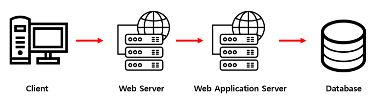
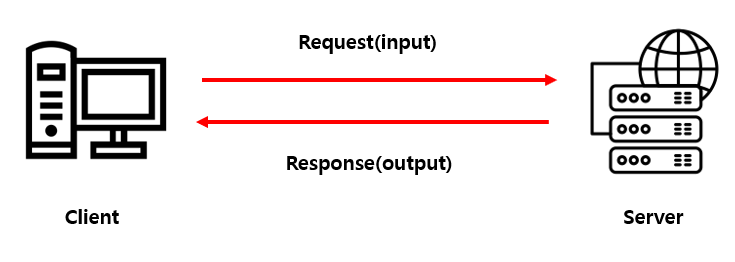
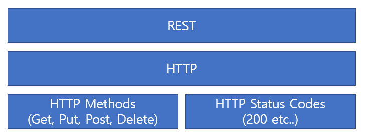

이 글은 인프런에서 이도원 강사님의 [**Spring Boot를 이용한 RESTful Web Services 개발**](https://www.inflearn.com/course/spring-boot-restful-web-services/news)을 참조한 글입니다.

 

 

 

### Web Service

Web Service : WWW(World Wide Web)를 이용한 디바이스와 디바이스 간에 통신.

또는 네트워크 상에서 특정한 포트로 열어 놓은 서버가 클라이언트 요청을 받은 다음 HTML, JSON, XML, images 와 같은 문서제공을 뜻하기도 함.

간단히 말하면, 네트워크 상에서 서로 다른 종류의 컴퓨터들 간에 상호작용 하기 위한 소프트웨어 시스템이라 할 수 있다.

XML과 같은 통일된 문서를 사용함으로써 데이터 형식의 통일성을 가져와 개발의 편의성을 가져옴.

 

### Web Application

Web Application : 서버에 저장되어 있고 웹브라우저를 통해서 실행할 수 있는 프로그램.

WebApplication Server : 웹 어플리케이션을 실행해주는 서버.

1. 클라이언트의 요청
2. HTML이나 이미지 같은 정적 문서는 웹서버에서 처리
3. 프로그램동작/계산/외부서비스와의 연동이 필요한 경우 클라이언트의 요청을 웹 어플리케이션 서버에 전달
4. 처리된 결과값을 웹서버를 통해서 클라이언트에게 보여보여줌.

 

### 동작방식(간단히)

클라이언트가 서버로 주는 인풋 값을 Request, 그에 대한 서버의 응답을 Response라고 한다. 이러한 서비스를 개발하기 위해서 **SOAP**와 **RESTful** 방식이 있다.

 

### SOAP(Simple Object Access Protocol)

XML 기반으로 Request와 Response를 구현한다. 보안이나 메세지 전송 등에 있어 REST보다 많은 표준들이 정해져 있기 때문에 더 복잡하고 무겁다. SSL도 지원하고 WS-Security도 지원하기 때문에 보안성이 요구되는 환경에 적합. 웹 서비스에는 그다지 좋지 않다.

 

### REST(REpresentational State Transfer)

영어를 풀어보면, 상태(컴퓨터가 가지고 있는 자원)를 전달하는 API라고 볼 수 있다. 플랫폼, 프로그램에 독립적이다. 즉 어디서나 사용 가능. 또한 개발하기 수월하고 데이터 형식이 JSON이기 때문에 브라우저 간에 호환성이 좋다.

HTTP를 사용해서 사용해서 리소스를 처리함. HTTP는 HTTP 메소드와 상태코드로 구성되어있다(흔히 보는 400에러도 여기서 나옴).

