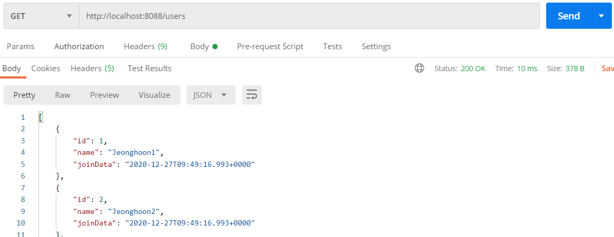
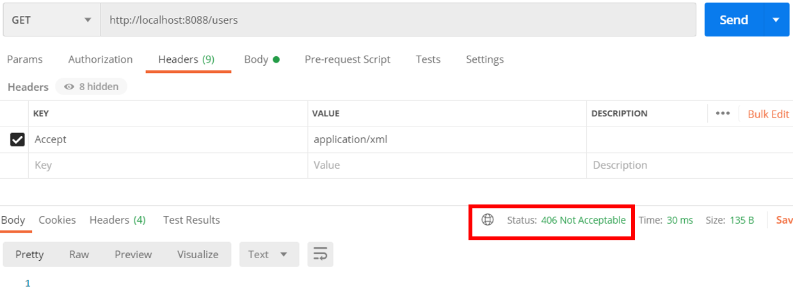
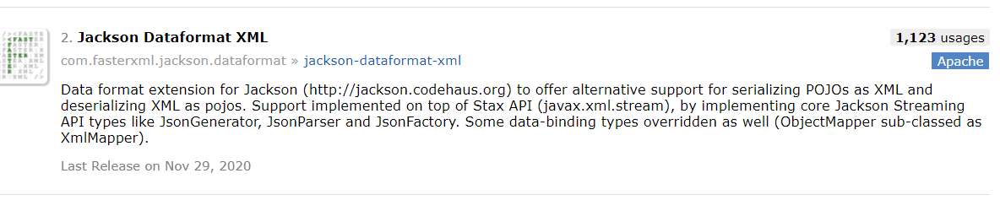
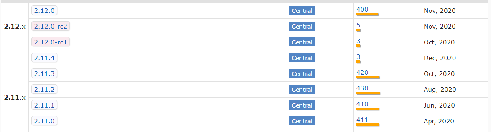
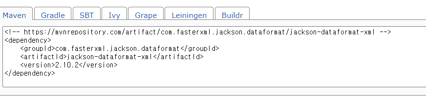
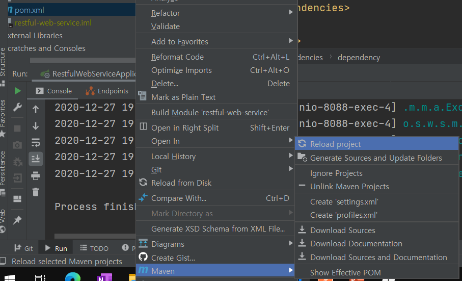
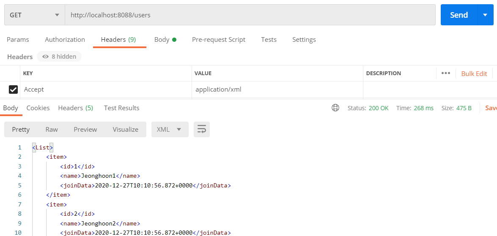

---

title: Spring boot) Json에서 XML형식으로 변환
date: 2020-12-27 16:21:20
category: Spring
draft: false
---


## XML 형식 변환

Json이 대세가 되었지만 XML이 필요없진 않다. xml은 메타데이터를 보다 다양하게 다룰 수 있다. 또한 대용량 데이터 송수신에 적합하다. 따라서 이미지 등의 바이너리 파일은 xml 형식이 유리하며다. 이번에는 Json파일을 xml로 변환하는 방법을 알아보자. 

기존 users의 데이터를 조회해보면 아래와 같이 나온다.



<br/>

여기서 헤더에 KEY = Accept / VALUE = appliacation/xml 로 설정하고 xml형식을 불러오면 에러가 뜨는 것을 확인할 수 있다. 400번 에러는 클라이언트의 에러이며, 서버에서 준비되지 않은 xml형식을 불러왔기 때문이다.



<br/>

현재 빌드 툴은 maven이다. Maven Repository에 들어가서 [Jackson Dataformat XML](https://mvnrepository.com/artifact/com.fasterxml.jackson.dataformat/jackson-dataformat-xml)을 검색하였다.



<br/>

여러 버전 선택이 가능하며,



<br/>

아무 버전이나 선택해서 pom.xml 파일에 의존성을 추가해주자.



<br/>

의존성을 pom.xml 파일에 추가한 후 리로드 해주면 적용된다.

```xml
<dependency>
    <groupId>com.fasterxml.jackson.dataformat</groupId>
    <artifactId>jackson-dataformat-xml</artifactId>
    <version>2.10.2</version>
</dependency>
```



<br/>

서버 재기동 후 xml로 요청하면 정상적으로 출력되는 것을 확인할 수 있다.

