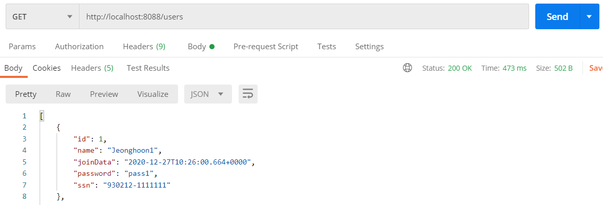
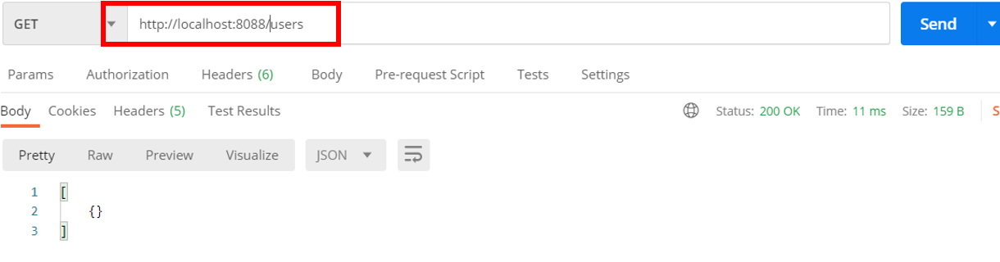

---

title: Spring boot) Response 데이터 필터링하기(@JsonIgnore, @JsonIgnoreProperties, @JsonFilter)
date: 2020-12-27 16:21:21
category: Spring
draft: false
---


## Response 데이터 필터링하기

클라이언트에게 중요한 데이터가 보여지면 보안상 위험하기 때문에 이번 포스트에서는 중요한 데이터를 필터링하는 방법에 대해 알아보자. 먼저 기존 user 클래스에 다음 필드를 추가한다.

```java
@Data
@AllArgsConstructor
public class User {
    private Integer id;

    @Size(min=4, message = "Name 4글자 이상 입력 해야함")
    private String name;
    @Past
    private Date joinData;
    
    //추가한 내용
    private String password;
    private String ssn;
}
```

<br/>

이에 맞게 데이터도 수정해주고

```java
@Service
public class UserDaoService {
	static {
        users.add(new User(1, "Jeonghoon1", new Date(), "pass1", "111111"));
        users.add(new User(2, "Jeonghoon2", new Date(), "pass2", "222222"));
        users.add(new User(3, "Jeonghoon3", new Date(), "pass3", "333333"));
    }
}
```

<br/>

조회해보면 다음과 같이 출력된다. 패스워드등의 중요한 정보가 그대로 노출된다.



<br/>

이제 클라이언트가 보지 못하게 필터링하는 방법을 알아보자.

<br/>

### 방법 1. @JsonIgnore, @JsonIgnoreProperties

user 클래스의 필드에 @JsonIgnore를 추가해준다.

```java
@Data
@AllArgsConstructor
public class User {
    private Integer id;

    @Size(min=4, message = "Name 4글자 이상 입력 해야함")
    private String name;
    @Past
    private Date joinData;
    
    //추가한 부분
    @JsonIgnore
    private String password;
    @JsonIgnore
    private String ssn;
}
```

<br/>

조회해보면 나오지 않는다.


<br/>

마찬가지로 @JsonIgnoreProperties 사용하여 나오지 않게 할 수 있다.

```java
@Data
@AllArgsConstructor
//추가한 부분
@JsonIgnoreProperties(value={"password", "ssn"})
public class User {
    private Integer id;

    @Size(min=4, message = "Name 4글자 이상 입력 해야함")
    private String name;
    @Past
    private Date joinData;
    
    private String password;
    private String ssn;
}
```


<br/>

### 방법2. @JsonFilter

먼저 user 클래스에  @JsonIgnoreProperties 대신 @JsonFilter를 추가하여 조건에 맞는 필드만 Json으로 변환되도록 설정할 것이다.

```java
@Data
@AllArgsConstructor
//@JsonIgnoreProperties(value={"password", "ssn"})
@JsonFilter("UserInfo")
public class User {
    private Integer id;

    @Size(min=4, message = "Name 4글자 이상 입력 해야함")
    private String name;
    @Past
    private Date joinDate;

    private String password;
    private String ssn;
}
```

<br/>

테스트를 위해 기존 `UserController`을 복사하여 `AdminUserController` 클래스를 생성했다. 기존 URL과 구분하기 위한 @RequestMapping을 추가하고, 특정 유저를 가져오는 메서드를 수정하였다. 그리고 빈의 프로퍼티를 제어할 수 있도록  `SimpleBeanPropertyFilter` 클래스를 사용하였다. 이제 지정한 필드들만  Json으로 바뀔 것이다.

```java
@RestController
@RequestMapping("/admin")
@AllArgsConstructor
public class AdminUserController {
    private UserDaoService service;

    @GetMapping("/users")
    public List<User> retrieveAllUsers(){
        return service.findAll();
    }

    @GetMapping("/users/{id}")
    public MappingJacksonValue retrieveUsers(@PathVariable int id){
        User user = service.findOne(id);

        if(user == null){
            throw new UserNotFoundException(String.format("ID[%s] not found", id));
        }

        SimpleBeanPropertyFilter filter = SimpleBeanPropertyFilter
                .filterOutAllExcept("id", "name", "joinDate", "password", "ssn");

        FilterProvider filters = new SimpleFilterProvider().addFilter("UserInfo", filter);
        MappingJacksonValue mapping = new MappingJacksonValue(user);
        mapping.setFilters(filters);

        return mapping;
    }
}
```

<br/>

테스트해보면, 일반적인 권한으로는 Json을 못가져오지만,


<br/>

URL에 admin을 포함한 Get은 가져오는 것을 확인할 수 있다.


<br/>

개별사용자와 마찬가지로 전체 사용자에대한 필터링도 추가해보자.

```java
@GetMapping("/users")
public MappingJacksonValue retrieveAllUsers(){
    List<User> users = service.findAll();

    SimpleBeanPropertyFilter filter = SimpleBeanPropertyFilter
        .filterOutAllExcept("id", "name", "joinDate", "password", "ssn");

    FilterProvider filters = new SimpleFilterProvider().addFilter("UserInfo", filter);
    MappingJacksonValue mapping = new MappingJacksonValue(users);
    mapping.setFilters(filters);

    return mapping;
}
```

<br/>

정상적으로 작동된다.



