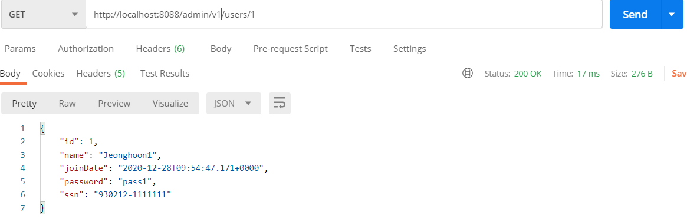
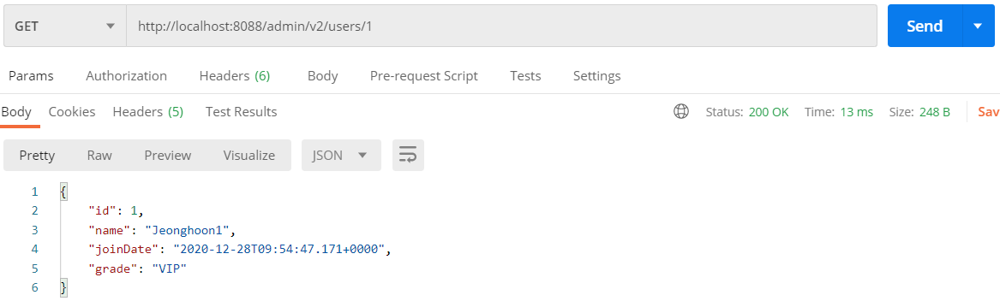
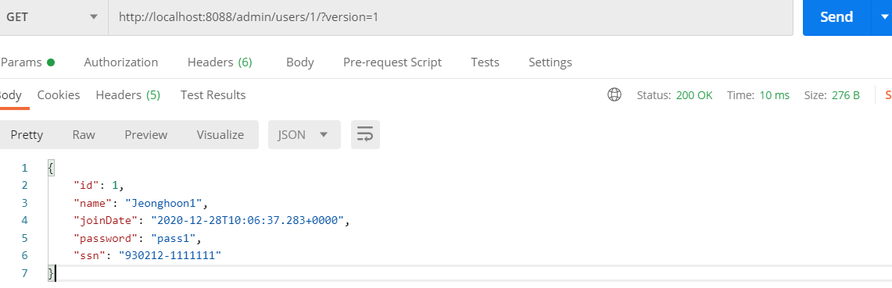
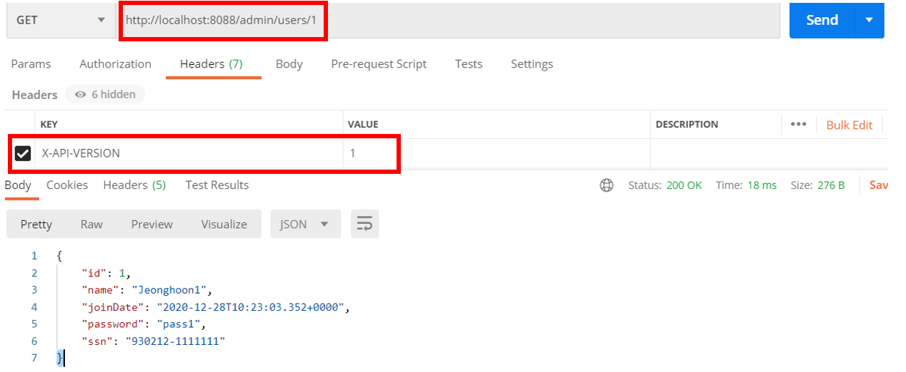
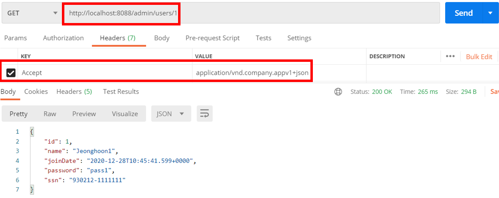

---

title: Spring boot) Rest API 버전 관리하기(URL, Request Parameter, Header)
date: 2020-12-28 16:21:22
category: Spring
draft: false
---

## Rest API 버전 관리하기

왜 Rest API의 버전을 관리해야할까? Rest API의 설계가 변경되거나 애플리케이션의 구조가 바뀔때마다 버전을 변경해서 사용해야 한다.

주의해야할 점

- URI에 정보를 노출시키지 말아야함
- 잘못된 헤더값 지양
- 웹에서 실행이 가능해야함
- API의 정확한 문서를 제공하는 것이 좋음

<br/>

### 방법1. URI를 이용한 방법

먼저 기존 user 클래스를 상속받는 userV2클래스를 만들어주었다. 참고로 상속과 객체생성을 위해 user와 userV2클래스에 생성자를 만들어줘야한다. @NoArgsConstructor로 디폴트생성자를 만들어주었다.

```java
@Data
@AllArgsConstructor
@NoArgsConstructor
//@JsonIgnoreProperties(value={"password", "ssn"})
@JsonFilter("UserInfoV2")
public class UserV2 extends User{
    private String grade;
}
```

<br/>

기존 `retrieveUser`메서드를 복사하여 `retrieveUserV2` 메서드를 만들었고, 아래와 같이 수정하였다. 기존 로직에 user 데이터를 userV2로 복사하여 V1버전의 내용에 V2가 누적되도록 만들었다. BeanUtils 는 빈 관련 작업을 도와주는 클래스로, 여기서는 카피하는 메서드를 사용하기 위해 작성했다.

```java
@GetMapping("/v2/users/{id}")
public MappingJacksonValue retrieveUsersV2(@PathVariable int id){
    User user = service.findOne(id);

    if(user == null){
        throw new UserNotFoundException(String.format("ID[%s] not found", id));
    }

    //user내용 userv2로 복사
    UserV2 userV2 = new UserV2();
    BeanUtils.copyProperties(user,userV2);
    
    //임의로 VIP 집어넣음
    userV2.setGrade("VIP");

    //기존과 다르게 grade 출력
    SimpleBeanPropertyFilter filter = SimpleBeanPropertyFilter
        .filterOutAllExcept("id", "name", "joinDate", "grade");

    FilterProvider filters = new SimpleFilterProvider().addFilter("UserInfoV2", filter);
    MappingJacksonValue mapping = new MappingJacksonValue(userV2);
    mapping.setFilters(filters);

    return mapping;
}
```

<br/>

버전이 다른 URI를 통해 다른 내용이 출력되는 것을 확인할 수 있다.





<br/>

### 방법2. Request Parameter를 이용한 방법

기존 메서드의 @GetMapping 값을 변경해준다. value 마지막에 /(슬래쉬)를 꼭 붙여야함을 잊지 말자

```java
@GetMapping(value = "/users/{id}/", params = "version=1")
public MappingJacksonValue retrieveUsersV1(@PathVariable int id){...}

@GetMapping(value = "/users/{id}/", params = "version=2")
public MappingJacksonValue retrieveUsersV2(@PathVariable int id){...}
```

<br/>

파라미터를 통해 조회가 가능하다



<br/>

참고로 파라미터가 여러개 있으면, params가 스트링배열이기 때문에 다음과같이 매핑해주면 된다. 호출은

http://localhost:8088/admin/users/1/?version=1&test=2

로 하면 된다.

```java
@GetMapping(value = "/users/{id}/", params = {"version=1", "test=2"})
public MappingJacksonValue retrieveUsers(@PathVariable int id){...}
```

<br/>

### 방법3. 헤더를 이용한 방법

헤더의 값을 이용해보자. 다음과 같이 변경한다.

```java
@GetMapping(value = "/users/{id}", headers="X-API-VERSION=1")
public MappingJacksonValue retrieveUsersV1(@PathVariable int id){...}

@GetMapping(value = "/users/{id}", headers="X-API-VERSION=2")
public MappingJacksonValue retrieveUsersV2(@PathVariable int id){...}
```

<br/>

헤더의 키와 값을 선택해서 동일한 내용을 출력할 수 있다.



<br/>

### 방법4. MIME Type을 이용한 방법

음악 등의 바이너리 파일은 ASCII만으로 전송이 불가능했고 이를 텍스트로 변환한 것을 인코딩이라 한다.

MIME이란 Multipurpose Internet Mail Extension의 약자로 일종의 인코딩방식이다. 

그럼 왜 MIME을 사용할 까?

기존의 UUencode 방식은 공백을 무시하여 원형 그대로 데이터를 받지 못하는 단점이 있었다. 이러한 단점을 보완한 것이 MIME 방식이다.

테스트를 위해 코드를 다음과 같이 수정했다. MIME 타입을 사용하기 위해 produces를 사용한다.

```java
@GetMapping(value = "/users/{id}", produces = "application/vnd.company.appv1+json")
public MappingJacksonValue retrieveUsersV1(@PathVariable int id){...}

@GetMapping(value = "/users/{id}", produces = "application/vnd.company.appv2+json")
public MappingJacksonValue retrieveUsersV2(@PathVariable int id){...}
```

