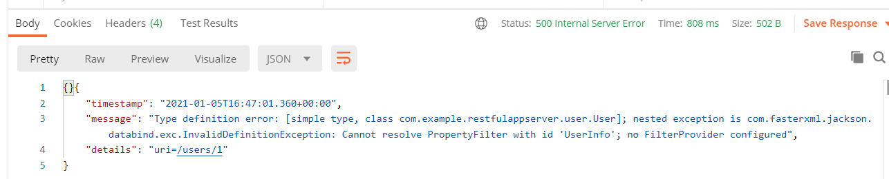
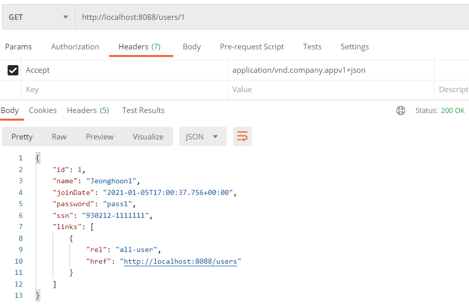

---

title: Spring boot) Hateoas로 REST API 처리하기
date: 2021-01-05 09:21:22
category: Spring
draft: false
---

Hateoas는 하이퍼 미디어(파일이나 영상 등)를 REST API의 상태정보를 관리하기 위한 메커니즘으로 활용하는 것이다. 쉽게 말해, 텍스트 아닌 리소스도 관리할 수 있다.

<br/>

먼저 라이브러리를 추가해주자. 기존에 사용하던 Spring boot의 라이브러리를 가져오면 되므로 

Maven의 경우 아래를 pom.xml 파일 안의 디펜던시에 넣어주면 된다.

```
<dependency>
	<groupId>org.springframework.boot</groupId>
	<artifactId>spring-boot-starter-hateoas</artifactId>
</dependency>
```

<br/>

나는 젠킨스를 사용하면서 Gradle로 빌드툴을 바꿨다. Gradle의 경우 build.gradle 파일 안의 디펜던시에 아래를 추가해주면 된다.

```
implementation 'org.springframework.boot:spring-boot-starter-hateoas'
```

<br/>

사용하기 전에, 현재 나는 스프링 2.4.x버전을 사용한다 버전에 따라 hateoas 사용방법이 다르니 주의하자.

이제 UserController 클래스의 retrieveUsers 메서드를 아래와 같이 변경하였다.

```java
@GetMapping("/users/{id}")
public EntityModel<User> retrieveUsers(@PathVariable int id){
    User user = service.findOne(id);

    if(user == null){
        throw new UserNotFoundException(String.format("ID[%s] not found", id));
    }

    EntityModel<User> model = new EntityModel<>(user);
    WebMvcLinkBuilder linkTo = linkTo(methodOn(this.getClass()).retrieveAllUsers());
    model.add(linkTo.withRel("all-user"));

    return model;
}
```

<br/>

변경 후 실행하니 에러가 떴다. 내용으로 보아 지난번에 사용한 propertyFilter에 연결되어 있어서 그런 것 같다.



<br/>

User 클래스의 @JsonFilter를 삭제하던가 아니면 AdminUserController의 MappingJacksonValue 메서드 안의 필터부분을 가져와서 사용해도 된다. 처리하고 다시 실행해보면 정상적으로 뜬다. links라는 부분에 



<br/>

이미지나 동영상은 추후에 넣어보도록 하겠다.