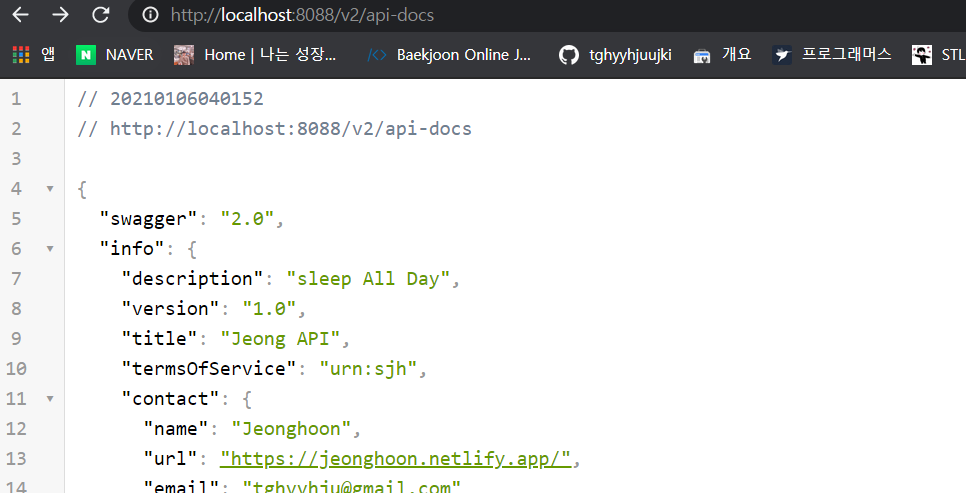

---

title: Spring boot) Swagger로 개발자 API 문서 생성하기 / 커스텀하기
date: 2021-01-06 10:21:23
category: Spring
draft: false
---

### 개발환경

IntelliJ

Spring boot 2.4.1

Gradle

'springfox-swagger2', version: '3.0.0'

'springfox-swagger-ui', version: '2.9.2'

임을 유의하자. 이번에 버전 문제로 에러가 많이 생겼다.

<br/>

개발함에 있어 API 명세서는 중요하다. Swagger는 이러한 API 문서작성을 자동화 하여 보다 편리하게 만들어준다.

가장 많이 사용하는 2.9.2v으로 설치했다. 참고로 지난 포스트부터  Gradle로 변경했다.

```
compile group: 'io.springfox', name: 'springfox-swagger2', version: '2.9.2'
compile group: 'io.springfox', name: 'springfox-swagger-ui', version: '2.9.2'
```

<br/>

SwaggerConfig라는 클래스를 만들어줬다. Configuration 용도로 사용할 클래스이므로 @Configuration, 그리고 Swagger 용도로 사용할 거기 때문에 @EnableSwagger2 애너테이션을 붙였다. 또한 Docker으로 반환하여 문서로 출력되도록했다.

```	java
@Configuration
@EnableSwagger2
public class SwaggerConfig {

    @Bean
    public Docket api(){
        return new Docket(DocumentationType.SWAGGER_2);
    }
}
```

<br/>

하지만 에러가 떴다. 

Correct the classpath of your application so that it contains a single, compatible version of org.springframework.plugin.core.PluginRegistry

이런 저런 짓을 하다가 찾은 것은, Swagger2는 Spring boot 2.2 이상 버전에서 Swagger 2.x 버전과 호환이 되지 않는다는 것이었다. 그래서 아래와 같이 바꿔줬다.

```
compile group: 'io.springfox', name: 'springfox-swagger2', version: '3.0.0'
compile group: 'io.springfox', name: 'springfox-swagger-ui', version: '3.0.0'
```

<br/>

다시 실행하고 http://localhost:8088/v2/api-docs 에 접속해보면 Swagger문서를 Json형식으로 볼 수 있다.


<br/>

하지만 http://localhost:8088/swagger-ui.html 에 들어가서는 Swagger-ui는 보이지 않았다.


<br/>

또 이것 저것 해보다가 Swagger-ui만 2.9.2 버전으로 돌렸더니 됐다. 아래와 같은 최종 버전이 있다.

```
compile group: 'io.springfox', name: 'springfox-swagger2', version: '3.0.0'
compile group: 'io.springfox', name: 'springfox-swagger-ui', version: '2.9.2'
```

<br/>

클릭해보면, 우리가 만들었던 API들을 확인할 수 있다!


<br/>

## 커스텀하기

이제 간단하게 상수를 만들어서 문서의 기본정보를 직접 만들어보자. 위의 SwaggerConfig 클래스를 아래와 같이 변경했다.

```java
@Configuration
@EnableSwagger2
public class SwaggerConfig {

    private static final Contact DEFAULT_CONTACT = new Contact("Jeonghoon",
            "https://jeonghoon.netlify.app/", "tghyyhju@gmail.com");

    private static final ApiInfo DEFAULT_API_INFO = new ApiInfo("Jeong API",
            "sleep All Day", "1.0", "urn:sjh", DEFAULT_CONTACT,
            "Apache 2.0","http://www.apache.org/licenses/LICENSE-2.0", new ArrayList<>());

    private static final Set<String> DEFAULT_PRODUCES_AND_CONSUMES = new HashSet<>(Arrays
            .asList("application/json", "application/xml"));

    @Bean
    public Docket api(){
        return new Docket(DocumentationType.SWAGGER_2)
                .apiInfo(DEFAULT_API_INFO)
                .produces(DEFAULT_PRODUCES_AND_CONSUMES)
                .consumes(DEFAULT_PRODUCES_AND_CONSUMES);
    }
}
```

<br/>

실행해보면 내가 설정한대로 바뀐 것이 보인다!




<br/>

이번에는 도메인을 변경해보자. User 클래스를 아래와 같이 변경했고 Swagger-ui에서 확인해보면 다음과 같이 나온다.

```java
@ApiModel(description = "유저 정보 도메인")
public class User {
    //User(){}
    private Integer id;

    @Size(min=4, message = "Name 4글자 이상 입력 해야함")
    @ApiModelProperty(notes = "사용자 이름")
    private String name;
    @Past
    @ApiModelProperty(notes = "사용자 등록일")
    private Date joinDate;
    @ApiModelProperty(notes = "사용자의 패스워드")
    private String password;
    @ApiModelProperty(notes = "사용자 주민번호")
    private String ssn;
}
```

