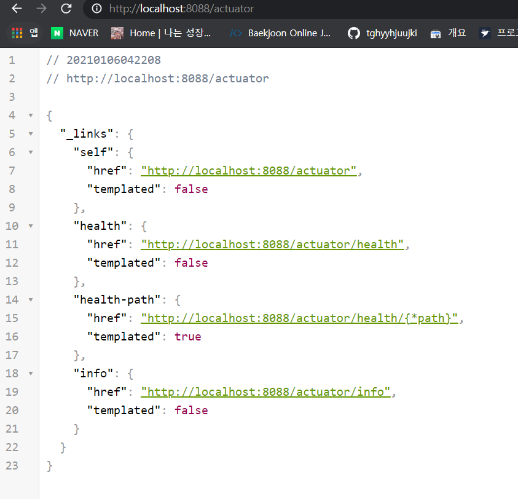

---

title: Spring boot) Actuator로 API 모니터링 설정
date: 2021-01-06 10:21:23
category: Spring
draft: false
---

### 개발환경

IntelliJ

Spring boot 2.4.1

Gradle

<br/>

### Actuator는 왜 사용할까?

Actuator를 사용하면 health, properties, beans, 구동된 AutoConfiguration 목록 등의 상태정보를 모니터링 할 수 있다.

<br/>

### 설정

Actuator를 사용하기 위해 build.gradle의 디펜던시에 추가해준다. Maven이 궁금하면 https://mvnrepository.com/artifact/org.springframework.boot/spring-boot-starter-actuator/2.4.1에서 확인

```
compile group: 'org.springframework.boot', name: 'spring-boot-starter-actuator', version: '2.4.1'
```

 <br/>

http://localhost:8088/actuator 에 들어가보면, 디폴트값은 아래와 같이 나온다.



<br/>

여기에 application.yml 또는 application.properties를 수정해준다. 그냥 dot(점) 대신에 :(콜론)과 들여쓰기의 차이이다. 다음부턴 이 설명은 생략.

yml일 경우

```
management:
  endpoints:
    web:
      exposure:
        include: "*"
```

<br/>

properties 일 경우

```
management.endpoints.web.exposure.include = "*"
```

<br/>

수정후 재실행해서 확인해보면, * 에서도 알 수 있는데, 확인 가능한 모든 URL을 보여준다.


<br/>