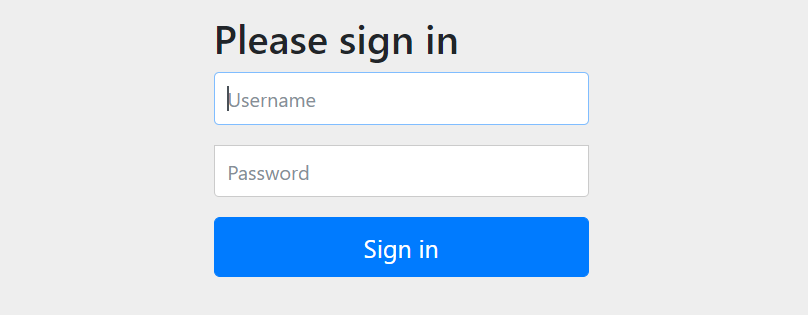
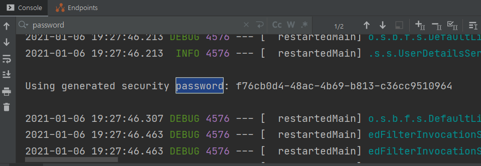
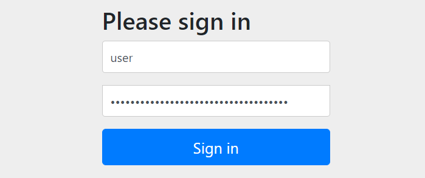
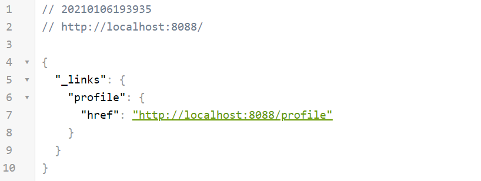
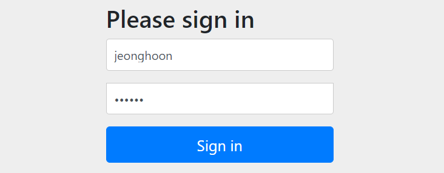
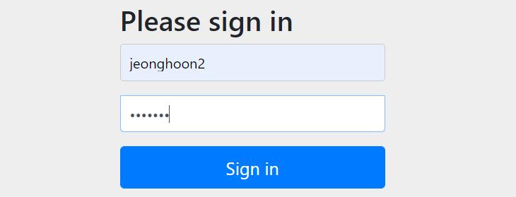
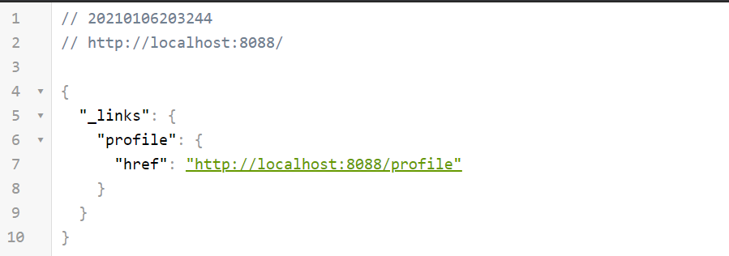

---

title: Spring boot) Spring Security 인증 및 커스텀하기
date: 2021-01-06 11:21:23
category: Spring
draft: false
---

### 개발환경

IntelliJ

Spring boot 2.4.1

Gradle

<br/>

먼저 build.gradle에 spring-boot-starter-security 라이브러리를 설치해준다.

```
dependencies {
	compile group: 'org.springframework.boot', name: 'spring-boot-starter-security'
}
```

<br/>

설치 후 실행하고, 웹에서 본인의 주소로 들어가면, 다음과 같이 인증을 하라고 나온다. 아이디는 user. 그럼 비밀번호는?



<br/>

콘솔에서 `password`를 검색하고 복사한다. 참고로 실행할 때마다 비밀번호는 바뀐다.



<br/>

인증을 하면 이제 데이터에 접근할 수 있다.





<br/>

### 사용자 지정 아이디, 비밀번호

간단하게 security 라이브러리만 설치해도 별 다른 설정 없이 사용이 가능했다. 하지만 아이디와 비밀번호를 내가 커스텀하고 싶으면 어떻게 할까?

application.yml 파일을 열고 다음과 같이 name, password 필드에 값을 입력하면 설정이 가능하다.

```yml
spring:
    security:
        user:
          name: jeonghoon
          password: hahaha
```



<br/>

### DB에서 처리 가능한 Configuration 파일 생성

하지만 설정파일에 지정해버리면 아이디와 비밀번호를 바꿀 때마다 서버를 재시작해야 하는 문제가 생긴다. 따라서 DB에서 처리가능하도록 Configuration 클래스를 만들어 해결해보자.

SecurityConfig 클래스를 만들어 다음과 같이 작성했다. `WebSecurityConfigurerAdapter`를 직접 들어가보면 다양한 메서드가 존재한다. 또한 로그인페이지를 구현할 때도 이 클래스를 사용한다. 

`.withUser()`에 사용자 아이디, 

`.password()` 에 사용자 비밀번호를 설정한다. noop 라고 명시하면 바로 비밀번호로 인식하고, 그렇지 않으면 인코딩으로 암호화를 해야한다.

`.roles()` 에는 역할을 부여한다. 

```java
@Configuration
public class SecurityConfig extends WebSecurityConfigurerAdapter {

    @Autowired
    public void configureGlobal(AuthenticationManagerBuilder auth) throws Exception{
            auth.inMemoryAuthentication()
                    .withUser("jeonghoon2")
                    .password("{noop}hahaha2")
                    .roles("USER");
    }
}
```

<br/>

로그인해보면 결과가 잘 나온다.



