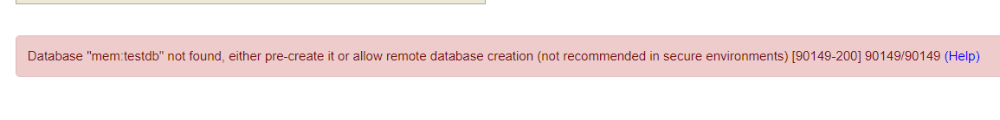

### 개발환경

IntelliJ

Spring boot 2.4.1

Gradle

<br/>

### JPA란?

Java Persistence API의 약자로, 자바 ORM(Object Relational Mapping, 객체와 테이블 간의 매핑)에 대한 API 표준이다. 

장점 : 재사용, 유지보수, 리팩토링에 용이

단점 : 복잡해질 수록 난이도가 올라가고, SQL문을 직접 사용해야 하는 경우가 생긴다.

<br/>

### Hibernate란?

논리적 개념인 JPA를 구현한 실제 라이브러리

<br/>

## JPA 관련 모듈 설치 및 사용

JPA와 H2모듈을 설치해준다. H2는 내장 램에 의존하는 데이터베이스로, 종료하면 사라진다. 이런 불편함이 있지만  JDBC와 MySQL 연동은 다른 프로젝트에서 진행했으므로, 여기서는 H2 사용에 대해 알아보자.

```
dependencies {
    runtimeOnly 'com.h2database:h2'
    compile group: 'org.springframework.boot', name: 'spring-boot-starter-data-jpa'
}
```

<br/>

본인 포트에 맞게 http://localhost:8088/h2-console 에 접속해보면 H2의 메인 화면이 나타난다.


<br/>

만약 지난번 Spring Security 때문에 테스트 연결에서 에러가 뜬다면, 권한에 걸리지 않도록 설정을 추가해야한다. 만들었던 SecurityConfig 클래스로 가서 상속 받았던 `WebSecurityConfigurerAdapter`의 `configure`메서드를 재정의해준다.

`authorizeRequests()`로 전달 받은 URL 전체를 권한 허용해주고,

`csrf().disable()`로 크로스 사이트 리퀘스트 부분을 사용하지 않게 한다. 어차피 공격 들어올 일도 없으니

마찬가지로

`headers()`에 관련된 옵션도 사용하지 않는다.

```java
@Configuration
public class SecurityConfig extends WebSecurityConfigurerAdapter {
	...
    @Override
    protected void configure(HttpSecurity http) throws Exception {
        http.authorizeRequests().antMatchers("/h2-console/**").permitAll();
        http.csrf().disable();
        http.headers().frameOptions().disable();
    }
    ...
}
```

<br/>

설정을 마치고 연결하니까 이런 에러가 떴다.



Database "mem:testdb" not found, either pre-create it or allow remote database creation (not recommended in secure environments) 90149-200\ 90149/90149 (Help)

찾아본 결과 H2의 버전이 높아짐에 따라 db를 자동으로 생성하지 않게 되었다. 따라서 application.yml 에서 아래와 같이 db를 직접 만들어주자. application.properties 이라면 아래 내용을 properties에 맞게 바꿔주면 된다.

```yml
spring:
	...
    datasource:
        url: jdbc:h2:mem:testdb
      jpa:
        show-sql: true
      h2:
        console:
          enabled: true
```

<br/>

이렇게 간단하게 db를 만들 수 있고, 정상적으로 출력되는 것도 확인했다.


<br/>

## Entity 생성 및 설정

이제 관련 애너테이션을 사용해서 엔터티, 즉 테이블로 만들어보자. 데이터로 사용해왔던 User 클래스에 

`@Entity`로 엔터티 선언을 하고, 

`@Id`로 기본키를 표시하고,

`@GeneratedValue` 으로 어떤식으로 키를 생성할지 선택하고(디폴트는 Auto) 다시 실행해보자.

```java
...
@Entity
public class User {
    @Id
    @GeneratedValue
    private Integer id;
    ...
}
```

<br/>

테이블이 들어가 있는 것을 확인할 수 있다! 이게 얼마나 편하냐면, 보통 MySQL에서 사용할텐데, 서버를 실행하면 테이블이 완성되어 있기 때문에 매번 만들어 줄 필요가 없다.


<br/>

select 문을 사용해보면 데이터가 없다. 데이터를 추가해주자.


<br/>

리소스 디렉토리에 data.sql 파일을 추가하고 user 필드에 맞는 아무런 값이나 넣자. 재기동하면 데이터가 들어가 있음을 확인할 수 있다.

```sql
insert into user value (1, sysdate(), 'jeonghoon', 'pw1', 'ssn1');
insert into user value (2, sysdate(), 'jeonghoon', 'pw2', 'ssn2');
insert into user value (3, sysdate(), 'jeonghoon', 'pw3', 'ssn3');
```

