---

title: Spring boot) Spring Data JPA로 CRUD 구현, 게시판 M:N 구현
date: 2021-01-07 11:21:23
category: Spring
draft: false
---

### 개발환경

IntelliJ

Spring boot 2.4.1

Gradle

관련모듈 : h2, spring-boot-starter-data-jpa

<br/>

### 사전작업

지난 포스트에서 엔터티까지만 만들었다. 여기에 CRUD 기능을 추가하기 위해선 레파지토리가 필요하다.

간단하게 말하자면, 만들고자 하는 테이블 하나당 엔터티 클래스 하나와 레파지토리 클래스 하나가 필요하다.

그리고 이 모두를 컨트롤할 컨트롤러를 하나 만들어야한다.

<br/>

먼저 `UserJpaController` 라는 컨트롤러 클래스를 만들었다. 이게 기본 틀이다.

```java
@RestController
@RequestMapping("/jpa")
public class UserJpaController {
    @Autowired
    private UserRepository userRepository;

}
```

<br/>

그리고 엔터티인 `User`클래스는 아래와 같이 생성한다.

`@Table`로 테이블 이름을 설정할 수 있다.

`@Entity`로 엔터티 선언을 해준다.

`@Id` 로 기본키를 설정했다.

```java
@Data
@NoArgsConstructor
@Table(name = "User_list")
@Entity
public class User {

    @Id
    private Integer id;
    private String name;
    private Date joinDate;
    private String password;
    private String ssn;
}
```

<br/>

## 사용자 조회 구현 - GET

### 전체 사용자 조회

사전작업에서 컨트롤러와 User 엔터티를 만들었으므로 레파지토리만 만들어주고 사용자 정보를 읽어오는 메서드를 컨트롤러에 추가하자.

먼저 `UserRepository`이다. `JpaRepository`에 들어가보면 사용할 수 있는 메서드들이 나와있다. 여기 있는 메서드를 가져다가 사용할 수도 있고, `UserRepository` 안에서 SQL문을 사용하여 커스텀도 가능하다.

```java
@Repository
public interface UserRepository extends JpaRepository<User, Integer> {

}
```

<br/>

모든 사용자 정보를 읽어오기 때문에  `retrieveAllUsers()`에서`findAll()`메서드를 사용했다.

```java
public class UserJpaController {
	...
    @GetMapping("/users")
    public List<User> retrieveAllUsers(){
        return userRepository.findAll();
    }
}
```

<br/>

실행해보면 데이터를 정상적으로 읽어온다.

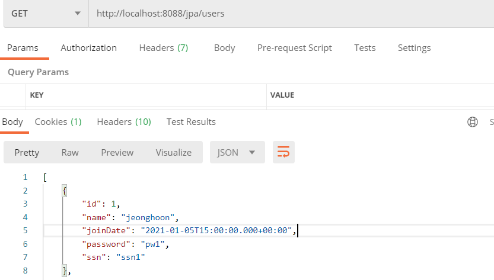

<br/>

### 개별 사용자 조회 

`UserJpaController`에 특정 ID만 검색하는 메서드를 추가했다. 앞의 Optional을 사용해야 하는데, 상속된 메서드를 타고 올라가서 findById()를 찾아보면, 하나의 ID를 검색할 때 반환값이 Optional이기 때문이다.

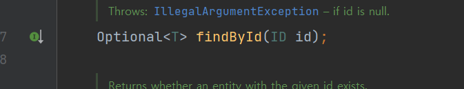

```java
@RestController
@RequestMapping("/jpa")
public class UserJpaController {
    ...
    @GetMapping("/users/{id}")
    public User retrieveUser(@PathVariable int id){
        Optional<User> user = userRepository.findById(id);

        return user.get();
    }
}
```

<br/>

이렇게만 해도 검색은 잘 된다.


<br/>

위 코드에다가 지난번에 구현한 hateoas와 id가 없을 때 발생할 에러메세지를 추가해줬다. 

```java
@RestController
@RequestMapping("/jpa")
public class UserJpaController {
    ...
    @GetMapping("/users/{id}")
    public EntityModel<User> retrieveUser(@PathVariable int id){
        Optional<User> user = userRepository.findById(id);

        if(!user.isPresent()){
            throw new UserNotFoundException(String.format("User ID [%s} not found", id));
        }

        EntityModel<User> model = new EntityModel<>(user.get());
        WebMvcLinkBuilder linkTo = linkTo(methodOn(this.getClass()).retrieveAllUsers());
        model.add(linkTo.withRel("all-user"));

        return model;
    }
}
```

<br/>

이제 하이퍼미디어 처리도 가능하고, 에러처리도 가능해졌다.

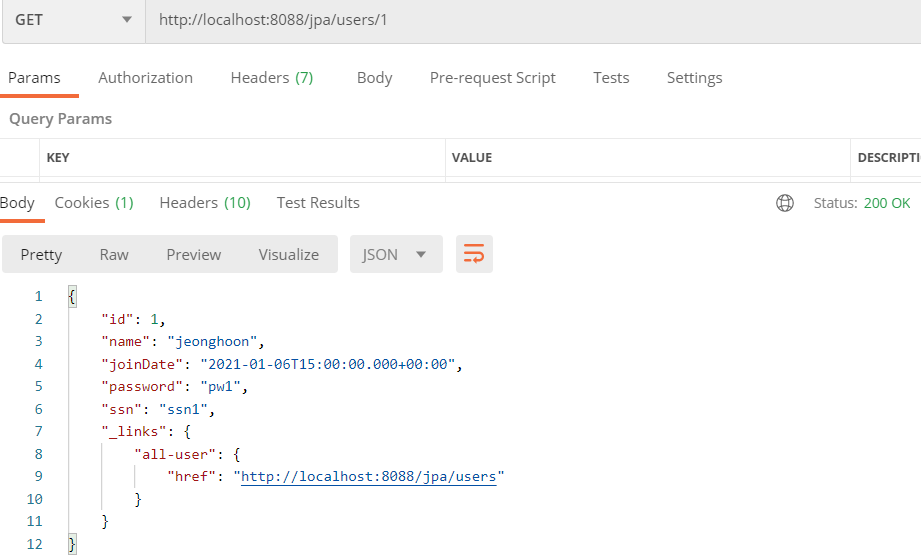

<br/>

## 사용자 삭제 구현 - DELETE

삭제는 정말 간단하다. 값을 따로 리턴할 필요가 없기 때문이다. 물론 삭제가 되었다는 메세지를 리턴하도록 구현해도 된다.

다음과 같이 `UserJpaController`에 delete 메서드를 추가해준다.

```java
@RestController
@RequestMapping("/jpa")
public class UserJpaController {
    ...
    @DeleteMapping("/users/{id}")
    public void deleteUser(@PathVariable int id){
        userRepository.deleteById(id);
    }
}
```

<br/>

실행해보자. 먼저 삭제하고 

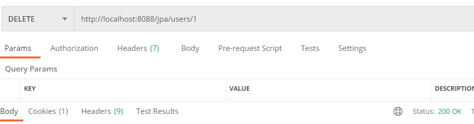

<br/>

조회해보면 id 1은 삭제되어있다.

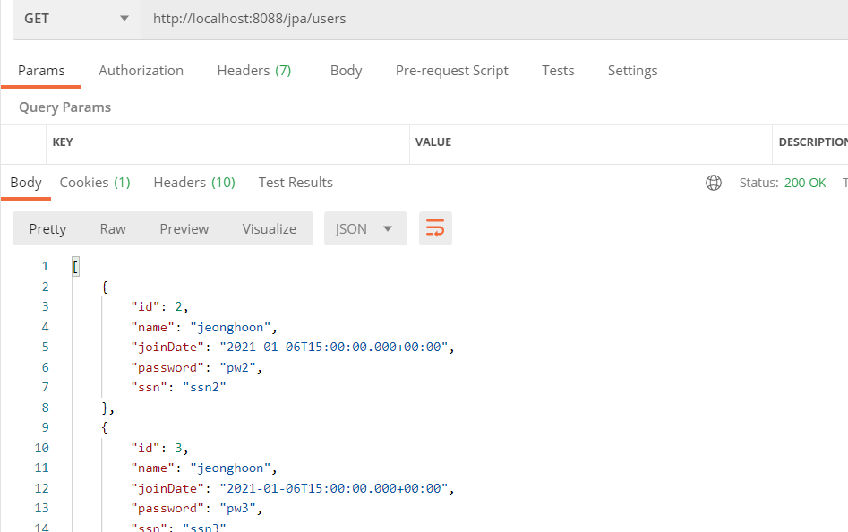

<br/>

## 사용자 추가 구현- POST

POST 메서드는 살짝 복잡하다. 먼저 코드부터 보면 다음과 같다. `@valid`는 유효성 검사때문이지 사용하지 않아도 돌아가긴한다.

`save()` 메서드를 사용하여 savedUser에 반환시키고 `ServletUriComponentsBuilder.fromCurrentRequest()` 를 이용해서 현재 생성될 id 값을`.path()`에 담고 이를 헤더값으로 `buildAndExpand()`에 매핑해서 전달시킬 것이다. 이를 URI 데이터 값으로 변환한다.

```java
@RestController
@RequestMapping("/jpa")
public class UserJpaController {
    ...
    @PostMapping("/users")
    public ResponseEntity<User> createUser(@Valid @RequestBody User user){
        User savedUser = userRepository.save(user);

        URI location = ServletUriComponentsBuilder.fromCurrentRequest()
                .path("/{id}")
                .buildAndExpand(savedUser.getId())
                .toUri();

        return ResponseEntity.created(location).build();
    }
}
```

<br/>

반환값인 `ResponseEntity`를 조금 뜯어보면, 헤더와 바디로 이루어진 것을 볼 수 있다.

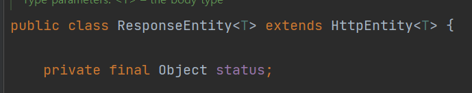

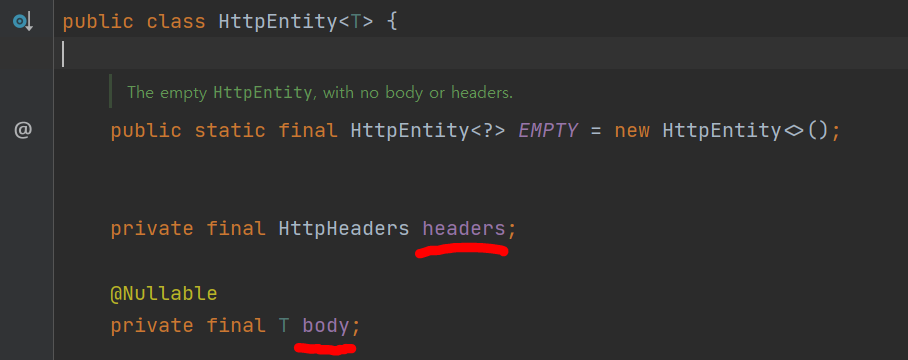

<br/>

이를 실행시켜보자. 데이터에 대한 POST요청을 보내고 확인해보면 추가된 것을 확인할 수 있다.

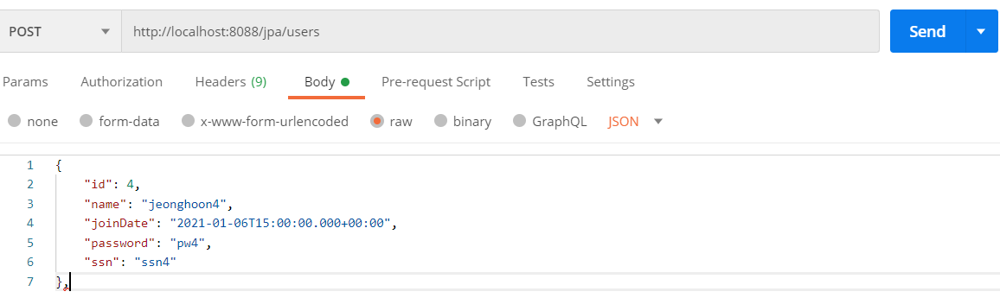

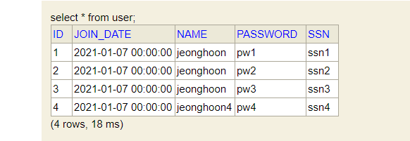

<br/>

## Post 응용, M:N 관계 만들기(게시판)

게시판을 보면 하나의 사용자가 여러 개의 게시물의 소유권을 갖는다. 이를 JPA방식으로 표현해보자.

먼저 UserPost라는 엔터티를 만들어주자. 여기서 user 필드를 보면 두개의 애너테이션이 사용됐는데,

`@ManyToOne`은 UserPost를 다수, 그리고 부모로 엮을 User 엔터티를 하나로 보고 매핑시킨 것이다. 즉 User : UserPost = 1 : N 이 성립한다.

`LAZY`로 항상 UserPost의 user 필드를 가져오는 것이 아니라, 불러올 때만 가져오도록 선언했다.

`@JsonIgnore`를 사용하여 노출되지 않게 만들었다.

```java
@Entity
@Data
@AllArgsConstructor
@NoArgsConstructor
public class UserPost {
    @Id
    @GeneratedValue
    private Integer id;

    private String description;

    @ManyToOne(fetch = FetchType.LAZY)
    @JsonIgnore
    private User user;

}
```

<br/>

그리고 기존에 있던 User 클래스에 아래를 추가한다. 마찬가지로

`@OneToMany`로 User 클래스는 1:N에서 1을 명시한 것이다. posts 필드에 다수를 저장할 예정이니 List로 선언한다.

```java
public class User {
    ...
    @OneToMany(mappedBy = "user")
    private List<UserPost> posts;
}
```

<br/>

그리고 UserJpaController의 전체 사용자조회 메서드에서 살짝만 수정하여 조회 메서드를 만들어준다.

```java
@RestController
@RequestMapping("/jpa")
public class UserJpaController {
    ...
    @GetMapping("/users/{id}/posts")
    public List<UserPost> retrieveAllPostsByUser(@PathVariable int id){
        Optional<User> user = userRepository.findById(id);

        if(!user.isPresent()){
            throw new UserNotFoundException(String.format("User ID [%s} not found", id));
        }

        return user.get().getPosts();
    }
}
```


<br/>

이제 테스트를 위해 실행해보자. UserPost 엔터티에 User id가 1번인 사람이 게시글을 작성한 것처럼 임의의 값을 넣었다.

```
insert into user_post values(1001, 'jeonghoon first post', 1);
insert into user_post values(1002, 'jeonghoon second post', 1);
```

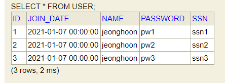

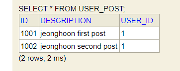

<br/>

포스트맨으로 조회해보면 글이 id에 맞게 종속되어 있는 것을 볼 수 있다!

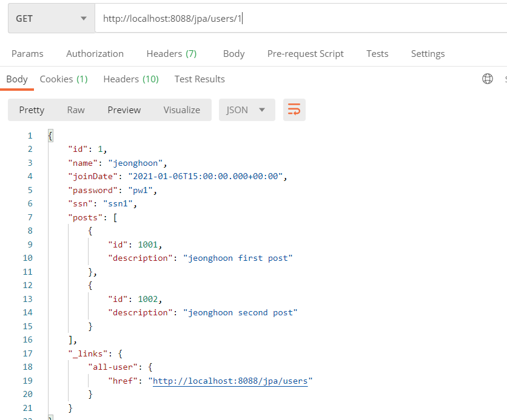

<br/>

잘 작동하긴 하는데 매번 insert로 글을 쓸 수 없으니 글 작성하기 위한 POST 메서드를 마지막으로 만들어보자.

UserPost의 레파지토리가 없으니 POST가 안 될 것이다. 인터페이스로 만들어주자. 그리고 컨트롤러 수정

<br/>

`UserPostRepository`

```java
@Repository
public interface UserPostRepository extends JpaRepository<UserPost, Integer> {
}
```

<br/>

컨트롤러에서 매커니즘은 다음과 같다.

1. UserPost는 User의 id를 저장해야 하므로 먼저 User의 id를 받아온다
2.  받아온 id를 UserPost에 저장한다.

`UserJpaController`

```java
@RestController
@RequestMapping("/jpa")
public class UserJpaController {
	...
    @Autowired
    private UserPostRepository userPostRepository;
	...
    @PostMapping("/users/{id}/posts")
    public ResponseEntity<UserPost> createUserPost(@PathVariable int id, @RequestBody UserPost userPost){
        //사용자를 먼저 검색함. Get 메서드에서 긁어왔다.
        Optional<User> user = userRepository.findById(id);
        if(!user.isPresent()){
            throw new UserNotFoundException(String.format("User ID [%s} not found", id));
        }
        userPost.setUser(user.get());

        //검색으로 사용자를 찾으면 savedUserPost에 넘겨준다. Post메서드에서 긁어왔다.
        UserPost savedUserPost = userPostRepository.save(userPost);

        URI location = ServletUriComponentsBuilder.fromCurrentRequest()
                .path("/{id}")
                .buildAndExpand(savedUserPost.getId())
                .toUri();

        return ResponseEntity.created(location).build();
    }
}
```

<br/>

두 개의 게시물을 작성했다.

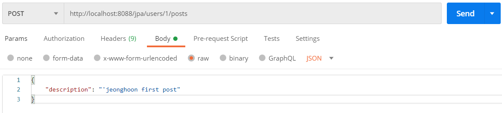

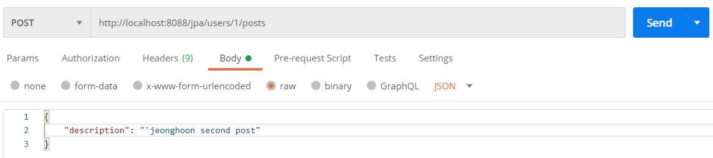

<br/>

조회해보니 정상적으로 출력 되었다!

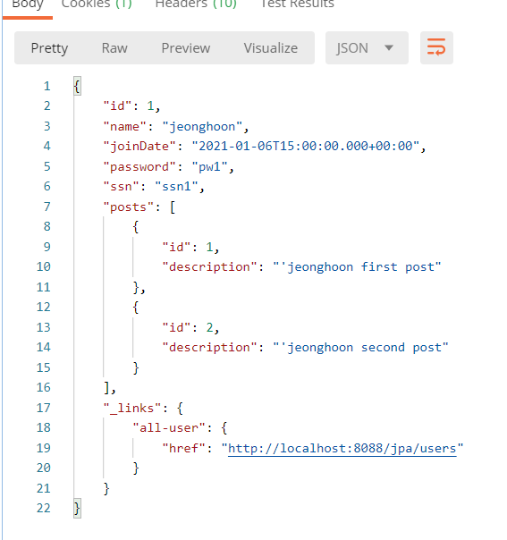