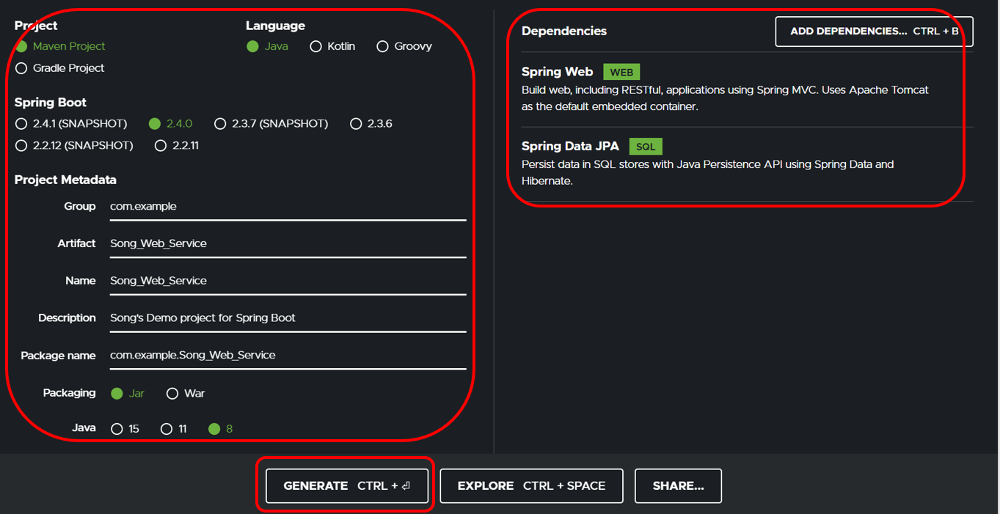
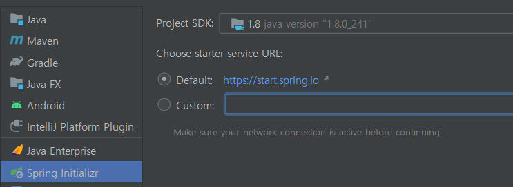
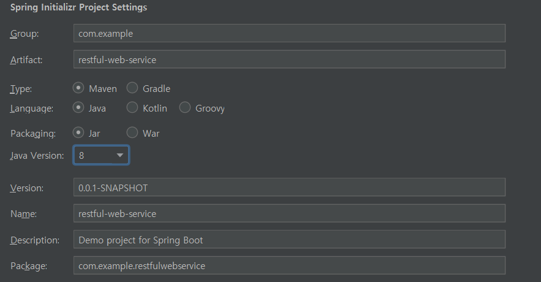
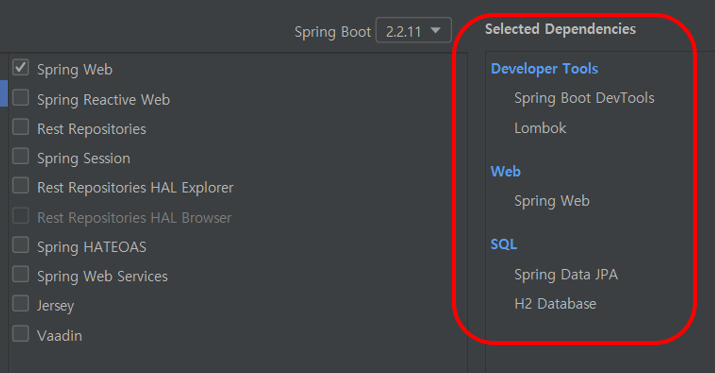
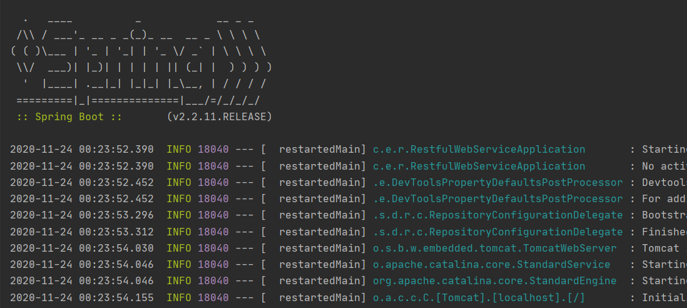
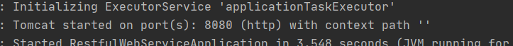
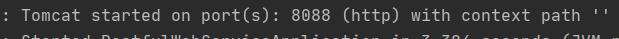

이 글은 인프런에서 이도원 강사님의 [**Spring Boot를 이용한 RESTful Web Services 개발**](https://www.inflearn.com/course/spring-boot-restful-web-services/news)을 참조 + @ 한 글입니다.

<br/>

<br/>

<br/>

### Spring

Spring Boot를 보기전에, Spring이란 무엇일까?

Spring은자바의 대표적인 애플리케이션 개발 프레임워크로, 의존성 주입(DI, Dependency), 제어역전(IOC, Inversion of Control)이라는 특징을 갖고 있으며, 결합도가 낮은 방식으로 애플리케이션을 개발할 수 있다. 이러한 개발방식은 단위테스트가 쉽기 때문에 고퀄의 프로그램을 개발할 수 있다.

유닛테스트 : 유닛 테스트는 컴퓨터 프로그래밍에서 소스 코드의 특정 모듈이 의도된 대로 정확히 작동하는지 검증하는 절차(위키백과 발췌).

<br/>

### Spring Boot

Spring Boot는 단독 실행 가능한 어플리케이션 플랫폼이다. 간단하게 개발 가능하고 상용화 가능한 수준의 어플리케이션을 만들 수 있다는 장점이 있다. Spring을 사용한 애플리케이션 개발에는 많은 설정작업이 따른다. 여기서 Spring boot를 사용하면, 최소한의 설정으로 서트파티 라이브러리까지 사용 가능해진다.

공식 사이트에서 설명하는 특징은 다음과 같다

- 기본적인 싱글 Spring 애플리케이션을 만들 수 있다
- 만들 수 있는 이유는, Tomcat, Jetty, Undertow를 내장하고 있기 때문(별도의 서버를 설치할 필요가 없음, war 파일을 배포할 필요가 없음!)
- Spring 프레임워크 실행에 필요한 기본적인 API를 포함한 starter 라는 컴포넌트를 제공
- Spring 프레임워크 설정작업은 Auto configuration을 통해 손쉽게 설정 가능.
- Spring 애플리케이션은 IOC, AOP와 같은 Spring 기능을 사용하기 위해서 별도의 XML파일을 추가하거나, Annotation을 통해 작업을 해야 했다. 하지만 Spring Boot에서는 이러한 과정이 생략되어 개발 로직에 시간을 더 쏟을 수 있게 됐다.
- 상용화에 필요한 통계, 상태점검에 필요한 모니터링, 외부설정을 위한 여러 라이브러리를 지원하기 때문에 개발에 용이하다.

<br/>

### Spring boot 프로젝트 생성

일단 여러 방법이 있는데 start.spring.io

[start.spring.io](start.spring.io)에 접속하여 기본 틀을 생성해주자. 참고로 이 작업은 이클립스 안에서도 가능하다.



왼쪽에서 버전 및 이름 설정이 가능하고, 오른쪽에서는 디펜던시 모듈을 추가할 수 있다. 난 Spring Web과 JPA를 선택했다. 아래 GENERATE를 누르면 옵션에 맞는 파일을 알집으로 제공해준다.

<br/>

이클립스에서도 개발이 가능하지만, 여기서는 IntelliJ IDAE를 사용하겠다. 이게 뭔지 간단히 말하자면. 이클립스처럼 IDE(통합 개발 환경)이다.

다음과 같이 Spring Initializr를 선택하고 start.spring.io를 선택한다.



<br/>

타입은 메이븐, 언어는 자바를 선택했다. Jar는 자바의 zip파일이라고 보면 된다. JRE만으로도 실행이 가능하다. 플랫폼에 귀속되어 외부에서 실행이 불가능하다. 반면 War는 웹 어플리케이션 압축파일이다. 이를 사용하면 웹 어플리케이션을 쉡게 배포하고 테스트가 가능해진다.



<br/>

다음과 같은 모듈을 추가하였다. 나중에 HATEOAS를 사용할 예정인데, Spring boot 2.1 버전과 2.2의 API사용 방법이 다르다. 현재 최소버전이 2.2 밖에 선택이 안된다. 뭐... 나중에 사용할 때 미래의 내가 해결하겠지..



<br/>

프로젝트를 만들고 실행하면 매우 반가운 화면이 나온다.



<br/>

또한 톰캣서버가 디폴트 포트 8080으로 실행중임을 확인할 수 있다.



<br/>

Gatsby(현재 이 블로그가 Gatsby)의 개발환경이 8080포트로 설정되어 있기 때문에, 실행하면 충돌할 게 뻔하다. 따라서 해당포트를 변경해주었다.

application.properties파일의 확장자를  properties에서 보다 기능이 많은 yml로 바꿔주고, 아래 내용을 입력해 포트를 변경하였다.

```yaml
server:
  port: 8088
```

<br/>

포트가 변경된 것을 확인할 수 있다.



