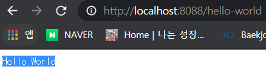
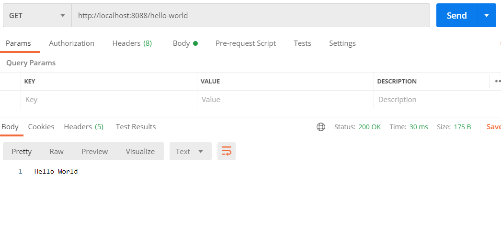

지난 글 [Spring Boot란?(feat.IntelliJ IDAE) + 프로젝트 생성](https://jeonghoon.netlify.app/Spring/SpringBoot2/)에 이어서 진행합니다. 

<br/>

### Annotation?

일단 Annotation에 대해 설명하자면, 자바 소스코드에 추가하여 사용할 수 있는 메타데이터(자신의 정보를 담고 있는데이터)의 일종이다. 자바에서 오버라이딩 할 때 @Overriding 으로 사용한 기억이 있을 것이다. 얘 역시 Annotation.

<br/>

먼저 HelloWorldController 라는 클래스를 하나 만들어준다.

```java
@RestController
public class HelloWorldController {
    // Get
    // hello-world (endpoint)
    @GetMapping(path = "/hello-world")
    public String helloWorld(){
        return "Hello World";
    }
}
```

<br/>

### @RestController

먼저 `@controller`와 `@RestController`의 차이는 `@ResponseBody`를 어떻게 사용하느냐에 달려있다. 기존 `@Controller`는 MVC에서 jsp나 html과 같은 뷰를 전달해주었기 때문에 데이터를 반환하기 위해서는 `@ResponseBody`를 사용해야했다. 하지만 프론트엔드와 백엔드를 분리하는 개발 방식이 주를 이루면서, Rest API를 통해 데이터만 전달하는`@RestController`를 사용하게 되었다. 즉 `@Controller`와 `@ResponseBody`가 합쳐진 것이 `@RestController`이며, JSON/XML 타입의 HTTP 응답을 직접 리턴하게 된다.

<br/>

### @GetMapping(Post,delete,update 다 마찬가지)

스프링 4.x부터 추가되었으며, 기존 @RequestMapping를 대체하여 다음과 같이 사용 가능하다. 어떤 메소드로 매핑할지 명확하고 짧기 떄문에 사용하기 편했다.

```java
@GetMapping("/hello-world")
@GetMapping(path = "/hello-world") // 어떤 속성인지 지정 가능

// 기존 RequestMapping
@RequestMapping(method=requestMethod.GET, path="/hello-world")
```

<br/>

이제 우리가 지정했던 http://localhost:8088/hello-world 에 접속해보자. localhost:8088까지는 Tomcat 서버를 지칭하고, 뒤의 hello-world는 우리가 지정한 API를 지칭한다. 정상적으로 출력 되는 것을 확인할 수 있다.



<br/>

PostMan으로도 테스트해봤다. 스테이터스 코드 200으로 정상, 그리고 Hello World가 정상으로 출력된다.

