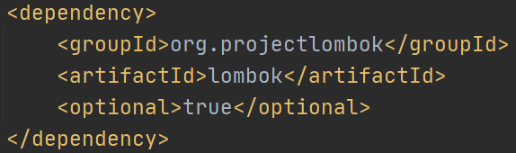
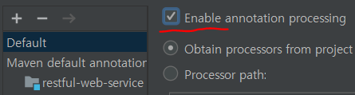
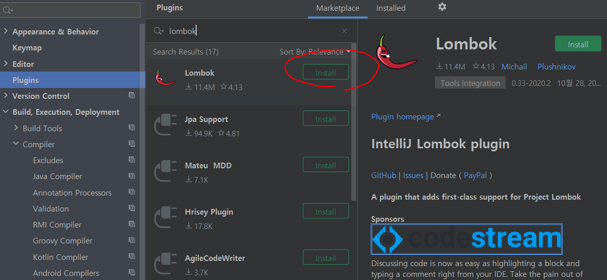
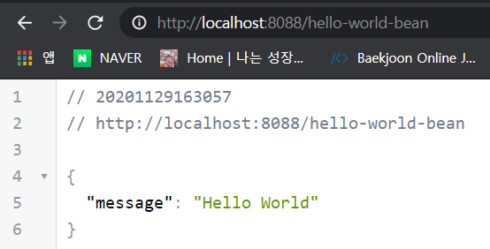

### Bean이란?

Bean은 Spring Bean 컨테이너에 존재하는 객체를 말한다. Spring 제어역전(IoC, Inversion of Control) 컨테이너에 의해 인스턴스화, 관리, 생성된다. Bean 컨테이너는 의존성 주입(DI, Dependency Injection)을 통해 Bean 객체를 사용할 수 있도록 해준다. 또한 기본적으로 스프링은 모든 Bean을 Singleton으로 생성하여 관리한다. 정의서에 따르면, 다음과 같은 특징을 가진다.

- 클래스는 패키지화 하여야 한다.
- 멤버변수는 프로퍼티(Property)라 칭한다.
- 클래스는 필요에 따라 직렬화가 가능하다.
- 프로퍼티의 접근자는 private이다.
- 프로퍼티마다 getter/setter 가 존재해야 하며, 그 이름은 각각 get/set으로 시작해야 한다.
- 위의 프로퍼티 getter/setter 메서드의 접근자는 public이어야 한다.
- 외부에서 프로퍼티에 접근은 메서드를 통해서 접근한다.
- 프로퍼티는 반드시 읽기/쓰기가 가능해야 하지만, 읽기 전용인 경우 getter만 정의할 수 있다.
- getter의 경우 파라미터가 존재하지 않아야 하고, setter의 경우 한 개 이상의 파라미터가 존재한다.
- 프로퍼티의 형이 boolean일 경우 get 메서드 대신 is메서드를 사용해도 된다.

<br/>

### 프로퍼티

Bean에 저장되어 있는 값을 나타내며, 메소드 이름을 사용해서 프로퍼티 이름을 결정한다.

읽기전용 프로퍼티 : get / is

읽기/쓰기 프로퍼티 : get / set id / set

<br/>

가장 기본적인 Bean 클래스를 만드는 방법은 다음과 같다.

```java
public class HelloWorldBean {
    private String message; // 값을 저장하는 속성 필드

    public String getMessage(){ // 값을 읽어오는 메소드
        return this.message;
    }

    public void setMessage(String msg){ // 값을 저장하는 메소드
        this.message = msg;
    }

    public HelloWorldBean(String message) { // 생성자
        this.message = message;
    }
}
```

<br/>

## Lombok

자바에서 기계적으로 작성하던 VO, DTO, Entity 의 관리와 유지보수를 편하게 만들어주는 라이브러리다. 특히 Spring에서 사용할 경우 JPA 환경과 함께 일관되고 가독성 좋은 애플리케이션을 만들게 해준다.

지난 번에 프로젝트를 생성해 줄 때 모듈을 추가해놨기 때문에 pom.xml에 이미 들어가 있는 것을 볼 수 있다.



<br/>

### @Date

Lombok의 @Date 애노테이션을 사용하면, 위의 코드를 아래와 같이 깔끔하게 만들 수 있다. 참고로 @Date는 @Getter, @Setter, @ToString, @EqualsAndHashCode, @Builder가 합쳐진 것.

```java
@Data
public class HelloWorldBean {
    private String message;

    public HelloWorldBean(String message) {
        this.message = message;
    }
}
```

<br/>

### @AllArgsConstructor

모든 Argument를 가진 Constructor가 내부적으로 만들어진다. 즉, 생성자 생략이 가능해진다!

```java
@Data
@AllArgsConstructor
//@NoArgsConstructor 매개변수 없는 디폴트 생성자 원하면 이거 사용
public class HelloWorldBean {
    private String message;
}
```

<br/>

참고로 IntelliJ에서는 애노테이션 사용이 비활성화 되어 있으므로 켜줘야한다. (Fille > Setting 에 들어가서 Annotation Processors를 검색한 후 활성화)



<br/>

만약 @AllArgsConstructor와 생성자를 동시에 선언하고 빌드하면 어떻게 될까? 이미 선언되어 있다며 오류가 발생한다.


<br/>

하지만 실행 전에는 오류를 확인할 방법이 없다. 프로젝트 안에서 lombok을 사용하겠다 선언한 것이지, IntelliJ에서 사용하겠다 선언한적이 없다. 따라서 IntelliJ 안에서 lombok을 설치해주자.



<br/>

이제 컨트롤러에서 아래와 같이 Bean 객체를 사용할 수 있다. 리턴은 Json형식으로.

```java
@GetMapping(path = "/hello-world-bean")
public HelloWorldBean helloWorldBean(){
    return new HelloWorldBean("Hello World");
}
```

