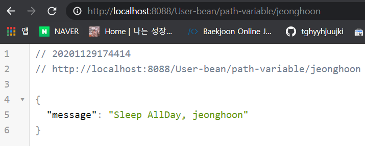

### @PathVariable

Spring 3.x에서 추가된 기능으로, URL 경로에 변수를 넣어줄 수 있다. 소괄호 { } 안에 전달할 변수를 넣어준다.

```java
@GetMapping(path = "/User-bean/path-variable/{name}")
```

<br/>

아래와 같이 동일한 메소드 이름에 파라미터 추가하고 오버라이딩하여 사용도 가능하다. 파라미터 값 앞에 @PathVariable 애노테이션을 추가해야한다. 소괄호 안의 값과 파라미터의 이름이 같으면 아래와 같이 사용 가능하다.

```java
@GetMapping(path = "/User-bean")
public HelloWorldBean helloWorldBean(){
    return new HelloWorldBean("Sleep AllDay");
}

@GetMapping(path = "/User-bean/path-variable/{name}")
public HelloWorldBean helloWorldBean(@PathVariable String name){
    return new HelloWorldBean("Sleep AllDay" + name));
}
```

<br/>

만약 소괄호 안의 변수(name)와 파라미터의 이름이 다르면 다음과 같이 value에 직접 입력하여 사용가능하다.

```java
@GetMapping(path = "/User-bean/path-variable/{name2}")
public HelloWorldBean helloWorldBean(@PathVariable(value = "name2") String name){
    return new HelloWorldBean("Sleep AllDay" + name));
}
```

<br/>

출력 형식도 다음과 같이 사용 가능.

```java
@GetMapping(path = "/User-bean/path-variable/{name2}")
public HelloWorldBean helloWorldBean(@PathVariable(value = "name2") String name){
    return new HelloWorldBean(String.format("Sleep AllDay, %s", name));
}
```

<br/>

파라미터로 전달된 Jeonghoon이 화면에 출력된 것을 볼 수 있다.



<br/>

<details> <summary>HelloWorldBean 전체 소스(클릭)</summary> <div markdown="1">

```java
package com.example.restfulwebservice.helloworld;

import lombok.AllArgsConstructor;
import lombok.Data;
import lombok.NoArgsConstructor;

@Data
@AllArgsConstructor
@NoArgsConstructor
public class HelloWorldBean {
    private String message;
}
```


</div> </details>

<details> <summary>HelloWorldController 전체 소스(클릭)</summary> <div markdown="1">

```java
package com.example.restfulwebservice.helloworld;

import org.springframework.web.bind.annotation.GetMapping;
import org.springframework.web.bind.annotation.PathVariable;
import org.springframework.web.bind.annotation.RestController;

@RestController
public class HelloWorldController {
    // Get
    // hello-world (endpoint)
    // @RequestMapping(method=requestMethod.GET, path="/hello-world")
    @GetMapping(path = "/hello")
    public String helloWorld(){
        return "Sleep AllDay";
    }

    @GetMapping(path = "/hello-bean")
    public HelloWorldBean helloWorldBean(){
        return new HelloWorldBean("Sleep AllDay");
    }

    @GetMapping(path = "/hello-bean/path-variable/{name}")
    public HelloWorldBean helloWorldBean(@PathVariable String name){
        return new HelloWorldBean("Sleep AllDay" + name);
    }
}

```


</div> </details>