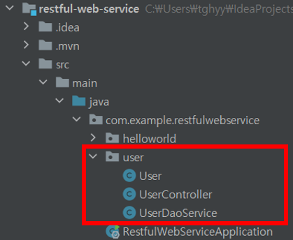
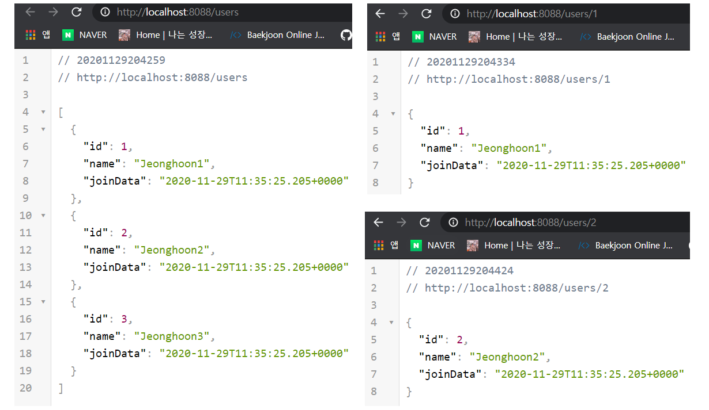
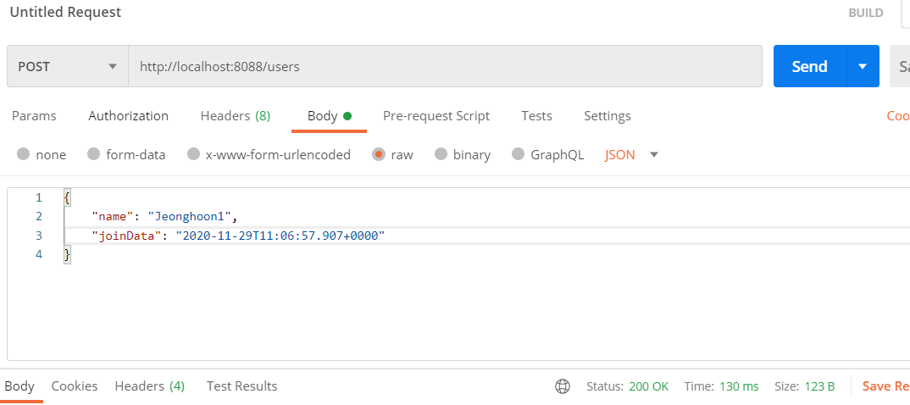
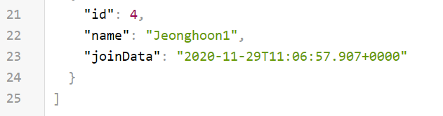
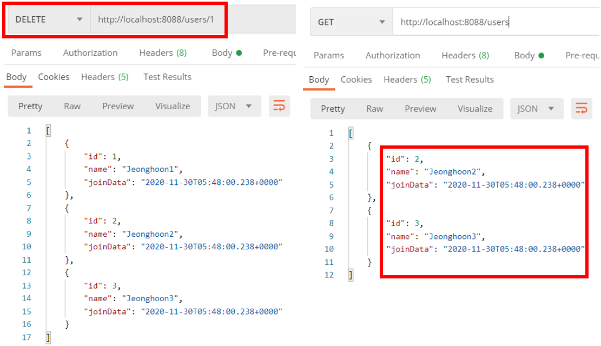

---

title: Spring boot) HTTP 메소드로 RESTful 사용자 CRUD 구현
date: 2020-11-29 16:21:14
category: Spring
draft: false
---


이번에는 지금까지 배운 내용 + HTTP 메소드GET, POST, DELETE 사용하여 DB에서 Read, Create, Delete 하는 기능을 추가할 예정이다. 또한 DB에 연동하지 않고 메모리 상에서 임시로 DB를 만들어 진행할 것이다.

시작하기 앞서, 다음과 같이 구성할 예정이다.



<br/>

먼저 user라는 패키지 밑에 User 클래스를 만들어주자(앞으로 Import, package는 생략). 아래와 같이 DB에서 사용할 필드를 정의한다.

```java
@Data
@AllArgsConstructor
public class User {
    private Integer id;
    private String name;
    private Date joinData;
}
```

<br/>

임시로 DB를 만드므로, DAO와 Service를 합쳐서 진행한다. UserDaoService 클래스를 만들고 안에 임시데이터를 넣었다. 여기서, DAO가 뭘까?

DAO(Data Access object) : DB의 데이터에 접근을 위한 객체, 여기서는 메모리에서 DB를 사용하므로 Service와 합침.

```java
public class UserDaoService {
    private static List<User> users = new ArrayList<>();
    static {
        users.add(new User(1, "Jeonghoon1", new Date()));
        users.add(new User(2, "Jeonghoon2", new Date()));
        users.add(new User(3, "Jeonghoon3", new Date()));
    }
}
```

<br/>

## @Component, @Service, @Repository, @Controller

앞으로 계속 나올 예정이므로 한번 짚고 넘어가자. 이 네가지 애노테이션은 모두 스프링 컨테이너에 빈이라고 등록하기 위한 애노테이션이다. 하지만 각각 차이점이 존재한다.

- @Component : 자동으로 스캔해서 등록하고 싶은 것들을 위해 사용
- @Service : Business Layer에서 Service를 명시하기 위해서 사용
- @Repository : Persistence Layer에서 DAO를 명시하기 위해서 사용
- @Controller : Presentation Layer에서 Contoller를 명시하기 위해서 사용

<br/>

즉, @Component 만 사용해도 되지만, 좀 더 명시적으로 표시하기 위해 스프링 자체에서도 @Service, @Repository, @Controller의 사용을 권장한다.

아무튼 이 클래스는 비즈니스 로직을 표현하는 클래스이므로 다음과 같이 @Service 애노테이션을 추가해주자.

```java
@Service
public class UserDaoService {

}
```


<br/>

## GET - 사용자 조회

이제 모든 사용자를 조회하는 `findAll()` 메소드와 특정 사용자를 조회하는 `findOne()`메소드를 만든다.  

```java
@Service
public class UserDaoService {
    // 전체 리턴
    public List<User> findAll(){
        return users;
    }
    // 전체에서 아이디가 같은 사용자 리턴
    public User findOne(int id){
        for (User user : users){
            if(user.getId() ==id){
                return user;
            }
        }
        return null;
    }
}
```

<br/>

여기까지 하면 당연히 안 된다. Json 형식을 처리할 @RestController 애노테이션을 사용하는 컨트롤러를 만들고 접근 가능한 URL을 지정해줘야한다. 조회를 처리할 GET 메소드를 만들어준다. 

```java
@RestController
@AllArgsConstructor
public class UserController {
    private UserDaoService service;
    // 전체유저
    @GetMapping("/users")
    public List<User> retrieveAllUsers(){
        return service.findAll();
    }
    // 특정유저
    @GetMapping("/users/{id}")
    public User retrieveUsers(@PathVariable int id){
        return service.findOne(id);
    }
}
```

<br/>

http://localhost:8088/users

http://localhost:8088/users/1

이제 조회해보면 잘 작동하는 것을 확인할 수 있다.



<br/>

## POST - 사용자 추가

먼저 UserDaoService 클래스에 usersCount를 3으로 초기화해준다. 이미 임시DB에 데이터 3개가 들어있기 때문이다. 그리고 user의 id를 가져오지 못하면 1씩 추가해준다. MySQL에서 Auto_Increment 와 같은 기능을 할 것이다.

```java
@Service
public class UserDaoService {

    private static int usersCount = 3;

    public User save(User user){
        if(user.getId() == null){
            user.setId(++usersCount);
        }
        users.add(user);
        return user;
    }
}
```

<br/>

이제 UserController 클래스에 사용자를 추가할 POST 메소드를 만들어준다. POST와 PUT 메소드는 클라이언트로부터 Json / XML과 같은 오브젝트를 받기 위해서는 매개변수에 타입에 @RequestBody 를 선언해야한다.

```java
public class UserController {
    @PostMapping("/users")
    public void createUser(@RequestBody User user){
        User savedUser = service.save(user);
    }
}
```

<br/>

이제 PostMan으로 데이터를 추가해보자. 상태코드가 200이고 확인해보니 잘 들어갔다.





<br/>

## DELETE - 사용자 삭제

POST와 구조적으로 동일하다.조금만 수정해주자. 먼저 UserDaoService에 deleteById메소드를 추가해주자. 사용자 데이터가 리스트에 들어있으므로 반복자를 만들어주자. 사용자 아이디가 없으면 반복자에서 삭제 후 리턴한다.

```java
@Service
public class UserDaoService {

    public User deleteById(int id){
        Iterator<User> iterator = users.iterator();

        while(iterator.hasNext()){
            User user = iterator.next();

            if(user.getId() == id){
                iterator.remove();
                return user;
            }
        }
        return null;
    }
}
```

<br/>

<br/>

<br/>

그리고 @DeleteMapping 애노테이션을 사용하여 UserController 클래스에 deleteUser 메소드를 추가해준다. 

```java
@RestController
@AllArgsConstructor
public class UserController {
    
    @DeleteMapping("/users/{id}")
    public void deleteUser(@PathVariable int id){
        User user = service.deleteById(id);
    }
}
```

<br/>

데이터가 3개 들어있고 DELETE 요청을 보내면, 다시 조회했을 때 정상적으로 사라진 것을 확인할 수 있다.



<br/>

하지만 이 소스에는 예외처리를 하지 않는다는 문제가 있다. 없는 사용자를 조회하거나 삭제할 때 에러메세지나 상태코드를 변경해주어야한다. 다음 포스트에서 알아보자.

<br/>

<details> <summary>User 전체 소스(클릭)</summary> <div markdown="1">

```java
package com.example.restfulwebservice.user;

import lombok.AllArgsConstructor;
import lombok.Data;

import java.util.Date;

@Data
@AllArgsConstructor
public class User {
    private Integer id;
    private String name;
    private Date joinData;
}
```


</div> </details>

<details> <summary>UserController 전체 소스(클릭)</summary> <div markdown="1">

```java
package com.example.restfulwebservice.user;

import lombok.AllArgsConstructor;
import org.springframework.http.ResponseEntity;
import org.springframework.web.bind.annotation.*;
import org.springframework.web.servlet.support.ServletUriComponentsBuilder;

import java.net.URI;
import java.util.List;

@RestController
@AllArgsConstructor
public class UserController {
    private UserDaoService service;

   // 전체유저 조회
    @GetMapping("/users")
    public List<User> retrieveAllUsers(){
        return service.findAll();
    }
    // 특정유저 조회
    @GetMapping("/users/{id}")
    public User retrieveUsers(@PathVariable int id){
        return service.findOne(id);
    }
    
    // 유저 추가
    //Post와 Put 메소드에서 클라이언트로부터 Json/XML과 같은 오브젝트를 받기
    // 위해서는 매개변수에 타입에 리퀘스트바디를 선언해야함
    @PostMapping("/users")
    public void createUser(@RequestBody User user){
        User savedUser = service.save(user);
    }

    // 특정유저 삭제
    @DeleteMapping("/users/{id}")
    public void deleteUser(@PathVariable int id){
        User user = service.deleteById(id);
    }
}
```


</div> </details>

<details> <summary>UserDaoService 전체 소스(클릭)</summary> <div markdown="1">

```java
package com.example.restfulwebservice.user;

import org.springframework.stereotype.Service;

import java.util.ArrayList;
import java.util.Date;
import java.util.Iterator;
import java.util.List;

@Service
public class UserDaoService {
    private static List<User> users = new ArrayList<>();

    private static int usersCount = 3;

    static {
        users.add(new User(1, "Jeonghoon1", new Date()));
        users.add(new User(2, "Jeonghoon2", new Date()));
        users.add(new User(3, "Jeonghoon3", new Date()));
    }

    public List<User> findAll(){
        return users;
    }

    public User save(User user){
        if(user.getId() == null){
            user.setId(++usersCount);
        }
        users.add(user);
        return user;
    }

    public User findOne(int id){
        for (User user : users){
            if(user.getId() ==id){
                return user;
            }
        }
        return null;
    }

    public User deleteById(int id){
        Iterator<User> iterator = users.iterator();

        while(iterator.hasNext()){
            User user = iterator.next();

            if(user.getId() == id){
                iterator.remove();
                return user;
            }
        }

        return null;
    }
}
```

</div> </details>