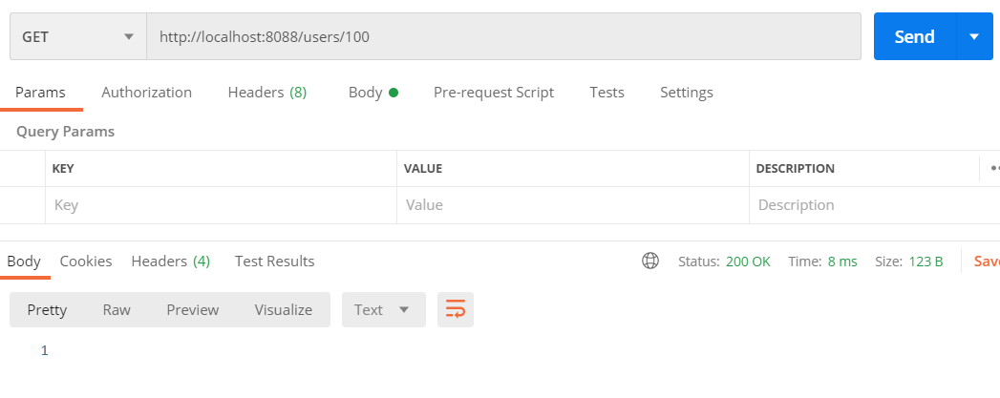

---

title: Spring boot) REST API에서 효율적인 상태코드 관리 / 예외처리
date: 2020-11-29 16:21:15
category: Spring
draft: false
---


<br/>

## 상태코드 관리

### ServletUriComponentsBuilder

이번에는 지금까지 배운 내용 + HTTP 메소드GET, POST, DELETE 사용하여 DB에서 Read, Create, Delete 하

아래와 같이 createUser 메소드에 URI를 검사하는 코드를 추가해준다.

`ServletUriComponentsBuilder`클래스를 사용하여 현재 요청의 URI를 가져올 수 있다. 다시 말해, 서버에서 반환시켜주려는 값을 Response 엔터티에 담아 리턴할 수 있다. 즉 상세정보 보기가 가능하다.

`fromCurrentRequest()`를 사용하여 현재 요청된 Request 값을 사용하고, 

`path`로 반환시킬 위치, 

`buildAndExpand`에 새롭게 설정한 id값을 `path`에 지정시켜준다. 

마지막으로 `toUri()`로 URI로 반환시켜준다.

리턴하기 위해 void를 `ResponseEntity<User>`로 우리가 도메인으로 지정했던 User를 반환하게 만든다.

```java
public class UserController {
    @PostMapping("/users")
    public ResponseEntity<User> createUser(@RequestBody User user){
        User savedUser = service.save(user);

        URI location = ServletUriComponentsBuilder.fromCurrentRequest()
                .path("/{id}")
                .buildAndExpand(savedUser.getId())
                .toUri();

        return ResponseEntity.created(location).build();
    }
}
```

<br>

좋은 REST API를 설계하는 방법 중 하나는 서버로부터 적절한 상태코드를 반환시키는 것이다. 테스트를 위해 임의의 값을 POST 때려보면, 상태코드가 201인 것을 확인할 수 있다. 이는 요청이 성공적이었으며, 결과로 새로운 리소스가 생겼다는 것을 알려준다. 

Headers의 Location에서는 새로 추가된 URI를 확인할 수 있다. id는 서버에서 자동으로 생성되기 때문에 id값을 알려면 다시 한 번 서버에 물어봐야한다. 하지만 이렇게 POST 메소드의 반환값에 URI를 추가하면 그만큼 네트워크 트래픽을 줄일 수 있다.


<br/>

여담이지만 모든 요청을 POST로 사용하는 것은 효율적이지 못하다. 요청에 맞게 GET, POST, UPDATE, DELETE를 사용하는 것이 바람직하다.

여기서는 나오지 않는데, 클라이언트 부분에서 미들웨어쪽으로 GET 요청으로 SQL 쿼리를 보내면 CRUD를 처리할 수 있다. 하지만 GET은 URI가 노출되기 때문에 보안에 치명적이다. 따라서 뭐든지 용도에 맞게 쓰는게 바람직하다고 할 수 있다.

<br/>

## 예외처리

### 특정한 예외처리

아래를 보자. DB에는 존재하지 않는 id 100번을 호출하면 값은 NULL인데 상태코드가 200으로 정상이라고 뜬다. 따라서 이부분은 에러를 발생시키도록 수정해야한다.



<br/>

먼저 retrieveUsers 클래스를 다음과 같이 바꿔주자. user 가 없으면, UserNotFoundException 에러를 생성한다.

```java
@GetMapping("/users/{id}")
public User retrieveUsers(@PathVariable int id){
    User user = service.findOne(id);

    if(user == null){
        throw new UserNotFoundException(String.format("ID[%s] not found", id));
    }

    return user;
}
```

<br/>

이제 UserNotFoundException 예외클래스를 다음과 같이 만들어준다. 개발자가 로직을 추가하여 처리해야하기 때문에 Throwable에서 RuntimeException으로 바꿔주자.

```java
public class UserNotFoundException extends RuntimeException {
    public UserNotFoundException(String message) {
        // 부모클래스쪽으로 전달받은 메세지를 반환
        super(message);
    }
}
```

<br/>

현재 패키지의 상태이다. 지난 포스트에서 UserNotFoundException이 추가되었다.


<br/>

포스트맨에서 없는 데이터를 조회해보면, 상태코드에 500에러가 뜬 것을 볼 수 있다.


<br/>

200번 대 에러는 정상 작동,

400번 대 에러는 클라이언트 문제,

500번 대 에러는 서버 문제다.

여기서 없는 데이터를 요청한 클라이언트의 잘못이기 때문에 500번대 에러가 아닌 400번대 에러가 떠야 한다. 다음과 같이 애노테이션을 추가해주자.

```java
@ResponseStatus(HttpStatus.NOT_FOUND)
public class UserNotFoundException extends RuntimeException {
    public UserNotFoundException(String message) {
        // 부모클래스쪽으로 전달받은 메세지를 반환
        super(message);
    }
}
```

<br/>

이제 404에러가 정상적으로 뜨는 것을 볼 수 있다.


<br/>


### 일반화된 예외클래스

