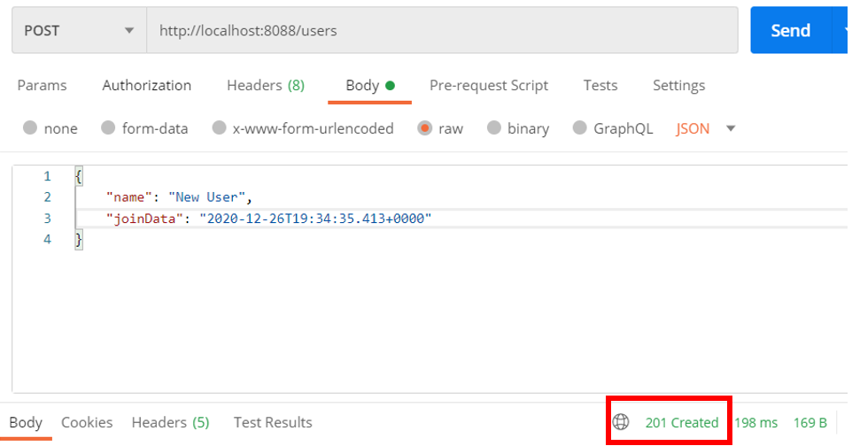
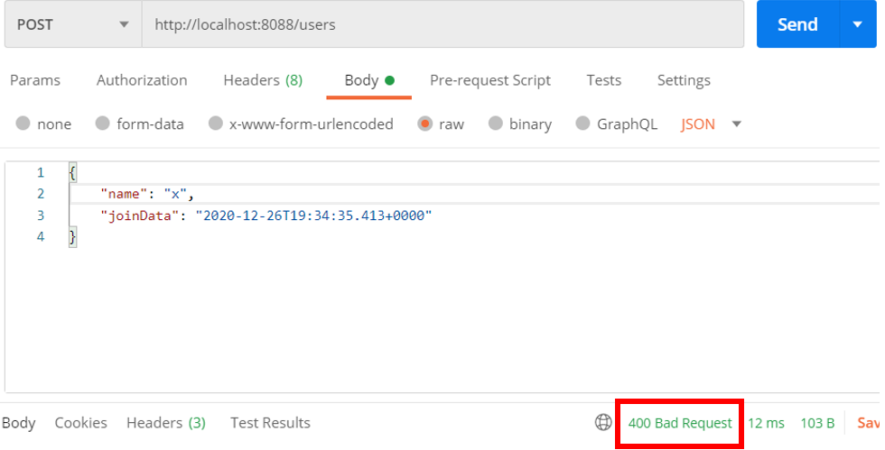
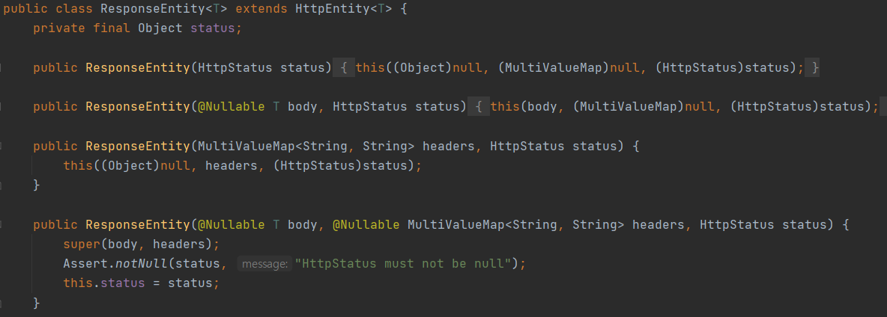
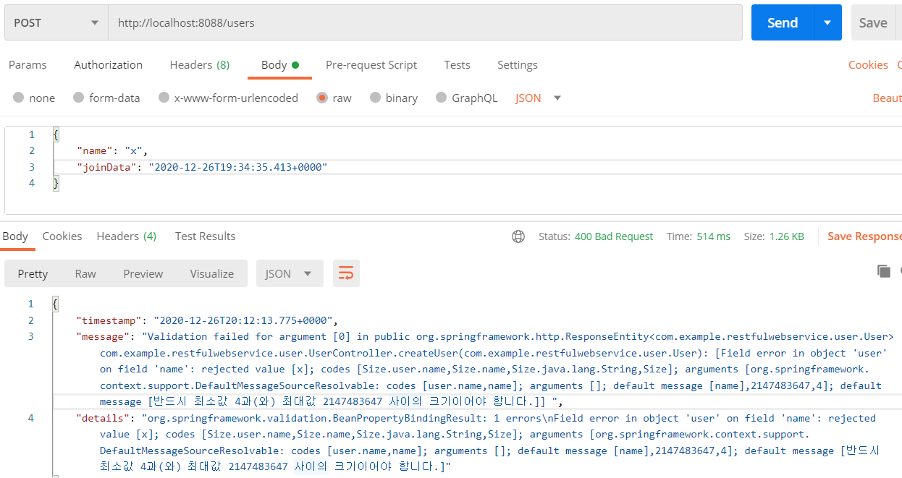
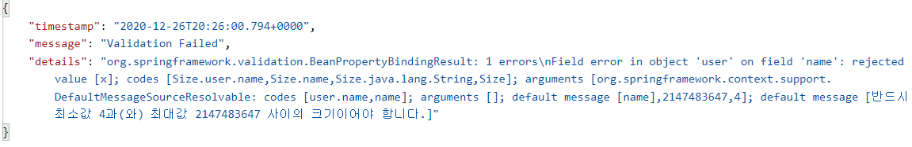
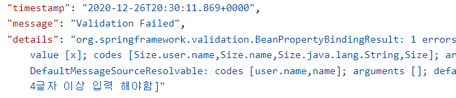

---

title: Spring boot) Validation API를 활용한 유효성 체크
date: 2020-12-26 16:21:15
category: Spring
draft: false
---


## 유효성 체크

Validation API를 사용하여 유효성을 체크해보겠다.

먼저 해당 값이 유효한지 체크하기 위해 유저클래스의 속성에 애노테이션을 추가해준다. name에 최소사이즈를 4로 설정하였다.

```java
public class User {
    private Integer id;

    @Size(min=4)
    private String name;
    @Past
    private Date joinData;
}
```

<br/>

사용자가 user 객체를 Json 형식으로 전달할 때 유효성 체크를 할 수 있도록 컨트롤러의 사용자 생성 부분에 @Valid를 추가해준다.

```java
@PostMapping("/users")
public ResponseEntity<User> createUser(@Valid @RequestBody User user)
```

<br/>

서버를 재기동하고 테스트를 해보자.

name이 네 글자 이상이면 정상적인 상태코드를 반환한다.



<br/>

하지만 4글자 미만이면, 다음과 같이 에러상태코드를 반환한다. 이처럼 유효성체크를 해주면 형식에 맞는 데이터를 받도록 유도할 수 있다.



<br/>

그럼 위 에러가 생겼을 때 처리해주는 메소드를 재정의해보자.

지난번 작성해놓았던 `CustomizedResponseEntityExceptionHandler` 클래스는 `ResponseEntityExceptionHandler`를 상속받고 있다. 내장함수로 들어가보면, `handleMethodArgumentNotValid` 메소드가 있는데, 이를 재정의해주자.

```java
@Override
protected ResponseEntity<Object> handleMethodArgumentNotValid(MethodArgumentNotValidException ex, HttpHeaders headers, HttpStatus status, WebRequest request) {
    ExceptionResponse exceptionResponse = new ExceptionResponse(new Date(), ex.getMessage(), ex.getBindingResult().toString());
    return new ResponseEntity(exceptionResponse, HttpStatus.BAD_REQUEST);
}
```

<br/>

참고로 리턴 형식은 `ResponseEntity` 내장 메서드에 들어가보면, 다음과 같이 오버로딩 되어 있음을 확인할 수 있고 이에 맞게 작성해주면 된다.



<br/>

아무튼, 재기동해보면 우리가 재정의한대로 에러메세지가 출력 되는 것을 확인할 수 있다!



<br/>

객체 생성부분을 아래처럼 수정하여 중복되는 문자를 없애주었다.

```java
ExceptionResponse exceptionResponse = new ExceptionResponse(new Date(), "Validation Failed", ex.getBindingResult().toString());
```



<br/>

아래처럼 에러메세지를 명시적으로 나타낼 수도 있다.

```java
@Size(min=4, message = "Name 4글자 이상 입력 해야함")
private String name;
```

