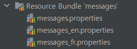
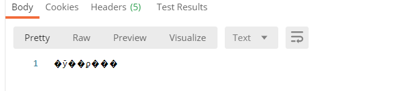
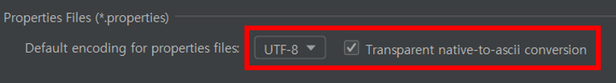
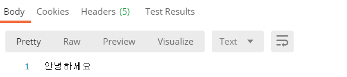
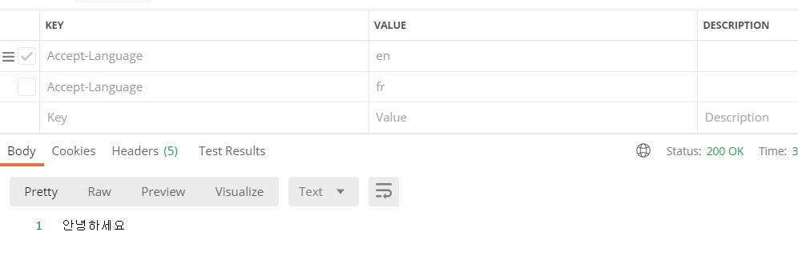
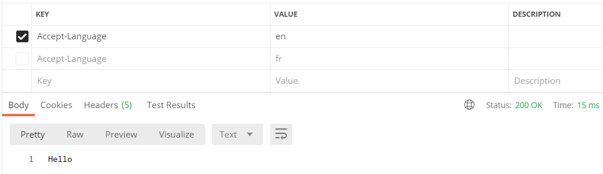
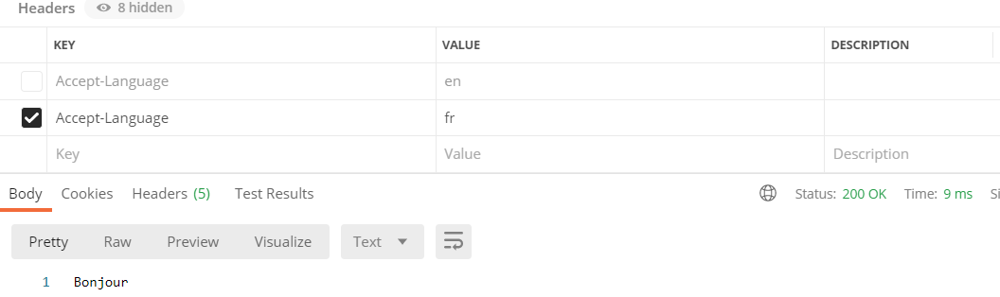

---

title: Spring boot) 다국어 처리하기
date: 2020-12-26 16:21:20
category: Spring
draft: false
---


## 다국어 처리하기


먼저 리소스 폴더 밑에 다음과 같이 임의의 언어파일을 추가하였다.



messages.properties

```
greeting.message=안녕하세요
```

messages_en.properties

```
greeting.message=Hello
```

messages_fr.properties

```
greeting.message=Bonjour
```

<br/>

그리고 컨트롤러에 다음과 같이 Accept-Language를 헤더로 갖는 Get 메서드를 추가하였다. 헤더의 Accept-Language의 값이 바뀌면 그에 맞는 언어의 파일을 불러올 것이다.

만약 헤더에 Accept-Language가 포함되지 않으면 디폴트값으로 한국어가 출력될 것이다. 기존의 `HelloWorldController` 클래스에 다음과 같은 코드를 추가하였다.

```java
public class HelloWorldController {

    @GetMapping(path = "/hello-world-internationalized")
    public String helloWorldInternationalized(
        @RequestHeader(name="Accept-Language", required = false) Locale locale){
        return messageSource.getMessage("greeting.message", null, locale);
    }
}
```

<br/>

Locale은 뭘까?

Locale 클래스에 들어가보면 다음과 같이 언어, 나라의 정보를 담고 있다.

```java
public final class Locale implements Cloneable, Serializable {

    static private final  Cache LOCALECACHE = new Cache();

    static public final Locale ENGLISH = createConstant("en", "");
    static public final Locale FRENCH = createConstant("fr", "");
    static public final Locale GERMAN = createConstant("de", "");
    .
    .
    .
```

<br/>

아무튼 우리가 정의한 메서드를 사용하기 위해서 의존성 주입을 해주어야 한다. 이번에는 생성자나 Setter 메서드가 아닌, @Autowired를 사용하였다. 의존성 주입의 개념과 방법들을 알았으니 앞으로는 @Autowired를 애용할 예정이다.

```java
public class HelloWorldController {

    //이 부분 추가
    @Autowired
    private MessageSource messageSource;

    @GetMapping(path = "/hello-world-internationalized")
    public String helloWorldInternationalized(
        @RequestHeader(name="Accept-Language", required = false) Locale locale){
        return messageSource.getMessage("greeting.message", null, locale);
    }
}
```

<br/>

### 한글깨짐 해결

포스트 제목이 다국어 처리하기인데 한글 깨짐이 발생했다(...)



<br/>

다음과 같이 File > Settings > Editor > File Encodings 에서 UTF-8로 바꾸어 해결하였다.





<br/>

### 결과

다음과 같이 헤더의 Accept-Language의 값이 변함과 동시에 언어가 변경되는 것을 확인할 수 있다. 





