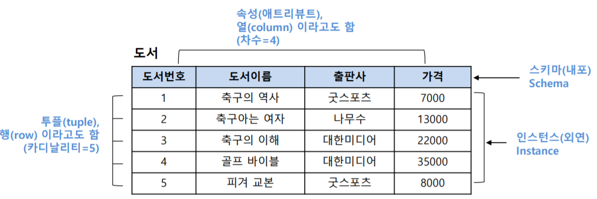
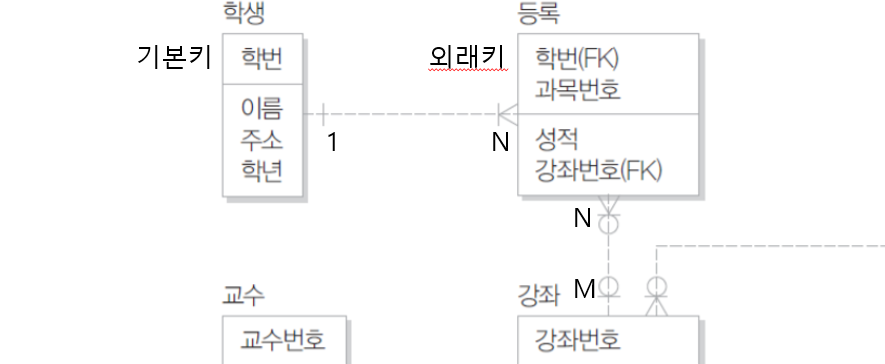
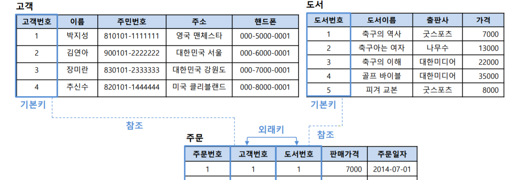
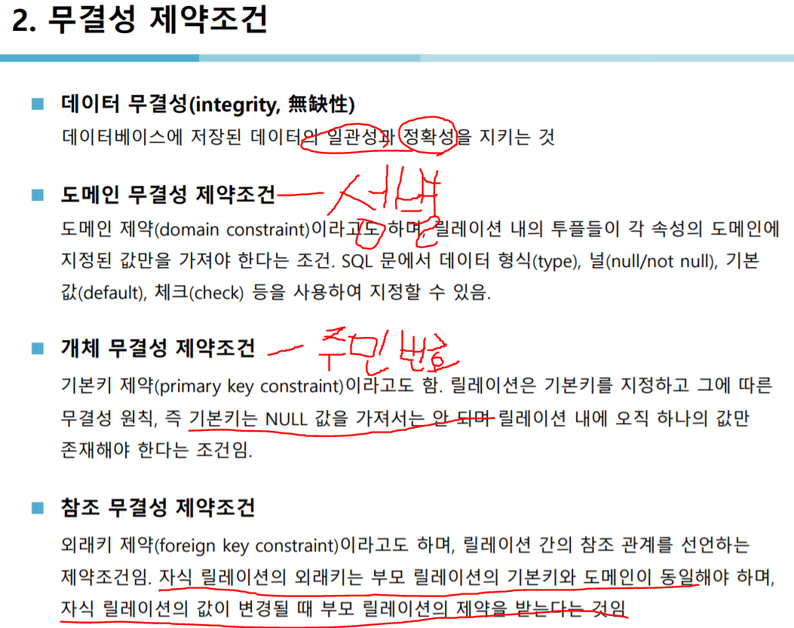
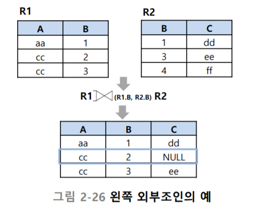
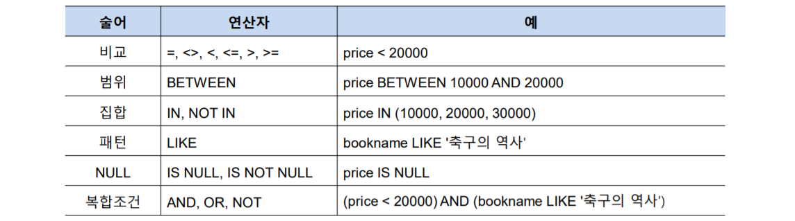
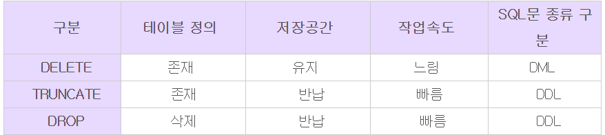

# Ddatabase

DDL - 정의어(data definition language) : create , drop, altor

DML - 조작어(data manipuldateion language) : insert, select, update, delete

DCL - 제어어(data control language) : grant revoke

<br/>

도메인 : 도메인은 동일한 테이블 타입을 가지는 속성을 분리하는 것을 의미

속성 = column = field

record = row = tuple = cadinallity



<br/>

select 간단예시

```sql
select 컬럼 from 테이블 where 조건
```

---

M:N관계는 보통 만들지 않고 둘을 쪼개서 1:M , 1:N으로 만든다





<br/>




외부조인(p.56) : 주문하지 않은 장미란 데이터도 가져올 수 있다



현재 왼쪽 다 표시(left join)

---

#DML

## select

```sql
select distinct publisher from Book; -- disticnt는 중복 제거
```

## where



```sql
select * from Book where price<20000; -- 가격 20000 아래 모두

# 같은 구문
select * from Book where price between 10000 and 20000;
select * from Book where price >= 10000 and price <=20000;

select * from Book where publisher in('굿스포츠','대한미디어'); -- 포함된
select * from Book where publisher not in('굿스포츠','대한미디어'); -- 포함 안 된

select * from Book where bookname like '축구%'; -- 축구라는 단어 일부가 포함된놈들 검색, 뒤에 % 붙여서 뒤에 아무거나 와도 됨
select * from Book where bookname like '%구%'; -- '구' 앞 뒤로 아무거나 와도 됨

select * from Book where bookname like '축구%' and price>=20000; -- 복합조건
```

<br/>

## Order by

```sql
select * from Book order by bookname desc; -- 내림차순 정렬, 디폴트는 오름차순
select * from Book order by publisher asc, price desc; -- 1차로 publisher 정렬, 2차로 desc 내림차순 정렬
```

집계함수

```sql
select sum(saleprice) as '총매출' from Orders; -- saleprice 합계를 총매출이란 이름으로 출력
select sum(saleprice), avg(saleprice), count(saleprice), max(saleprice), min(saleprice)  from Orders; -- 이런 기능이 있다
```

group by

```sql
select custid, count(*), sum(saleprice), avg(saleprice) from Orders group by custid;
-- custid로 그룹을 묶는데, 그 그룹 내에서 전체 카운트, 합계, 평균을 출력*/
```

having (group by 없이는 사용되지 않는다)

```sql
select custid, count(*), sum(saleprice) 
from Orders where saleprice >= 8000 group by custid
having count(*) >= 2 and sum(saleprice) >= 30000; -- 가격이 8천원 이상인 고객이 구매한 책의 수량, 단 2권 이상 구매한 고객과 3만원 이상인 고객만. 여기서 결과에 대해 조건을 줄 때는 having을 사용
```

<br/>

## Join

```sql
-- 이름 기준으로 그룹묶고 오름차순 정렬하고 합계출력인데, 고객과 주문의 custid가 같아야함
select name, sum(saleprice)
from Customer, Orders
where Customer.custid = Orders.custid
group by Customer.name
order by Customer.name;
```

고객의 이름과 고객이 주문한 도서 이름 중 가격 20000이상인 놈들 출력

```sql
select c.name, b.bookname, b.price -- 출력할 속성
from Customer as c, Orders as o, Book as b -- 참조할 테이블
where c.custid = o.custid and o.bookid=b.bookid and b.price >=20000; -- 조건
```

where 의 조건은 on 에 써준다

```sql
-- 두 구문은 같은 구문, join쓰고 안 쓰고의 차이
select c.name, o.saleprice
from Customer as c join Orders as o
on c.custid = o.custid
where saleprice >= 20000;

select c.name, o.saleprice
from Customer as c, Orders as o
where c.custid=o.custid and saleprice >= 20000;
```

쿼리 안에 쿼리, 가장 비싼책의 이름을 알고싶다

```sql
select bookname from Book
where price=(select max(price)  -- 가장 비싼책의 가격을 price에, 그 bookname을 가져오겠다
			from Book);
```

한번이라도 구매한적 있는 고객

```sql
select name from Customer
where custid in (select custid from Orders);
```

대한미디어 들어가는 책 산 고객

```sql
select name from Customer  -- 3. 그 id의 이름을 출력
where custid in(
	select custid from Orders -- 2. 그걸 구매한 사람의 id를 가져오고
	where bookid in(
		select bookid from Book where publisher='대한미디어')); -- 1. 대한미디어인 책을 가져오고
```

** 출판사별로 출판사의 평균 도서 가격보다 비싼 도서를 구하시오

```sql
select b1.bookname, b1.publisher from Book as b1
where b1.price > (select avg(b2.price) from Book as b2
			   where b1.publisher=b2.publisher); -- 안의 select에서 group by 할 필요가 없다!
```

---

## DDL

char(10) 는 10개의 배열을 풀로 사용하지만,

varchar(10)은 만약 2개의 배열만 사용했다면 나머지 8개는 지워버려서 효율적이다

### create

```sql
create table NewBook(
	bookid integer not null,
	bookname varchar(20) not null,
	publisher varchar(20) null,
	price integer default 10000,
    primary key(bookid) -- 기본키 지정, 안에 쉼표 넣고 키 추가하면 복합키 된다
);

create table NerCustomer(
	custid integer primary key,
	name varchar(40) not null,
	address varchar(40),
	phone varchar(15) default '000-0000-0000' -- 값 없으면 디폴트 넣는다
);

-- 이제 참조할 수 있도록 외래키 포함한 테이블 작성
CREATE TABLE NewOrders (
	orderid INTEGER,
	custid INTEGER NOT NULL,
	bookid INTEGER NOT NULL,
	saleprice INTEGER,
	orderdate DATE,
	PRIMARY KEY (orderid),
	FOREIGN KEY (custid) REFERENCES NewCustomer(custid) ON DELETE CASCADE
    -- FOREIGN KEY (bookid) REFERENCES NewBook(bookid) ON DELETE CASCADE 외래키 이렇게 추가
    -- NewCustomer의 custid랑 연동되도록 설정. 연쇄삭제. cascade로 설정하면 부모와 자식에 동시에 영향을 미친다
);

-- ddl은 아니지만 테스트
insert into NewBook values(100, 'Docker', 'SkInfosec', 20000);
insert into NewCustomer values(10, 'jeonghoon', 'seoul', '010-5280-6607');
insert into NewOrders values(1,10,100,30000, now()); -- now는 현재 시간
insert into NewOrders values(2,20,200,30000, now()); -- 얘는들어가지 않는다. 두번째 값인 custid는 외래키, 즉 직접 넣을 때 참조하는 테이블인 NewCustomer에 없는 custid면 생성 불가능

update NewCustomer set custid=20 where custid=10; -- 자식은 부모 테이블 함부러 못바꾼다, update cascade 걸어 놓으면 바꿀 수 있음

delete from NewCustomer where custid=10; -- delete cascade 조건 걸어놨기 때문에 데이터 삭제 가능
```

### alter

```sql
-- 위 NewBook에서
alter table NewBook add isbn varchar(13); -- isbn이라는 속성 추가
alter table NewBook modify isbn integer; -- 그 속성의 타입 int로 변경
alter table NewBook drop column isbn; -- 속성 제거
alter table NewBook modify bookid integer not null; -- 기존 속성 not null로 변경
alter table NewBook add primary key(bookid); -- 기본키 없을 때 기본키 추가

-- 테이블 삭제
drop table NewOrders;
drop table NewBook;
drop table NewCustomer;
```

---

## DML

## insert 

```sql
insert into 테이블이름[(속성리스트 생략가능)] values(값 리스트);

insert into Book(bookid, bookname, publisher, price)
select bookid, bookname, publisher, price from Imported_Book; -- 다른테이블에 있는거 바로 저장 가능

-- 컬럼 수와 null 등의 조건이 맞다면 간단하게 표현 가능
insert into Book
select * from Book;
```

## update

```sql
update 테이블명 set 속성명 = 값 where 조건;

-- Imported_Book 테이블의 bookid가 21번인 놈의 출판사를 Book테이블의 bookid가 12번 놈으로 바꾸기
update Book set publisher=(select publisher from Imported_Book where bookid=21) where bookid=12;
```

## delete 

```sql
delete from Book where bookid=11; -- 11번 삭제
```



---

## quiz

```sql
-- 1. 박지성의 총 구매액
select sum(o.saleprice) from Orders as o, Customer as c where o.custid=c.custid

-- 2. 박지성이 구매한 도서의 수
select count(bookid)
from Orders
where custid=(select custid from Customer where name='박지성');

-- 3. 박지성이 구매한 도서의 출판사 수
select count(b.publisher)
from Book as b, Orders as o
where b.bookid=o.bookid and o.custid = (select custid from Customer where name='박지성');

-- 4. 박지성이 구매한 도서의 이름, 가격, 정가와 판매가격의 차이
select b.bookname, b.price, b.price-o.saleprice
from Book as b, Orders as o, Customer as c
where b.bookid=o.bookid and o.custid=c.custid and name like '박지성';

-- 5. 박지성이 구매하지 않은 도서의 이름
select b.bookname
from Book as b, Orders as o
where b.bookid=o.bookid and o.custid <> (select custid from Customer where name='박지성');

-- 6. 2014년 7월 4일~7월 7일 사이에 주문받은 도서의 주문번호
select * from Orders
where orderdate between '2014-07-04' and '2014-07-07';

-- 7. 2014년 7월 4일~7월 7일 사이에 주문받은 도서를 제외한 도서의 주문번호
select * from Orders
where orderdate not between '2014-07-04' and '2014-07-07';

-- 8. 고객의 이름과 고객이 구매한 도서 목록
-- 9. 도서의 판매액 평균보다 자신의 구매액 평균이 더 높은 고객의 이름
select name ,avg(saleprice)
from Customer as c, Orders as o
where c.custid=o.custid
group by name 
having avg(saleprice) > (select avg(saleprice) from Orders);

-- 10. 박지성이 구매한 도서의 출판사와 같은 출판사에서 도서를 구매한 고객의 이름
-- 11. 두 개 이상의 서로 다른 출판사에서 도서를 구매한 고객의 이름
select name from Customer as c1
where 2 >= (
	select count(distinct publisher) from Customer as c, Orders as o, Book as b
	where c.custid=o.custid and o.bookid=b.bookid and (name like c1.name)
);
-- 12. 전체 고객의 30% 이상이 구매한 도서
select bookname from Book as b1
where (
	select count(b.bookid) 
	from Book as b, Orders as o
	where b.bookid=o.bookid
    and b.bookid=b1.bookid)>=0.3*(select count(*) from Customer);
```

quiz2

```sql
-- 1. 팀장(manager)의 이름을 보이시오.
select name from Employee where position='Manager';

-- 2. ‘IT’ 부서에서 일하는 사원의 이름과 주소를 보이시오.
select name, address from Department as d, Employee as e
where d.deptno=e.deptno and d.deptname='IT';

-- 3. ‘홍길동’ 팀장(manager) 부서에서 일하는 사원의 수를 보이시오.
select count(deptno) from Employee 
where deptno=(select deptno from Employee where name='홍길동');

-- 5. 두 명 이상의 사원이 참여한 프로젝트의 번호, 이름, 사원의 수를 보이시오.
select p.projno, p.projname, count(name) from Employee as e, Project as p
where e.deptno=p.deptno
group by p.projno, p.projname
having count(*) >=2;

-- 6. 세 명 이상의 사원이 있는 부서의 사원 이름을 보이시오.
select e.name from Employee as e, Department as d
where e.deptno=d.deptno and d.deptname=(
	select deptname from Employee as e, Department as d
    where e.deptno=d.deptno
    group by d.deptname having count(name) >=3);
```